# From VMware vSphere to Azure Local: What Changes and Where to Click

The industry shift away from VMware has accelerated dramatically. Organizations worldwide are evaluating alternatives, driven by licensing changes, acquisition uncertainty, and evolving business needs. For many enterprises, this transition represents both a significant operational challenge and a strategic opportunity to modernize their virtualization infrastructure.

This blog addresses the practical reality facing infrastructure teams: when organizational decisions mandate a platform change, success depends on understanding exactly how daily operations translate to the new environment. Rather than debating platform merits, this analysis provides the detailed operational mapping that VMware administrators need to maintain service levels during transition.

Throughout this blog, we use a reference environment to illustrate real-world scale implications: **if you run a large vSphere environment (90+ hosts and 2,500+ VMs), the platform change is already decided.** This scale represents a common enterprise deployment where teams manage complex, multi-tier applications across significant infrastructure. All examples, configurations, and operational procedures in this blog reflect the considerations relevant to environments of this complexity, helping teams understand not just what changes, but how those changes impact operations at scale.


This is an operator-focused reference for VMware-native admins. It maps vSphere, NSX, and vCenter capabilities to Azure Local (formerly Azure Stack HCI) equivalents with clear, neutral language. Key operational translations include:

• Hypervisor and VM mobility: vMotion → Live Migration; HA/maintenance workflows
• Management tooling: vCenter/PowerCLI → Azure Portal, Windows Admin Center, PowerShell
• Operations: lifecycle, patching, backup, monitoring, DR
• Disconnected operations: what keeps working locally; 30‑day check-in expectations

These operational mappings form the foundation for deeper analysis. The full blog examines every layer of the virtualization stack, from hypervisor fundamentals through disaster recovery orchestration, providing the technical detail infrastructure teams need to plan transitions, maintain operational continuity, and make informed architectural decisions during platform migration.

## Table of Contents

- [Feature Overview](#feature-overview)
- [1 Core Virtualization Platform (Hypervisor & Infrastructure)](#section-1-core-virtualization-platform-hypervisor-infrastructure)
- [2 Management Tools and Interfaces](#section-2-management-tools-and-interfaces)
- [3 Virtual Machine Lifecycle Operations](#section-3-virtual-machine-lifecycle-operations)
- [4 High Availability, Clustering & Application Protection](#section-4-high-availability-clustering-application-protection)
- [5 Storage Architecture](#section-5-storage-architecture)
- [6 Backup & Data Protection](#section-6-backup-data-protection)
- [7 Disaster Recovery & Site Failover](#section-7-disaster-recovery-site-failover)
- [8 Monitoring, Performance & Resource Optimization](#section-8-monitoring-performance-resource-optimization)
- [9 Automation and Scripting](#section-9-automation-and-scripting)
- [10 Disconnected/Limited Connectivity](#section-10-disconnectedlimited-connectivity)
- [11 Security and Compliance](#section-11-security-and-compliance)
- [12 GPU and Hardware Acceleration](#section-12-gpu-and-hardware-acceleration)
- [13 Software-Defined Networking (SDN)](#section-13-software-defined-networking-sdn)
- [14 Scalability and Limits](#section-14-scalability-and-limits)
- [15 Cloud Integration and Hybrid Services](#section-15-cloud-integration-and-hybrid-services)
- [16 Migration Planning and Strategy](#section-16-migration-planning-and-strategy)
- [17 Lifecycle Management](#section-17-lifecycle-management)
- [18 Licensing and Cost Considerations](#section-18-licensing-and-cost-considerations)
- [19 Conclusion: Embracing Azure Local: What the Team Should Expect](#section-19-conclusion-embracing-azure-local-what-the-team-should-expect)
- [20 References](#section-20-references)


---


## Feature Overview

This comprehensive feature comparison analyzes how VMware vSphere capabilities translate to Azure Local, highlighting architectural differences, operational changes, and migration considerations for enterprise environments. The table below maps equivalent functionality between platforms while identifying areas where approaches differ significantly. Key themes include the shift from VMware's on-premises-centric management to Azure Local's cloud-integrated hybrid model, the transition from proprietary VMware APIs to standards-based PowerShell and Azure tooling, and the evolution from centralized resource management (DRS) to distributed automation approaches. 

Each feature comparison includes migration complexity assessments, operational workflow changes, and business impact considerations to help planning teams understand both technical requirements and organizational change management needs. Features marked with significant architectural differences (such as fault tolerance, resource management, and networking) require the most planning attention, while areas with direct equivalency (such as storage and basic VM operations) typically involve primarily procedural changes rather than fundamental redesign.

| Feature                                 | Azure Local                                                                 | VMware vSphere                                                      |
|------------------------------------------|-------------------------------------------------------------------------------------------|---------------------------------------------------------------------|
| Core Virtualization Platform             | Hyper-V (bare-metal, NUMA, nested virt, GPU, S2D)                                         | ESXi (bare-metal, vNUMA, nested virt, vGPU, vSAN)                   |
| Management Tools and Interfaces          | Azure Portal, Windows Admin Center, PowerShell, Arc                                       | vCenter, PowerCLI, HTML5/vSphere Client                             |
| VM Lifecycle Operations                  | ARM/Bicep, WAC, PowerShell, templates, checkpoints, live migration                        | vCenter templates, snapshots, vMotion, PowerCLI                     |
| High Availability, Clustering & Application Protection | Failover Clustering, Live Migration, CAU, cluster failover (15-25s), VM monitoring | HA, DRS, vMotion, FT (zero-downtime), vLCM, App HA, VM monitoring |
| Storage Architecture                     | Storage Spaces Direct (S2D), hyperconverged, software-defined storage, CSV                | vSAN, traditional SAN/NAS, storage policies, distributed storag!e     |
| Backup & Data Protection                 | VSS integration, Azure Backup APIs, third-party vendor support                           | CBT, vSphere APIs (VADP), third-party vendor support                |
| Disaster Recovery & Site Failover        | Azure Site Recovery, Hyper-V Replica, cross-site replication                             | Site Recovery Manager, vSphere Replication, array-based replication |
| Monitoring, Performance & Resource Optimization | Azure Monitor, WAC, Log Analytics, PowerShell automation, automatic VM load balancing, Dynamic Memory | vRealize Operations, DRS, predictive analytics, TPS, ballooning |
| Automation and Scripting                 | PowerShell, Azure CLI, ARM/Bicep, Azure DevOps, Ansible                                   | PowerCLI, vRealize Automation, Terraform, Ansible                   |
| Disconnected/Limited Connectivity        | WAC, PowerShell, 30-day offline mode                                                      | vCenter, host client, limited offline, no cloud dependency          |
| Security and Compliance                  | Guarded Fabric, Shielded VMs, Azure Policy, BitLocker, JEA                                | vSphere encryption, vTPM, secure boot, NSX micro-segmentation       |
| GPU and Hardware Acceleration            | GPU-P (live migration supported with prerequisites), DDA (no live migration support)     | vGPU, DirectPath I/O, vMotion with GPU                              |
| Software-Defined Networking              | SDN, HNV, Azure integration, basic micro-segmentation                                     | NSX-T, advanced SDN, micro-segmentation                             |
| Scalability and Limits                   | 16 hosts/cluster, 240TB VM RAM, 2048 vCPUs/VM                                            | 96 hosts/cluster, 24TB VM RAM, 768 vCPUs/VM                         |
| Cloud Integration and Hybrid Services    | Azure Arc, Microsoft Entra ID integration, hybrid identity, native Azure service integration        | Limited cloud integration, third-party cloud connectors, hybrid solutions |
| Migration Planning and Strategy          | Azure Migrate, assessment tools, phased migration, P2V conversion utilities               | vCenter Converter, migration planning tools, V2V migration, assessment utilities |
| Lifecycle Management                     | CAU, Azure Update Manager, WAC, PowerShell                                                | vLCM, vCenter, PowerCLI                                             |
| Licensing and Cost Considerations        | Subscription per core, Azure Hybrid Benefit                                               | Perpetual/subscription, add-ons, Enterprise Plus for advanced       |

This table provides a roadmap for the deep-dive analysis ahead, ensuring you can quickly reference the areas most relevant to your environment and migration planning.

[Back to Table of Contents](#table-of-contents)

---
## Section 1: Core Virtualization Platform (Hypervisor & Infrastructure)

The foundation of your virtualization environment changes from ESXi to Azure Local (Hyper-V), maintaining enterprise-grade capabilities while integrating cloud services. Using our hypothetical enterprise example of 90+ hosts managing 2,500+ VMs across 6 clusters, this section illustrates how hypervisor and infrastructure concepts translate at operational scale.

**Hypervisor Transition:** VMware ESXi will be replaced by the **Azure Local operating system** (a specialized Hyper-V based OS). Both are bare-metal hypervisors with comparable performance and enterprise features. Hyper-V supports modern capabilities like virtual NUMA, nested virtualization, GPU acceleration, and memory management. In practice, you should expect similar VM performance and stability from Hyper-V as with ESXi, as both are mature type-1 hypervisors. For our example environment, this means your existing VM workloads will run with equivalent performance characteristics on the new hypervisor foundation.

**Enterprise Clustering Architecture:** In Azure Local, Hyper-V hosts are joined in **Windows Failover Clusters** (managed by Azure Arc). This provides high availability equivalent to vSphere clusters, but with a fundamental architectural difference: distributed cluster management rather than centralized control.

**Operational Scale Impact: Cluster Distribution:** Azure Local's 16-node maximum per cluster creates a different operational paradigm for large environments. In our enterprise example:
• Current vSphere: Single vCenter managing 90+ hosts as a unified resource pool with centralized DRS and HA policies
• Azure Local Architecture: Six separate Azure Local clusters (15 nodes each plus six nodes in the final cluster) managed individually through Azure Arc
• Management Complexity: Instead of one vCenter interface, operations teams manage six discrete clusters, each requiring separate maintenance windows, capacity planning, and resource allocation decisions

**Storage Architecture at Scale:** Each Azure Local cluster uses **Storage Spaces Direct (S2D)** for storage pooling, functionally similar to VMware vSAN where each node's local disks form a shared, resilient storage pool across the cluster. For our enterprise scenario, this means:
• Storage Management Evolution: Six separate S2D storage pools instead of one unified vSAN cluster
• Capacity Planning Changes: Storage growth requires adding nodes to specific clusters rather than expanding centralized storage
• Performance Considerations: Storage performance scales within each 16-node cluster boundary rather than across the entire 90-host environment

**Network Infrastructure Translation:** Networking transitions from vSphere Distributed Switches to Hyper-V Virtual Switches with optional Azure Arc-enabled SDN. In large environments:
• Basic Networking: Many organizations continue using VLAN-based networking with Hyper-V virtual switches across their cluster infrastructure
• Advanced SDN: Azure Arc-enabled SDN provides software-defined networking capabilities but requires cloud connectivity for full functionality
• Network Management: Each cluster requires separate network configuration instead of centralized distributed switch management

**Enterprise Operational Reality: Resource Distribution:** The 16-node cluster limitation fundamentally changes resource allocation strategies:
• VM Placement: Workloads must be distributed across multiple clusters rather than leveraging DRS across the entire host pool
• Maintenance Windows: Patching requires coordinating across six separate clusters instead of unified maintenance mode operations
• Disaster Recovery Planning: Cross-cluster failover requires different planning than vCenter's unified resource management

**Licensing Architectural Impact:** Azure Local uses a subscription-based licensing model (billed per physical core per month), unlike VMware's host licensing. For our enterprise example with 90+ hosts, this represents:
• Cost Model Shift: From perpetual host licenses to ongoing per-core subscription costs across all 90 hosts
• Windows Server Licensing: Each of the 2,500+ VMs still requires Windows Server licensing unless you leverage Azure Hybrid Benefits
• Budget Planning: Operational expense model rather than capital expenditure for the hypervisor layer

### Enterprise Architecture Summary

This hypothetical but realistic enterprise scenario illustrates the fundamental shift from vSphere's centralized resource management to Azure Local's distributed cluster architecture. While individual cluster capabilities remain equivalent, operational workflows must adapt to managing multiple discrete clusters rather than a single unified resource pool. The result is a more distributed management approach that trades centralized control for cloud-integrated hybrid capabilities and simplified per-cluster operations.

[Back to Table of Contents](#table-of-contents)

---
## Section 2: Management Tools and Interfaces

The hardest part of leaving VMware is not learning new features; it's figuring out where to click for tasks you've done thousands of times. After years of muscle memory navigating vCenter's familiar interface, Azure Local feels like walking into a house where someone moved all the furniture. Everything you need is still there, but it's in different rooms.

**Enterprise Context:** Managing 2,500+ VMs across 6 distributed Azure Local clusters fundamentally changes from vCenter's unified inventory management. Where vCenter provides centralized visibility across your entire 90+ host estate through a single interface, Azure Local spreads your infrastructure across multiple management boundaries. Each of your 6 clusters becomes its own management domain, requiring you to navigate between separate Azure resource groups rather than browsing a single, comprehensive inventory tree.

### The Management Philosophy Revolution

Microsoft has turned traditional datacenter management upside down. Where VMware puts your local vCenter at the center of the universe, Azure Local declares "the cloud is your new headquarters." This is not just a cosmetic change; it's a fundamental shift in how you think about infrastructure ownership and control.

In your current environment, vCenter acts as the single source of truth for your 90+ hosts and 2,500+ VMs. You log into one interface, see everything, and manage everything from that central console. Azure Local scatters this unified view across cloud-native interfaces, local management tools, and PowerShell automation—each serving specific scenarios but none providing the comprehensive oversight that vCenter delivers.

### Your New Primary Interface: Azure Portal

Opening Azure Portal for infrastructure management feels like stepping into the future (and occasionally, like stepping off a cliff). Once your six clusters are registered with Azure Arc, each appears as a living, breathing Azure resource with its own identity, metrics, and management capabilities. Your VMs become "Azure Local VMs" with full cloud integration: Role-Based Access Control (RBAC), Azure Hybrid Benefits, cloud monitoring, and unified governance alongside your Azure-native resources.

The transformation is profound. Where vCenter showed you a hierarchical tree of datacenters, clusters, and hosts, Azure Portal presents your infrastructure as cloud resources with tags, resource groups, and subscriptions. Your development team no longer needs custom vCenter roles to manage their test VMs—they get Azure RBAC permissions to specific clusters, creating true self-service without exposing your entire 6-cluster infrastructure.

But here is the catch: each cluster exists as an independent Azure resource. Instead of vCenter's unified inventory where you could search across all 2,500 VMs instantly, you're navigating between separate cluster resource groups. Need to find a VM? You must remember which cluster it's running on, because Azure Portal does not provide cross-cluster inventory searches the way vCenter's global view did.

The Azure Portal creates VMs with full Azure Arc integration: RBAC permissions, Azure Hybrid Benefits, cloud monitoring, and policy enforcement. These "Azure Local VMs" live in the cloud management plane, which brings incredible capabilities but also creates an irrevocable management decision. Once you create a VM through Azure Portal, it cannot be managed through local tools like Windows Admin Center.

### Your Secondary Toolkit: CLI and PowerShell

When the graphical interface is not enough, you'll live in PowerShell—but it's not the PowerCLI you know. Azure Local splits automation between two worlds: Az PowerShell and Azure CLI for Arc-enabled resources and cloud integration, and traditional PowerShell modules (Hyper-V, Failover Clustering) for underlying platform operations.

Remember those PowerCLI scripts you wrote to provision 50 VMs at once? Here's how they evolve:

**Old PowerCLI approach:**
```powershell
Connect-VIServer -Server vcenter.company.com
Get-Template "Windows2022-Template" | New-VM -Name "WebServer-{0:D3}" -VMHost (Get-VMHost | Get-Random)
```

**New Azure CLI approach:**
```bash
az stack-hci vm create --resource-group "Cluster01-RG" --name "WebServer-001" --image "Windows2022-Image" --size "Standard_D2s_v3"
```

The syntax changes, but the automation power remains. ARM templates and Bicep files replace vCenter templates, providing Infrastructure-as-Code capabilities that vCenter never offered. Your VM definitions become version-controlled, repeatable, and auditable in ways that vCenter's point-and-click approach couldn't match.

### Your Safety Net: Windows Admin Center

WAC feels like coming home; it's the closest thing to vCenter you'll find in the Azure Local ecosystem. When the internet is down, when Azure Portal is slow, or when you need to see what's happening right now on the cluster, Windows Admin Center provides that familiar interface with live migration wizards, VM console access, and real-time performance charts.

But there is a crucial limitation: WAC creates "unmanaged VMs" that exist outside Azure Portal's visibility. It's like having two parallel universes for your VMs—Azure Arc VMs managed through the cloud, and traditional Hyper-V VMs managed locally. These worlds do not intersect, and crossing between them is a one-way trip.

**Use WAC when:**
- Azure connectivity is unavailable (your internet is down, not theirs)
- You need immediate console access to a problematic VM
- Real-time cluster troubleshooting requires live performance data
- Emergency scenarios where waiting for Azure Portal isn't acceptable

Remember: every VM you create in WAC becomes invisible to Azure Portal forever. In a 2,500+ VM environment, this management split can create operational nightmares if not carefully controlled.

### Your Emergency Kit: Traditional Tools

Failover Cluster Manager and Hyper-V Manager are like the emergency kit in your car: you hope never to need them, but you're grateful they exist when disaster strikes. These tools provide the deepest level of cluster and VM access, perfect for 3 AM troubleshooting sessions when everything else has failed.

Failover Cluster Manager shows you the raw Windows clustering underneath Azure Local—cluster nodes, shared volumes, cluster networks, and VM roles. When Azure Portal shows a VM as "running" but users can't connect, Failover Cluster Manager reveals the cluster resource states that explain what's really happening.

Hyper-V Manager provides host-level VM access—direct configuration changes, console connections, and VM settings that aren't exposed through higher-level tools. Use it when you need to modify VM hardware settings that Azure Portal or WAC don't support, or when troubleshooting requires direct hypervisor-level visibility.

### The Critical Decision Point: VM Creation Choices

Here is where things get permanent. The moment you create a VM, you're choosing its entire management future, and that choice is irreversible through supported methods.

**Create through Azure Portal:** Your VM becomes an "Azure Local VM" with full cloud integration—RBAC, Azure Hybrid Benefits, policy enforcement, and cloud monitoring. But it's invisible to Windows Admin Center and can only be managed through Azure interfaces.

**Create through WAC or PowerShell:** Your VM becomes a traditional Hyper-V VM with local management capabilities, console access, and familiar Windows tools. But it's invisible to Azure Portal and loses all cloud integration benefits.

Imagine this scenario: You are restoring 50 critical VMs from backup after a disaster. The restoration process creates traditional Hyper-V VMs because backup tools do not preserve Azure Arc identity. Suddenly, 50 of your VMs have vanished from Azure Portal, lost their RBAC permissions, and cannot be managed through your cloud-integrated workflows. The only way to fix this is manually recreating each VM through Azure Portal, a process that could take days in an enterprise environment.

### Real-World Management Scenarios

**It is 2 AM, a critical VM is down, and you need console access:** Azure Portal provides Connect flows for RDP/SSH, but if networking is broken, you'll need Windows Admin Center's web-based console or Hyper-V Manager's direct console connection. Know which tools can reach your VMs in disaster scenarios.

**The development team wants self-service VM creation without exposing production:** Azure RBAC provides granular permissions to specific clusters or resource groups. Developers get Azure Portal access to their designated cluster without seeing the other five production clusters. This replaces vCenter's custom roles with cloud-native permissions.

**You are planning maintenance on cluster three while cluster five is already in maintenance:** Instead of vCenter's unified maintenance mode, you're coordinating PowerShell-driven "pause/drain roles" operations across independent clusters. Each cluster enters maintenance mode separately, requiring careful coordination to avoid resource contention.

### The Automation Evolution

Your PowerCLI expertise is not gone; it is evolving. The scripting concepts remain the same, but the syntax and approach change significantly.

**Bulk VM operations transformation:**
```powershell
# VMware PowerCLI - Unified Approach
Connect-VIServer -Server vcenter.company.com
Get-VM | Where-Object {$_.PowerState -eq "PoweredOn"} | Measure-Object

# Azure Local PowerShell - Distributed Approach  
$Clusters = @("AzLocal-Cluster01", "AzLocal-Cluster02", "AzLocal-Cluster03")
$AllVMs = @()
foreach ($Cluster in $Clusters) {
    $VMs = Get-VM -ComputerName $Cluster | Where-Object {$_.State -eq "Running"}
    $AllVMs += $VMs
}
$AllVMs | Measure-Object
```

The power increases—ARM templates provide Infrastructure-as-Code that vCenter never offered, enabling version-controlled, auditable, repeatable deployments across your 6-cluster infrastructure.

### Enterprise Reality Check

Managing 2,500+ VMs across six distributed clusters changes everything about daily operations. Where vCenter gave you one place to see everything, Azure Local gives you six places to coordinate everything. The tools are powerful—often more powerful than their vCenter equivalents—but the operational model is fundamentally different.

You are trading vCenter's unified control for Azure's distributed, cloud-integrated approach. The result is enhanced RBAC, global scalability, and seamless hybrid cloud operations, but at the cost of centralized visibility and simplified management workflows.

Success depends on understanding each tool's strengths, respecting the irreversible consequences of management method choices, and embracing Infrastructure-as-Code practices that make distributed management sustainable at enterprise scale.

The future of infrastructure management is cloud-native, distributed, and automated. Azure Local's management tools are designed for this future, but getting there requires abandoning the centralized control patterns that made vCenter so comfortable for traditional datacenter operations.


>**Note on System Center Virtual Machine Manager (SCVMM):** While SCVMM provided centralized management for earlier Azure Stack HCI deployments, this comparison focuses on Azure Local's native management tools and Azure integration. SCVMM remains valid for organizations with existing System Center investments, but the Azure-native approach represents the strategic direction.
### Tool Usage Decision Matrix

**When to Use Each Management Interface:**

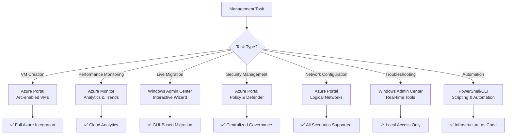

| Operation Type | Azure Portal | Windows Admin Center | PowerShell | Best Use Case |
|---------------|--------------|---------------------|------------|---------------|
| **VM Creation** | Azure Local VM creation | Creates unmanaged VMs | `az stack-hci-vm create` | Portal: Arc-enabled VMs, CLI: Automation |
| **Performance Monitoring** | Azure Monitor | WAC performance tab | `Get-Counter` | Portal: Analytics, WAC: Real-time troubleshooting |
| **Live Migration** | Not available | Move VM wizard | `Move-ClusterVirtualMachineRole` | WAC: Interactive, PS: Automation |
| **Security Management** | Azure Policy/Defender | Local security settings | Security cmdlets | Portal: Policy, WAC: Local config |
| **Network Configuration** | Logical networks (all scenarios) | Local network troubleshooting | Network cmdlets | Portal: Logical networks, WAC: Local troubleshooting |

### Automation Transition Guide

**Scripting Framework Changes:**

| Automation Task | PowerCLI Approach | PowerShell/Azure CLI Approach |
|-----------------|------------------|------------------------------|
| **Bulk VM Operations** | `Get-VM \| ForEach-Object` | `az stack-hci-vm list \| ForEach-Object` |
| **Host Configuration** | `Get-VMHost \| Set-VMHostAdvancedConfiguration` | `Invoke-Command -ComputerName $Hosts` |
| **Resource Monitoring** | `Get-Stat -Entity $VM` | `Get-AzMetric -ResourceId $VM` |
| **Network Management** | `Get-VirtualSwitch \| New-VirtualPortGroup` | `az stack-hci-vm network lnet create` |

### Critical Management Method Considerations

**Management Method Lock-in:** You cannot mix VM management approaches without losing functionality:

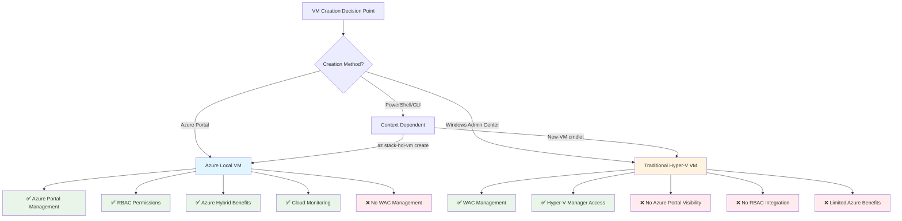

- **Azure Local VMs** (created via Azure Portal): Managed through Azure Portal, CLI, PowerShell. **Cannot** be managed through Windows Admin Center.
- **Traditional Hyper-V VMs** (created via WAC/PowerShell): Managed through Windows Admin Center, Hyper-V Manager, PowerShell. **Cannot** be managed through Azure Portal.
- **Microsoft's recommendation:** "The recommended way to create and manage VMs on Azure Local is using the Azure Arc control plane."

**VM Restoration Limitations:** VMs restored from backup, disaster recovery tools, or created outside the Azure portal (via WAC/PowerShell/external restore) **lose their Azure Arc identity and resource bridge registration**:
- Restored VMs revert to traditional Hyper-V VMs and cannot be converted back to Arc-enabled VMs through supported methods
- Cross-instance restores (to different Azure Local systems) lose Arc management capabilities
- Loss of Azure Portal management, RBAC permissions, and Azure Hybrid Benefits requires manual VM recreation

**Feature Gaps:** According to Microsoft's official [VM management capabilities comparison table](https://learn.microsoft.com/en-us/azure/azure-local/concepts/compare-vm-management-capabilities?view=azloc-2507#comparison-of-vm-management-capabilities), Azure Local VMs have limited Windows Admin Center support (marked with ❌), while WAC-created VMs have "limited manageability from the Azure Arc control plane, and fewer Azure Hybrid Benefits."

 > **Key Takeaway:** Azure Portal first, Azure CLI/PowerShell for automation, Windows Admin Center when cloud unavailable, traditional tools for troubleshooting only. Choose your VM management method carefully—it affects long-term manageability and disaster recovery.

**Bottom Line:** Azure Local's management hierarchy prioritizes cloud integration over local control. While this requires learning new Azure-native workflows instead of vCenter's unified approach, the result is enhanced RBAC, global scalability, and seamless hybrid cloud operations. Success depends on understanding when to use each tool and the irreversible consequences of management method choices.

[Back to Table of Contents](#table-of-contents)

---

## Section 3: Virtual Machine Lifecycle Operations

Daily VM management remains familiar with equivalent capabilities for provisioning, migration, and maintenance operations. Using our hypothetical enterprise example of 90+ hosts managing 2,500+ VMs across 6 clusters, this section illustrates how VM lifecycle management adapts to Azure Local's distributed architecture and cloud-integrated tooling.

Daily VM operations in Azure Local will feel familiar, with analogous features to vSphere for creating, running, and modifying virtual machines:

**Enterprise VM Provisioning & Template Strategy:** In our example environment with 2,500+ VMs, the shift from vCenter's centralized template management to Azure Local's distributed approach requires new standardization workflows. In vSphere, you might clone from templates managed centrally through vCenter. Azure Local doesn't use vCenter templates in the same way, but you have enterprise-focused options:

### Enterprise VM Provisioning Workflow Comparison

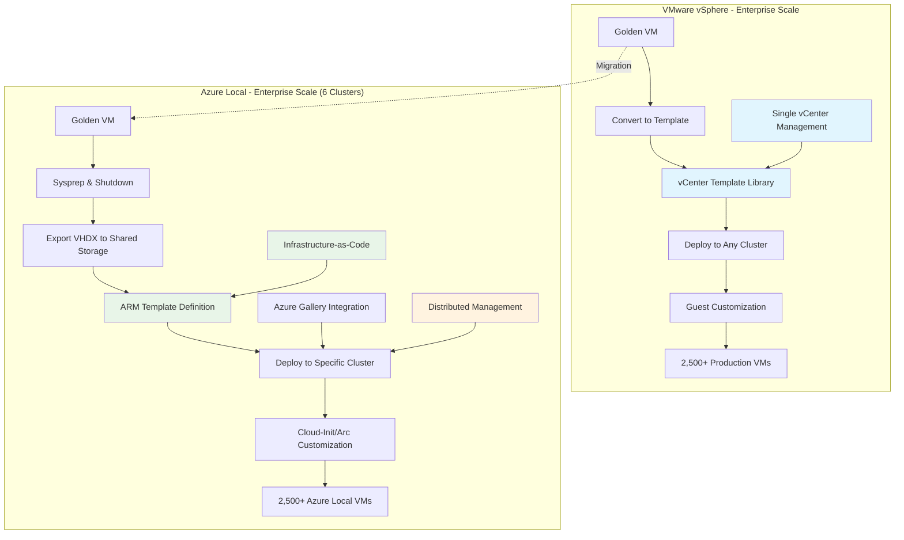

**Enterprise Template Management Strategy:**
- **Shared Image Libraries:** Azure Local can integrate with Azure's Shared Image Gallery, allowing you to maintain golden VHDX images accessible across all 6 clusters. While not as GUI-integrated as vCenter templates, using scripted deployment or WAC's "Create VM from existing disk" with Infrastructure-as-Code achieves standardized deployment across clusters.
- **ARM Template Infrastructure:** For 2,500+ VM environments, Azure Resource Manager templates become critical to define VM configurations (vCPU, memory, OS image, networking) consistently across your 6-cluster architecture. Unlike vCenter's point-and-click template deployment, enterprise Azure Local environments require PowerShell automation and ARM template libraries.
- **Sysprep and Clone Libraries:** You can sysprep a VM, shut it down, and copy its VHDX to shared storage accessible by all clusters. This creates a master image library similar to VMware templates but requires distributed storage planning across your 6-cluster infrastructure.
- **Cloud-Init Integration:** Azure Local supports Cloud-Init for Linux and VM customization via Azure Arc, which can inject configuration into new VMs. For enterprise environments, this replaces VMware's guest customization specifications with cloud-native configuration management.

**Enterprise Live Migration Operational Changes:** VMware's vMotion allows moving running VMs between hosts across your entire 90+ host infrastructure with centralized DRS automation. Azure Local's **Live Migration** operates differently at enterprise scale:

**Enterprise Scale Live Migration Constraints:**
- **Cluster Boundary Limitation:** Live migration works only within each 16-node cluster, not across your 6-cluster infrastructure. This means VM workload mobility is constrained to cluster boundaries rather than the entire 90-host resource pool.
- **Cross-Cluster VM Mobility:** Moving VMs between clusters requires shutdown, export, and import processes—unlike vSphere's seamless vMotion across the entire datacenter infrastructure.
- **Maintenance Mode Procedures:** Instead of vCenter's unified maintenance mode across 90+ hosts, you'll coordinate "pause/drain roles" operations across 6 separate clusters using PowerShell or WAC, requiring more complex maintenance orchestration.

**Enterprise Checkpoint (Snapshot) Management at Scale:** For 2,500+ VMs, checkpoint management becomes a significant operational consideration that differs from VMware snapshots:

**Enterprise Checkpoint Strategy Differences:**
- **No Azure Portal Checkpoint Management:** Azure Local VMs managed through the portal don't support checkpoint operations via the Azure interface—these must be managed through PowerShell automation for enterprise-scale operations.
- **PowerShell Automation Required:** Unlike vCenter's GUI-based snapshot management across thousands of VMs, enterprise Azure Local checkpoint operations require PowerShell scripting for bulk operations across your 6-cluster infrastructure.
- **Storage Consumption Patterns:** Production checkpoints use VSS integration for application-consistent snapshots across enterprise workloads, providing better consistency than VMware snapshots for Windows-based applications but requiring different storage capacity planning.

**Enterprise VM Tools and Integration Evolution:** In our 2,500+ VM scenario, the transition from VMware Tools to Hyper-V Integration Services affects operations:

**Integration Services at Enterprise Scale:**
- **Automatic Integration:** Modern Windows and Linux distributions include Hyper-V drivers by default, eliminating the VMware Tools installation and update cycles that enterprise environments typically automate through vCenter.
- **Better Windows Application Integration:** Hyper-V Integration Services provide superior VSS (Volume Shadow Copy Service) integration for enterprise applications like SQL Server, Exchange, and SharePoint compared to VMware Tools' VSS coordination.
- **Reduced Maintenance Overhead:** Unlike VMware Tools requiring updates across 2,500+ VMs, Hyper-V Integration Services update through standard OS patching, simplifying enterprise maintenance workflows.

### Enterprise VM Operations: Management Tool Distribution

```mermaid
graph TB
    subgraph "What Changes for Daily VM Operations (2,500+ VMs)"
        A1[VM Snapshots → Checkpoints<br/>PowerShell required for bulk operations]
        A2[vMotion → Live Migration<br/>Limited to cluster boundaries (16 hosts max)]
        A3[vCenter Console → Multiple interfaces<br/>Azure Portal for Arc VMs, WAC for local VMs]
        A4[Template Cloning → ARM/PowerShell workflows<br/>Infrastructure-as-Code required for scale]
        A5[VMware Tools → Integration Services<br/>OS-integrated, reduced maintenance burden]
    end
    
    subgraph "Enterprise Management Reality (6 Clusters)"
        B1[vCenter: All 2,500 VMs in one interface]
        B2[Azure Local: Distributed management<br/>Arc VMs via Portal, Local VMs via cluster-specific tools]
    end
    
    A1 --> C1[⚠️ PowerShell scripting required]
    A2 --> C2[❌ Reduced VM mobility scope]
    A3 --> C3[⚠️ Tool selection affects VM lifecycle]
    A4 --> C4[✅ Better automation opportunities]
    A5 --> C5[✅ Simplified enterprise maintenance]
    
    B1 --> D1[Centralized operational model]
    B2 --> D2[Distributed operational complexity]
    
    style C1 fill:#fff3e0
    style C2 fill:#ffebee
    style C3 fill:#fff3e0
    style C4 fill:#e8f5e8
    style C5 fill:#e8f5e8
    style D1 fill:#e1f5fe
    style D2 fill:#fff3e0
```

**Enterprise Resource Allocation Changes:** Managing resource allocation across 2,500+ VMs requires different approaches in Azure Local compared to vSphere's centralized DRS:

**Enterprise Resource Management Evolution:**
- **Distributed Resource Planning:** Instead of DRS managing resource allocation across 90+ hosts, you must plan VM placement across 6 discrete clusters, each with independent resource pools and capacity constraints.
- **Dynamic Memory at Scale:** Hyper-V's Dynamic Memory feature can provide better memory efficiency than VMware's ballooning across large VM deployments, but requires careful planning to avoid memory pressure in high-density environments.
- **VM Load Balancing Limitations:** Azure Local's automatic VM load balancing operates within each 16-node cluster every 30 minutes, but cannot balance workloads across your entire 6-cluster infrastructure like vSphere DRS.

### Enterprise Operational Summary

This hypothetical but realistic enterprise scenario demonstrates how Azure Local VM lifecycle operations provide equivalent core functionality with significantly different management workflows. The 2,500+ VM scale requires embracing Infrastructure-as-Code practices, PowerShell automation, and distributed management approaches rather than vCenter's unified interface.

**Critical Enterprise Considerations:**
- **Template Management:** Shift from centralized vCenter templates to ARM templates and shared image libraries
- **VM Mobility:** Accept cluster-boundary limitations instead of datacenter-wide vMotion
- **Automation Requirements:** Develop PowerShell scripts for operations that were GUI-based in vCenter
- **Management Tool Selection:** Understand that VM creation method determines long-term manageability across your infrastructure

**Bottom Line:** Azure Local VM lifecycle operations provide equivalent functionality to vSphere with fundamentally different management paradigms. While VMware consolidates most operations in vCenter across your entire infrastructure, Azure Local requires distributed management approaches, PowerShell-centric automation, and Infrastructure-as-Code practices to operate effectively at enterprise scale. Success depends on embracing cloud-native management patterns rather than attempting to replicate vCenter's centralized operational model.

### VM Provisioning Workflow Comparison

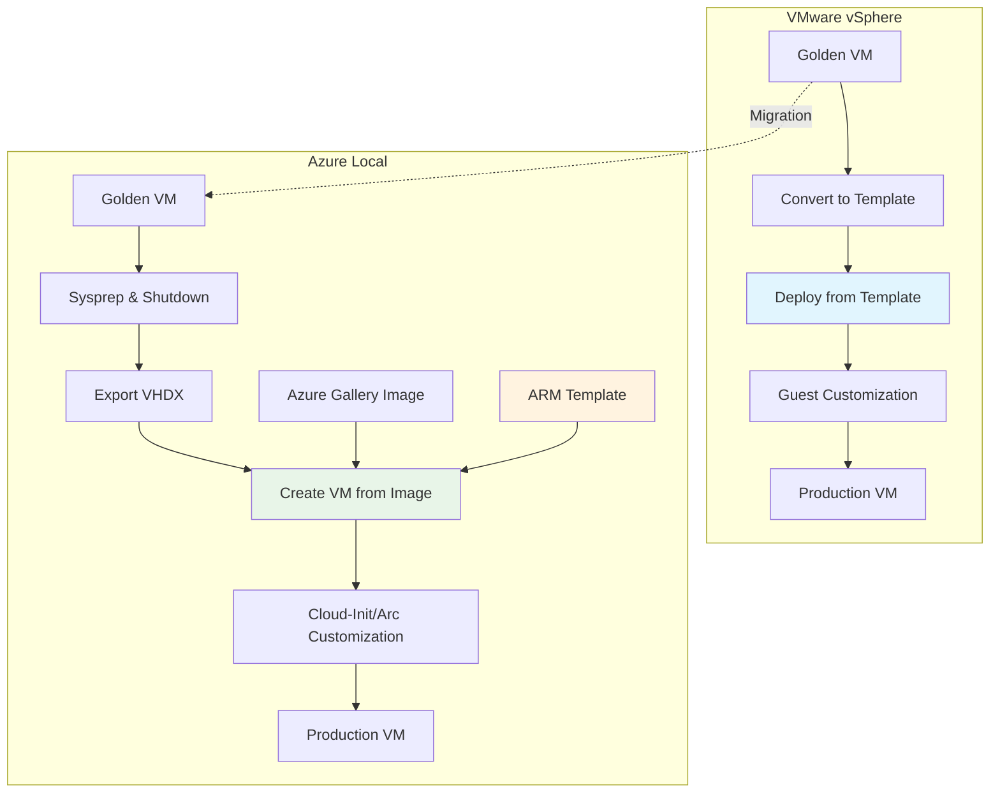

- Through Azure Portal, you can create a new VM (Azure Local VM) and specify an image or existing VHD. Azure Local can integrate with Azure's image gallery, or you can keep a library of golden VHD(X) images (similar to templates) on a file share. While not as GUI-integrated as vCenter templates, using scripting or WAC's "Create VM from existing disk" achieves a similar result. Additionally, Azure Resource Manager templates can define a VM shape (vCPU, memory, OS image, etc.) for consistent deployment across clusters.
- **Sysprep and clone:** You can sysprep a VM, shut it down, and copy its VHDX to use as a master image. This is analogous to how many admins create VMware templates (which are essentially VMs marked as template).
- Azure Local also supports **Cloud-Init** for Linux and **VM customization** tasks via Azure Arc, which can inject configuration into new VMs similar to VMware guest customization.

**Live Migration (vMotion):** VMware's vMotion allows moving running VMs between hosts with no downtime. Hyper-V's equivalent is **Live Migration**, and it's a core feature of Azure Local clusters. You can initiate a live migration through WAC or Failover Cluster Manager (by moving the VM role to another node) – the VM continues running during the move, just like vMotion. Live migration is within the same cluster; cross-cluster LM isn't supported. Live Migration performance and limits are comparable to vMotion; it uses a dedicated network (or networks) to transfer memory and state. In practice, you'll put a host into "**pause/drain roles**" mode (maintenance mode) which automatically live-migrates its VMs to other hosts, allowing patching or hardware maintenance – similar to vSphere's maintenance mode + DRS.

**VM Snapshots (Checkpoints):** VMware "snapshots" have a parallel in Hyper-V called **checkpoints**. You can take a checkpoint of a VM's state, do changes or backups, and later apply or discard it. Standard checkpoints save the VM's disk and memory state. Azure Local supports both standard and "production" checkpoints (production checkpoints use VSS in the guest to create a disk-consistent point-in-time without saving memory, ideal for backups). The experience is similar: you can create a checkpoint in WAC or PowerShell, and if needed, revert (apply) that checkpoint to roll back a VM.

**Cloning and VM Copies:** If you need to duplicate a VM, the process isn't one-click clone as in vCenter, but it's straightforward: you can export a VM (which copies its VHDX and config) and import it as a new VM. WAC has an **"Export VM"** action, or you can use PowerShell cmdlets to accomplish a clone. Alternatively, as mentioned, keep a library of prepared images for quick deployment.

**VM Tools and Integration Services:** In vSphere, VMs run VMware Tools for optimized drivers and guest OS integration. Azure Local uses **Hyper-V Integration Services** – analogous tools providing driver optimization (for storage, network, etc.) and guest integration (for time sync, shutdown, heartbeat, VSS, etc.). The good news is that modern Windows and Linux OSs include Hyper-V integration components by default (Windows has them built-in, Linux distributions have Hyper-V drivers in the kernel).

**Console Access:** vSphere offers a web console or remote console to VMs. With Azure Local, Portal provides Connect flows (RDP/SSH). Use WAC for web-based console.

**Resource Allocation & Performance Settings:** All the VM hardware settings you're used to in VMware exist in Hyper-V, though sometimes under different names. For CPU and memory: you can set vCPUs, reserve or limit CPU capacity (via Hyper-V "virtual machine reserve" or setting processor weight, analogous to VMware shares/reservations). Memory can be fixed or "Dynamic Memory" – Hyper-V's form of memory overcommitment. Dynamic Memory can automatically adjust a VM's memory between a minimum and maximum, based on demand, which is somewhat comparable to VMware's ballooning/overcommit.

### VM Operations: Where You'll Click Instead

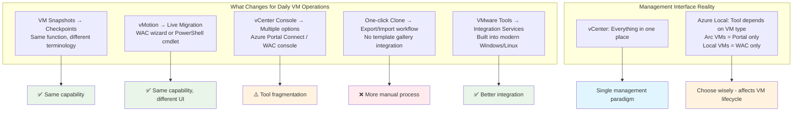

**Bottom Line:** Azure Local VM lifecycle operations provide equivalent functionality to vSphere with different management interfaces. While VMware consolidates most operations in vCenter, Azure Local splits between cloud-based Azure Portal for Azure Local VMs and local Windows Admin Center for direct management. Your team will need to adapt to PowerShell-centric automation and distributed management tools, but core VM operations remain familiar with similar performance settings and resource allocation options.

[Back to Table of Contents](#table-of-contents)

---

## Section 4 - High Availability, Clustering & Application Protection

VM uptime protection evolves from ESXi HA/DRS to Windows Failover Clustering with integrated Azure services for health monitoring. Using our hypothetical enterprise example of 90+ hosts managing 2,500+ VMs across 6 clusters, this section illustrates how high availability architectures and operational procedures adapt to distributed cluster management.

Maintaining VM uptime during host failures or maintenance is just as crucial in Azure Local as in vSphere, and similar mechanisms exist with important enterprise-scale operational differences:

**Enterprise High Availability Architecture Changes:** In our example environment, Azure Local's distributed clustering approach fundamentally changes how high availability operates compared to vSphere's unified resource management:

**Enterprise HA Architecture Comparison:**
- **vSphere Centralized HA:** Single vCenter managing HA policies across all 90+ hosts with unified resource pools and centralized DRS automation for optimal VM placement
- **Azure Local Distributed HA:** Six independent Windows Failover Clusters, each managing HA within 16-node boundaries without cross-cluster resource coordination or automated workload balancing

**Enterprise Clustering Operational Reality:** In Azure Local, Hyper-V hosts are joined in **Windows Failover Clusters** (managed by Azure Arc). This provides high availability equivalent to vSphere clusters but with critical scale differences:

**Enterprise Scale HA Implications:**
- **Resource Pool Fragmentation:** Instead of 90+ hosts functioning as a unified resource pool with DRS optimization, you manage six discrete resource pools with independent failover and load balancing policies
- **Maintenance Coordination Complexity:** Enterprise change management shifts from vCenter's single maintenance mode operation across the entire infrastructure to coordinated cluster-by-cluster PowerShell-driven drain operations
- **VM Load Balancing Limitations:** Azure Local's VM load balancing runs every 30 minutes within each cluster independently—unlike vSphere DRS which considers resource utilization across your entire 90+ host infrastructure for optimal placement

**Enterprise Cluster Features at Scale:**

| Cluster Feature | VMware vSphere (90+ hosts) | Azure Local (6 clusters) | Enterprise Operational Impact |
|-----------------|---------------------------|---------------------------|------------------------------|
| **High Availability** | vSphere HA across entire infrastructure | 6 independent cluster HA policies | HA configuration multiplied across clusters |
| **Resource Balancing** | DRS across all 90+ hosts | VM load balancing per 16-node cluster | Reduced resource optimization scope |
| **Maintenance Mode** | Unified across infrastructure | Per-cluster drain operations | 6x maintenance procedures coordination |
| **Admission Control** | Infrastructure-wide resource planning | Per-cluster capacity reservations | More complex capacity planning |

**Enterprise VM-Level Protection Strategy:** Azure Local's approach to VM protection differs significantly when managing 2,500+ VMs across distributed clusters:

**Enterprise Protection Considerations:**
- **Cluster-Boundary Constraints:** Each cluster provides independent VM protection, requiring workload distribution planning to avoid single points of failure across your 6-cluster architecture
- **Cross-Cluster Failover Planning:** Unlike vSphere's unified resource pool, Azure Local requires explicit disaster recovery planning for cross-cluster VM failover scenarios
- **Resource Reservation Complexity:** Instead of managing admission control across 90+ hosts, you must configure resource reservations independently across 6 clusters

### Enterprise Maintenance Procedures Evolution

**Enterprise Maintenance Workflow Changes:** The transition from vSphere's centralized maintenance operations to Azure Local's distributed approach affects large-scale operational procedures:

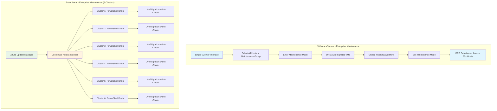

**Enterprise Maintenance Operational Changes:**
- **Coordination Overhead:** Maintenance operations require PowerShell scripting across 6 independent clusters instead of unified vCenter operations
- **Phased Maintenance Planning:** Enterprise patching cycles must account for cluster dependencies and cross-cluster application architectures
- **Resource Capacity Planning:** Each cluster requires independent capacity planning during maintenance windows since VMs cannot migrate across cluster boundaries

**Enterprise Recovery Time and Fault Tolerance Analysis:** At 2,500+ VM scale, understanding recovery characteristics becomes critical for business continuity planning:

### Enterprise High Availability Reality Check

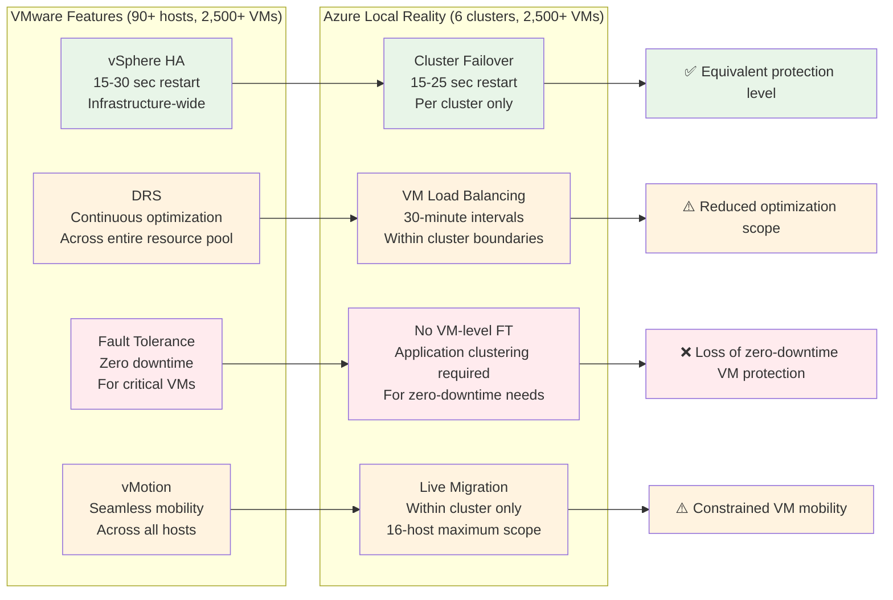

**Enterprise Protection Method Analysis:**

| Protection Method | VMware Implementation (Enterprise Scale) | Azure Local Implementation | Business Impact at Scale |
|-------------------|------------------------------------------|----------------------------|--------------------------|
| **VM Restart Protection** | vSphere HA across 90+ hosts with unified policies | 6 independent cluster failover policies | Equivalent protection but distributed management |
| **Zero Downtime Protection** | Fault Tolerance for critical VMs | Not available - requires application clustering | Critical VMs lose zero-downtime capability |
| **Resource Optimization** | DRS across entire 90+ host infrastructure | Per-cluster VM load balancing (30-min cycles) | Reduced resource optimization effectiveness |
| **Planned Maintenance** | vMotion across entire datacenter | Live Migration within 16-host boundaries | Maintenance procedures become more complex |

**Enterprise Resource Consumption Impact at Scale:** The architectural differences between VMware FT and Azure Local clustering affect resource utilization planning:

**Enterprise Resource Planning Considerations:**
- **VMware Fault Tolerance Resource Cost:** FT creates duplicate VMs consuming 2x CPU and memory resources for zero-downtime protection across select critical VMs
- **Azure Local Cluster Overhead:** Minimal per-cluster overhead allows higher VM consolidation ratios across your 2,500+ VM infrastructure but without zero-downtime protection
- **Capacity Planning Evolution:** Shift from FT resource reservations to application-level clustering and additional cluster capacity for high-availability requirements

### Enterprise Operational Learning Curve

**Enterprise Team Transition Considerations:** Managing 2,500+ VMs across 6 clusters requires different operational skillsets and procedures compared to unified vCenter management:

**Enterprise Skillset Evolution:**
- **PowerShell Automation:** Operations teams must develop PowerShell expertise for bulk cluster operations that were GUI-based in vCenter
- **Distributed Management:** Shift from single-pane monitoring to Azure Monitor integration across multiple cluster resources
- **Cluster-Aware Applications:** Architecture teams must design applications for cluster boundary constraints rather than datacenter-wide resource mobility

### Enterprise Architecture Summary

This hypothetical but realistic enterprise scenario demonstrates how Azure Local provides equivalent VM-level high availability through Windows Failover Clustering but with fundamental operational differences at scale. The distributed 6-cluster architecture trades vSphere's unified resource management for cloud-integrated hybrid capabilities and more complex operational procedures.

**Critical Enterprise Considerations:**
- **Resource Pool Fragmentation:** Accept 16-node cluster limits instead of 90+ host unified resource pools
- **Maintenance Complexity:** Develop coordinated maintenance procedures across multiple independent clusters  
- **Zero-Downtime Loss:** Plan application-level clustering for workloads that previously relied on VMware Fault Tolerance
- **Operational Tool Evolution:** Transition from vCenter GUI workflows to PowerShell and Azure Monitor-based management

**Bottom Line:** Azure Local provides equivalent VM-level high availability through Windows Failover Clustering for the majority of enterprise VMware customers who used vSphere HA. However, the operational paradigm shifts from centralized management across 90+ hosts to distributed cluster management with cloud integration. Customers who relied on VMware Fault Tolerance lose zero-downtime VM-level protection, while live migration capabilities remain equivalent but constrained to cluster boundaries. Enterprise success depends on adapting operational procedures to distributed cluster management and developing PowerShell automation for scale operations.

### What You Lose and Gain in High Availability

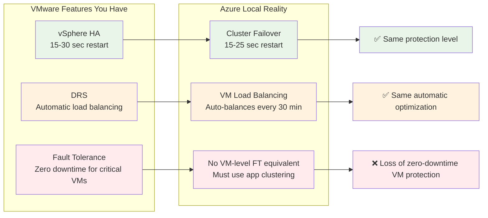

| Protection Method | VMware Implementation | Azure Local Implementation | Business Impact |
|-------------------|----------------------|---------------------------|-----------------|
| **VM Restart (Most Common)** | vSphere HA (15-30 seconds) | Cluster Failover (15-25 seconds) | Equivalent brief outage |
| **Zero Downtime (Niche)** | Fault Tolerance (0 seconds) | Not available - use application clustering | FT users lose zero-downtime capability |
| **Live Migration** | vMotion (0 seconds) | Live Migration (0 seconds) | Equivalent planned maintenance capability |

**Resource Consumption Impact:** VMware Fault Tolerance creates a duplicate VM running in lockstep, consuming additional CPU and memory resources for zero-downtime protection. Azure Local cluster failover uses minimal cluster overhead, allowing higher VM consolidation ratios but with brief restart windows instead of zero-downtime protection.

**Operational Learning Curve:** The team should be prepared for a shift from vCenter's unified interface to Windows Admin Center and PowerShell-based cluster management for advanced scenarios. Azure Monitor Insights helps monitor new cluster metrics, replacing vSphere's centralized monitoring approach.

**Bottom Line:** Azure Local provides equivalent VM-level high availability through Windows Failover Clustering for the majority of VMware customers who used vSphere HA. However, customers who relied on VMware Fault Tolerance lose zero-downtime VM-level protection. Live migration capabilities remain equivalent for planned maintenance scenarios, and Azure Local's VM load balancing provides similar automatic optimization to VMware DRS with 30-minute intervals.

[Back to Table of Contents](#table-of-contents)

---

## Section 5 - Storage Architecture

Your VMware storage architecture—whether external SAN, vSAN, or hybrid—transitions to Storage Spaces Direct with fundamental changes in storage presentation, management, and operational workflows. Using our hypothetical enterprise example of 90+ hosts managing 2,500+ VMs across 6 clusters, this section illustrates how storage architectures evolve from diverse VMware approaches to standardized S2D implementations.

Understanding how traditional storage concepts translate to Azure Local helps you plan storage performance, capacity, and infrastructure changes regardless of your current VMware storage approach.

### Enterprise Storage Experience Translation at Scale

**Core Enterprise Storage Reality:** Regardless of your current VMware storage setup, Azure Local uses Storage Spaces Direct (S2D) exclusively. For our 2,500+ VM environment, this means your storage management experience changes significantly, but the fundamental storage capabilities remain equivalent. The key difference is architectural standardization rather than storage technology variety.

**Enterprise Storage Management Experience Changes:**

| Current VMware Storage (90+ hosts) | Azure Local Approach (6 clusters) | Migration Complexity | Enterprise Operational Impact |
|-------------------------------------|-----------------------------------|---------------------|------------------------------|
| **External FC/iSCSI SAN** | 6 separate S2D storage pools | High - Architecture change | Complete storage workflow transformation across infrastructure |
| **vSAN HCI** | 6 separate S2D storage pools | Medium - Concept translation | Management tool evolution and policy distribution |
| **Hybrid (SAN + vSAN)** | 6 separate S2D storage pools | High - Consolidation required | Unified storage management approach across all clusters |
| **NFS/NAS** | 6 separate S2D storage pools | High - Protocol change | File service architecture redesign and distribution |

### Enterprise External SAN → Storage Spaces Direct Transformation

**Traditional SAN Architecture Changes at Enterprise Scale:** Most VMware customers using external SAN arrays face the most significant storage architecture changes when moving to Azure Local, particularly at enterprise scale.

**Enterprise Storage Infrastructure Transformation:**

| Traditional SAN Approach (Enterprise) | Azure Local S2D Approach (6 Clusters) | Infrastructure Change Impact |
|---------------------------------------|----------------------------------------|----------------------------|
| **Centralized Storage Arrays** | 6 distributed server-based storage pools | Hardware procurement shifts from centralized arrays to distributed server storage |
| **Unified FC/iSCSI Network** | 6 separate Ethernet-based storage networks | Network infrastructure distributed across cluster boundaries |
| **Centralized LUN Management** | 6 independent CSV management systems | Storage presentation distributed across clusters |
| **Single Array Management Console** | PowerShell/WAC across 6 clusters | Management tool complexity multiplies with cluster count |
| **Centralized RAID Controllers** | 6 separate software-defined resilience pools | Hardware dependency reduction but management distribution |

**Enterprise Operational Workflow Changes at Scale:**
- **LUN Creation:** Single array-based LUN carving → 6 separate S2D volume creation processes via PowerShell/WAC
- **Storage Monitoring:** Unified array management console → Windows Storage Health Service across 6 clusters
- **Performance Tuning:** Centralized array cache/tier policies → S2D cache and resiliency policies per cluster
- **Capacity Planning:** Single array expansion → Node addition decisions across 6 clusters for optimal resource distribution

**Enterprise Storage Team Impact:** At enterprise scale, your storage teams transition from managing multiple SAN arrays to standardizing on S2D across 6 clusters, eliminating dozens of array management interfaces but requiring distributed storage pool management expertise.

### Enterprise vSAN → Storage Spaces Direct Architectural Translation

**For enterprise customers currently using vSAN:** The transition involves conceptual translation rather than fundamental architecture change, but the distributed management approach differs significantly at scale.

**Enterprise vSAN to S2D Architecture Mapping:**

| Storage Component | Enterprise vSAN (90+ hosts) | Enterprise S2D (6 clusters) | Architecture Impact at Scale |
|-------------------|----------------------------|------------------------------|----------------------------|
| **Storage Pooling** | Single vSAN cluster-wide pool | 6 independent S2D cluster pools | Storage abstraction distributed across cluster boundaries |
| **Data Placement** | Unified vSAN object placement | 6 separate S2D mirror/parity systems | Data placement algorithms distributed per cluster |
| **Cache Tier** | Centralized vSAN cache policy | 6 independent S2D cache configurations | Cache management complexity multiplied across clusters |
| **Capacity Tier** | Unified capacity tier management | 6 separate capacity tier configurations | Capacity planning distributed across cluster architecture |
| **Resiliency** | Global FTT policies | 6 independent mirror/parity configurations | Resiliency policies managed per cluster rather than globally |

**Enterprise vSAN Policy Translation at Scale:** Your existing vSAN storage policies translate to Storage Spaces Direct but must be configured independently across each cluster:

| Workload Type | Enterprise vSAN Policy (90+ hosts) | Enterprise S2D Configuration (6 clusters) | Capacity Planning Impact |
|---------------|-----------------------------------|---------------------------------------------|-------------------------|
| **High Performance** | FTT=1, RAID-1 + All-Flash across infrastructure | Two-way mirror + NVMe cache per cluster | 50% usable capacity across 6 storage pools |
| **Balanced** | FTT=1, RAID-5 + Hybrid across infrastructure | Mirror-accelerated parity per cluster | 66% usable capacity with per-cluster optimization |
| **Capacity Optimized** | FTT=2, RAID-6 + Archive across infrastructure | Dual parity + compression per cluster | 75% usable capacity with distributed management |

### Enterprise Storage Presentation and Management Changes

**Enterprise VMFS vs CSV Architecture:** The fundamental change from VMware's unified VMFS datastore model to distributed Windows Cluster Shared Volumes affects how storage is presented and managed across 2,500+ VMs.

**Enterprise Storage Presentation Comparison:**

| Storage Concept | VMware Approach (Enterprise) | Azure Local Approach (6 Clusters) | Operational Difference at Scale |
|-----------------|------------------------------|-------------------------------------|--------------------------------|
| **Storage Abstraction** | Unified VMFS datastores | 6 separate CSV systems | Different file system presentation per cluster |
| **VM Storage Files** | .vmdk on centralized VMFS | .vhdx on distributed NTFS/ReFS | File format changes with distributed management |
| **Storage Policies** | Global vSphere storage policies | 6 independent S2D resiliency settings | Policy management complexity increases with clusters |
| **Thin Provisioning** | Centralized VMFS thin disks | VHDX dynamic expansion per cluster | Equivalent functionality but distributed implementation |
| **Storage vMotion** | Cross-datastore migration globally | CSV live migration within cluster boundaries | Storage mobility constrained to cluster scope |

### Enterprise Performance Characteristics and Planning

**Enterprise Storage Performance Translation:** Understanding performance differences helps with capacity planning and architecture decisions across 2,500+ VM deployments.

| Performance Metric | External SAN (Enterprise) | vSAN All-Flash (90+ hosts) | S2D All-Flash (6 clusters) | Enterprise Planning Consideration |
|--------------------|----------------------------|----------------------------|-----------------------------|----------------------------------|
| **Aggregate Throughput** | FC/iSCSI fabric limited | 2GB/s+ per host (unified) | 3GB/s+ per host (distributed) | Higher per-cluster bandwidth but no cross-cluster aggregation |
| **Storage Scalability** | Array capacity limits | 96 hosts maximum unified pool | 16 hosts per cluster pool | Different scale-out approaches across cluster boundaries |
| **Management Complexity** | Centralized array tools | Single vSAN management | 6 separate cluster management | Management overhead increases with cluster count |

**Enterprise Management Workflow Changes:** Storage administration transitions from centralized array-specific tools to distributed Windows-native management interfaces.

**Enterprise Storage Operations Evolution:**

| Management Area | Enterprise SAN/vSAN Approach | Azure Local S2D Approach (6 Clusters) | Operational Impact |
|-----------------|-------------------------------|----------------------------------------|-------------------|
| **Health Monitoring** | Centralized array/vSAN monitoring | Storage Health Service across 6 clusters | Monitoring complexity distributed but standardized |
| **Performance Analytics** | Unified performance tools | Storage Performance Monitor per cluster | Performance analysis distributed across cluster boundaries |
| **Capacity Management** | Centralized capacity planning | Independent capacity planning per cluster | Capacity growth decisions require cluster-aware planning |

### Enterprise Storage Transition Planning and Strategy

**Enterprise Migration Planning Approach:** Different VMware storage architectures require different transition strategies and timelines, particularly at 2,500+ VM scale.

**Enterprise External SAN Migration Strategy:**
1. **Infrastructure Assessment:** Evaluate existing SAN capacity, performance, and lifecycle status across entire infrastructure
2. **S2D Sizing:** Plan server hardware to meet current storage performance requirements across 6 clusters
3. **Network Planning:** Design 6 separate Ethernet-based storage networks to replace unified FC/iSCSI infrastructure
4. **Skills Development:** Train storage teams on PowerShell and distributed Windows storage management across clusters
5. **Phased Migration:** Plan data migration from SAN to S2D during coordinated maintenance windows across cluster boundaries

**Enterprise Capacity Planning Evolution:** At enterprise scale, capacity planning changes: instead of expanding SAN arrays, enterprise growth requires adding nodes to existing clusters or deploying additional 16-node clusters, fundamentally changing infrastructure scaling decisions.

### Enterprise Storage Networking and Infrastructure Changes

**Enterprise Network Architecture Evolution:** Storage networking requirements change significantly, especially for external SAN customers managing large infrastructures.

| Network Aspect | Traditional SAN (Enterprise) | vSAN (90+ hosts) | Azure Local S2D (6 clusters) | Enterprise Infrastructure Impact |
|-----------------|------------------------------|-------------------|--------------------------------|--------------------------------|
| **Storage Protocol** | Unified FC/iSCSI | Centralized vSAN network | 6 separate Ethernet SMB3 networks | Protocol simplification but network distribution |
| **Network Isolation** | FC fabric or unified iSCSI VLAN | Centralized vSAN traffic isolation | Storage intent networks per cluster | Network segmentation distributed across clusters |
| **Redundancy** | Dual FC paths or centralized multipath | Unified vSAN network redundancy | NIC teaming or SR-IOV per cluster | Redundancy planning distributed across cluster boundaries |
| **Bandwidth Planning** | Centralized FC/iSCSI planning | Unified 10GbE+ for vSAN | 25GbE+ recommended per cluster | Bandwidth planning requires per-cluster optimization |

### Enterprise Architecture Summary

This hypothetical but realistic enterprise scenario illustrates how Storage Spaces Direct represents a fundamental shift from diverse VMware storage approaches to a unified but distributed software-defined storage model. At enterprise scale, external SAN customers face the most significant architectural changes, while vSAN customers experience management and tooling distribution across cluster boundaries.

**Critical Enterprise Storage Considerations:**
- **Management Distribution:** Accept distributed storage management across 6 clusters instead of centralized array/vSAN control
- **Capacity Planning Evolution:** Shift from centralized expansion to cluster-aware growth strategies  
- **Performance Optimization:** Plan storage performance within cluster boundaries rather than infrastructure-wide optimization
- **Operational Complexity:** Develop expertise in distributed storage management while gaining simplified per-cluster operations

**Storage Management Experience Changes:**

| Current VMware Storage | Azure Local Approach | Migration Complexity | Operational Impact |
|------------------------|----------------------|---------------------|-------------------|
| **External FC/iSCSI SAN** | Storage Spaces Direct (S2D) | High - Architecture change | Complete storage workflow transformation |
| **vSAN HCI** | Storage Spaces Direct (S2D) | Medium - Concept translation | Management tool and policy changes |
| **Hybrid (SAN + vSAN)** | Storage Spaces Direct (S2D) | High - Consolidation required | Unified storage management approach |
| **NFS/NAS** | Storage Spaces Direct (S2D) | High - Protocol change | File service architecture redesign |

### External SAN → Storage Spaces Direct Transformation

**Traditional SAN Architecture Changes:** Most VMware customers using external SAN arrays face the most significant storage architecture changes when moving to Azure Local.

**Storage Infrastructure Transformation:**

| Traditional SAN Approach | Azure Local S2D Approach | Infrastructure Change |
|---------------------------|---------------------------|---------------------|
| **Storage Array** | Server-based storage pool | Hardware procurement shifts from arrays to servers |
| **FC/iSCSI Network** | Ethernet-based storage network | Network infrastructure simplification |
| **LUN Presentation** | Cluster Shared Volumes (CSV) | Storage presentation method changes |
| **Array Management** | PowerShell/WAC storage management | Management tool and skillset evolution |
| **RAID Controllers** | Software-defined resilience | Hardware dependency reduction |

**Operational Workflow Changes:**
- **LUN Creation:** Array-based LUN carving → S2D volume creation via PowerShell/WAC
- **Storage Monitoring:** Array management consoles → Windows Storage Health Service
- **Performance Tuning:** Array cache/tier policies → S2D cache and resiliency policies
- **Capacity Planning:** Array expansion → Node addition for capacity/performance scaling

**Converged Mode Option:** Azure Local supports converged mode where you can continue using existing SAN arrays as Cluster Shared Volumes, but you lose cloud integration benefits and most customers migrate to S2D for operational simplification.

### vSAN → Storage Spaces Direct Architectural Translation

**For customers currently using vSAN:** The transition involves conceptual translation rather than fundamental architecture change, as both are software-defined storage approaches.

| Storage Component | vSAN | Storage Spaces Direct | Architecture Impact |
|-------------------|------|----------------------|-------------------|
| **Storage Pooling** | vSAN cluster-wide storage pool | S2D cluster-shared volumes | Similar abstraction layer |
| **Data Placement** | vSAN object placement | S2D mirror/parity placement | Different algorithms, same resilience |
| **Cache Tier** | vSAN read/write cache | S2D cache with NVMe/SSD | Equivalent performance acceleration |
| **Capacity Tier** | vSAN capacity drives | S2D capacity drives | Standard HDD/SSD support |
| **Resiliency** | FTT policies (RAID-1/5/6) | Mirror/parity configurations | Different terminology, same protection |

**vSAN Policy Translation:** Your existing vSAN storage policies directly translate to Storage Spaces Direct resiliency configurations with equivalent or better capacity efficiency:

| Workload Type | vSAN Policy | S2D Configuration | Capacity Efficiency |
|---------------|-------------|-------------------|-------------------|
| **High Performance** | FTT=1, RAID-1 + All-Flash | Two-way mirror + NVMe cache | 50% usable capacity |
| **Balanced** | FTT=1, RAID-5 + Hybrid | Mirror-accelerated parity | 66% usable capacity |
| **Capacity Optimized** | FTT=2, RAID-6 + Archive | Dual parity + compression | 75% usable capacity |

### Storage Presentation and Management Changes

**VMFS vs CSV Architecture:** The fundamental change from VMware's VMFS datastore model to Windows Cluster Shared Volumes affects how storage is presented and managed.

**Storage Presentation Comparison:**

| Storage Concept | VMware Approach | Azure Local Approach | Operational Difference |
|-----------------|-----------------|---------------------|----------------------|
| **Storage Abstraction** | VMFS datastores | Cluster Shared Volumes (CSV) | Different file system and presentation |
| **VM Storage Files** | .vmdk on VMFS | .vhdx on NTFS/ReFS | Different file formats and management |
| **Storage Policies** | vSphere storage policies | S2D resiliency settings | Different terminology, similar concepts |
| **Thin Provisioning** | VMFS thin disks | VHDX dynamically expanding | Equivalent functionality, different implementation |
| **Storage vMotion** | Cross-datastore migration | CSV live migration | Similar capability, different underlying mechanism |

### Performance Characteristics and Planning

**Storage Performance Translation:** Understanding performance differences helps with capacity planning and architecture decisions.

| Performance Metric | External SAN | vSAN All-Flash | S2D All-Flash | Planning Consideration |
|--------------------|---------------|----------------|---------------|----------------------|
| **Throughput** | FC/iSCSI limited | 2GB/s+ per host | 3GB/s+ per host | Higher bandwidth potential with S2D |
| **Scalability** | Array capacity limits | 96 hosts max | 16 hosts per cluster | Different scale-out approaches |
**Management Workflow Changes:** Storage administration transitions from array-specific tools to Windows-native management interfaces.

| **Health Monitoring** | Array monitoring tools | vSAN health service | Storage Health Service | Windows event log integration |
| **Performance Analytics** | Array performance tools | vSAN performance | Storage Performance Monitor | Native Windows performance counters |
### Storage Transition Planning and Strategy

**Migration Planning Approach:** Different VMware storage architectures require different transition strategies and timelines.

**External SAN Migration Strategy:**
1. **Infrastructure Assessment:** Evaluate existing SAN capacity, performance, and lifecycle status
2. **S2D Sizing:** Plan server hardware to meet current storage performance and capacity requirements  
3. **Network Planning:** Design Ethernet-based storage network to replace FC/iSCSI infrastructure
4. **Skills Development:** Train storage teams on PowerShell and Windows storage management
5. **Phased Migration:** Plan data migration from SAN to S2D during maintenance windows

**vSAN Migration Strategy:**
1. **Policy Mapping:** Document existing vSAN storage policies and map to S2D resiliency settings
4. **Tool Integration:** Reconfigure monitoring and automation tools for S2D management

### Storage Networking and Infrastructure Changes

**Network Architecture Evolution:** Storage networking requirements change significantly, especially for external SAN customers.

| Network Aspect | Traditional SAN | vSAN | Azure Local S2D |
|-----------------|-----------------|------|-----------------|
| **Storage Protocol** | FC/iSCSI | vSAN network | Ethernet SMB3 |
| **Network Isolation** | FC fabric or iSCSI VLAN | vSAN traffic isolation | Storage intent networks |
| **Redundancy** | Dual FC paths or iSCSI multipath | vSAN network redundancy | NIC teaming or SR-IOV |
| **Bandwidth Planning** | FC/iSCSI link speeds | 10GbE+ for vSAN | 25GbE+ recommended for S2D |

### Bottom Line

Storage Spaces Direct represents a fundamental shift from diverse VMware storage approaches to a unified software-defined storage model. External SAN customers face the most significant architectural changes, while vSAN customers experience more of a management and tooling transition. Both paths lead to simplified storage management with Windows-native tools and often superior performance characteristics.

> **Key Takeaway:** Whether coming from external SAN or vSAN, Azure Local consolidates storage management into a single S2D approach that eliminates storage array dependencies while providing equivalent or better performance through software-defined storage.

[Back to Table of Contents](#table-of-contents)

---

## Section 6 - Backup & Data Protection

Your existing backup solutions transition from VMware VADP framework to Hyper-V VSS integration with equivalent backup capabilities but important restore behavior differences for Azure Local Arc-enabled VMs. Using our hypothetical enterprise example of 90+ hosts managing 2,500+ VMs across 6 clusters, this section illustrates how backup orchestration and data protection strategies adapt to distributed cluster architecture and cloud-integrated management.

**Platform-Agnostic Backup Reality:** Backup is fundamentally a third-party solution challenge, not a platform-specific one. However, the integration methods, APIs, and critically, the restore behaviors change significantly between VMware and Azure Local environments, particularly at enterprise scale.

### Enterprise Backup Integration Architecture Changes

**Enterprise VMware vs Azure Local Backup Integration:** Your backup vendor adapts from VMware's VADP APIs to Windows VSS integration, but backup functionality remains equivalent with better Windows application integration across your 2,500+ VM infrastructure.

**Enterprise Backup Architecture Evolution:**

| Backup Component | VMware Integration (2,500+ VMs) | Azure Local Integration (6 Clusters) | Enterprise Operational Impact |
|------------------|--------------------------------|-------------------------------------|------------------------------|
| **Backup APIs** | VADP centralized through vCenter | VSS integration per cluster + cloud APIs | Different integration methods but equivalent scale functionality |
| **Change Tracking** | CBT across unified infrastructure | RCT per cluster with better reliability | More reliable change tracking but distributed management |
| **Snapshot Method** | vSphere snapshots via centralized VADP | Hyper-V checkpoints via distributed VSS | Native Windows integration per cluster |
| **Application Quiescing** | VMware Tools VSS trigger across infrastructure | Hyper-V Integration Services VSS per cluster | Superior Windows application integration at scale |

### Enterprise Third-Party Backup Vendor Compatibility

**Major Backup Vendor Support at Enterprise Scale:** All major backup vendors support Hyper-V/Azure Local with equivalent functionality to their VMware implementations, but deployment patterns change:

**Enterprise Backup Deployment Evolution:**
- **Veeam:** Full Azure Stack HCI support with Hyper-V integration modules - deployment shifts from vCenter integration to distributed backup proxy deployment across 6 clusters
- **Commvault:** Dedicated Hyper-V protection capabilities with Azure Local compatibility - MediaAgent deployment adapted for cluster-aware backup operations  
- **Rubrik:** Native Azure Stack HCI integration with cloud-first architecture - cluster integration provides better cloud backup coordination than VMware deployments
- **Veritas NetBackup:** Comprehensive Hyper-V support for Azure Local environments - backup policies distributed across cluster boundaries
- **Other Enterprise Vendors:** Similar Hyper-V support across major backup solutions with cluster-aware deployment patterns

**Enterprise Backup Process Equivalency at Scale:** While the underlying APIs differ, backup functionality remains equivalent across 2,500+ VM deployments:
- **Application-consistent backups** through distributed VSS integration with superior reliability
- **Incremental backup capabilities** via Resilient Change Tracking across all clusters  
- **File-level restore capabilities** from VM backups with equivalent performance
- **Cross-platform restore options** for disaster recovery scenarios across cluster boundaries

### Enterprise Backup Orchestration Changes

**Enterprise Backup Management Evolution:** Managing 2,500+ VM backup jobs shifts from vCenter integration to distributed backup agent deployment across 6 clusters, requiring different orchestration approaches:

**Enterprise Backup Orchestration Comparison:**

| Orchestration Aspect | VMware vCenter (Unified) | Azure Local (6 Clusters) | Enterprise Operational Impact |
|----------------------|---------------------------|---------------------------|------------------------------|
| **Backup Job Management** | Centralized through vCenter | Distributed across clusters + Azure integration | Job management complexity increases but gains cloud coordination |
| **Policy Distribution** | Global policies via vCenter | Per-cluster policies + Azure Policy integration | Policy management distributed but standardized |
| **Backup Agent Deployment** | vCenter-coordinated agent updates | Cluster-aware agent deployment + Azure Arc management | Agent management becomes distributed but cloud-integrated |
| **Backup Reporting** | Unified vCenter reporting | Distributed cluster reporting + Azure Monitor integration | Reporting shifts from centralized to cloud-integrated dashboards |

**Enterprise Scale VSS Integration Benefits:** At scale, the VSS integration provides more reliable application quiescing than VMware Tools, significantly reducing backup consistency issues across large SQL Server, Exchange, and SharePoint deployments typical in 2,500+ VM environments.

### CRITICAL ENTERPRISE RESTORE BEHAVIOR DIFFERENCES

**Azure Local VM Restore Limitations at Scale:** This is the most significant difference that affects operational procedures - most restore scenarios lose Azure Arc integration and revert VMs to standard Hyper-V management, creating operational complexity at enterprise scale.

### Enterprise Azure Local VM Restore Behavior Matrix

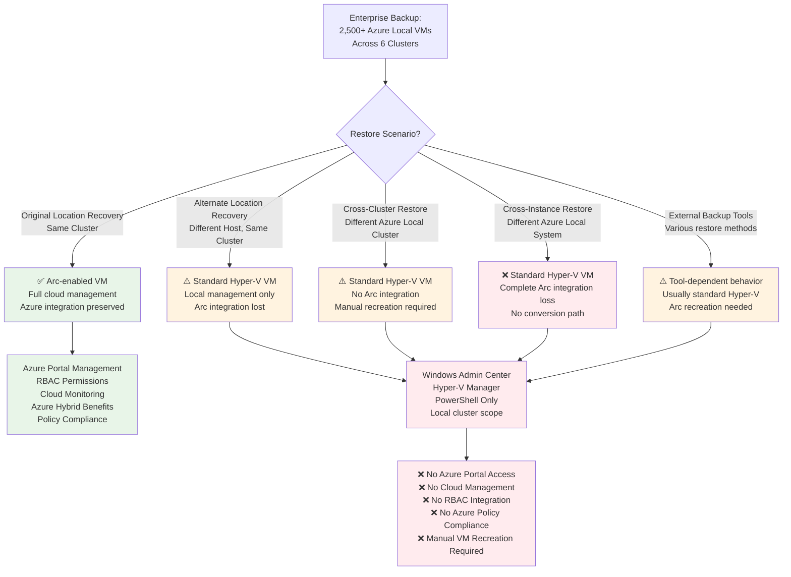

**Enterprise Restore Behavior Reality at Scale:** Understanding these limitations is critical for backup strategy planning and operational expectations across 2,500+ VM deployments:

| Restore Scenario | Expected Behavior (Enterprise) | Actual Behavior | Business Impact at Scale |
|------------------|--------------------------------|-----------------|--------------------------|
| **Original Location Restore** | Restore as Arc-enabled VM | **Restores as Arc-enabled VM** | Preserves cloud management for normal restore operations |
| **Cross-Cluster Restore** | Azure Local VM on different cluster | **Hyper-V VM without Arc integration** | Significant operational impact - loses cloud management across cluster boundaries |
| **Disaster Recovery Scenarios** | Azure Local VMs in DR site | **Standard Hyper-V VMs requiring manual recreation** | Major operational overhead during disaster recovery |
| **External Backup/DR Tools** | Varies by tool and configuration | **Typically Hyper-V VM only** | Most enterprise backup solutions lose Arc integration |

**Enterprise-Scale Operational Implications:**
1. **Azure Portal Management Loss at Scale:** Restored VMs (except original location restores) lose Azure portal visibility across your 6-cluster infrastructure
2. **Resource Bridge Registration Loss:** VMs restored across cluster boundaries lose connection to Azure Arc resource bridge registration
3. **Enterprise Azure Policy Compliance:** Restored VMs fall out of Azure policy and governance frameworks affecting compliance reporting
4. **Azure Monitoring Integration Loss:** Loss of Azure Monitor integration and cloud-based logging across enterprise monitoring infrastructure
5. **No Re-Arc Conversion at Scale:** Cannot convert restored Hyper-V VMs back to Arc-enabled VMs, requiring manual recreation across distributed infrastructure
6. **Manual Recreation Overhead:** Must create new Arc-enabled VMs and migrate data to restore full cloud management functionality - significant operational overhead at 2,500+ VM scale

### Enterprise Backup Strategy Recommendations

**Enterprise Mixed VM Environment Planning:** At 2,500+ VM scale, backup strategy must account for Arc integration preservation requirements:

**Enterprise VM Backup Strategy Matrix:**
- **Standard Hyper-V VMs:** Full backup/restore capability with no Arc limitations - suitable for development and test environments
- **Arc-enabled VMs (Production):** Backup works normally, but plan for Hyper-V-only recovery and Arc recreation workflows
- **Critical Azure Local VMs:** Consider application-level backup/recovery strategies to maintain Arc integration for mission-critical workloads
- **Cross-Cluster Applications:** Architect application-level backup solutions that don't depend on VM-level Arc integration

**Enterprise Operational Procedures at Scale:**
- **Document Azure Local VM Dependencies:** Create enterprise inventory of which VMs require Azure Arc integration for operational compliance
- **Test Restore Procedures at Scale:** Validate recovery workflows and Azure Local VM recreation processes across 6-cluster architecture  
- **Azure Resource Automation:** Maintain Infrastructure-as-Code templates to recreate Azure Local VM configurations across cluster boundaries
- **Hybrid Backup Approach:** Implement guest-level backup for critical Azure Local VMs to avoid Arc integration loss during recovery operations

### Enterprise Azure Integration Benefits

**Enterprise Hybrid Backup Capabilities:** Azure Local provides enhanced cloud integration compared to traditional VMware environments, particularly valuable at enterprise scale:

**Enterprise Cloud Integration Advantages:**
- **Azure cloud storage targets** for offsite backup without additional infrastructure - significant cost savings compared to traditional VMware DR sites
- **Cross-region replication** capabilities through Azure's global infrastructure - superior geographic distribution than traditional VMware DR approaches
- **Integrated monitoring** through Azure Monitor for backup job visibility across 6-cluster infrastructure - unified monitoring superior to traditional VMware monitoring
- **Cost optimization** through Azure storage tiers and lifecycle management - operational cost advantages over traditional VMware backup infrastructure

### Enterprise Architecture Summary

This hypothetical but realistic enterprise scenario demonstrates how backup processes largely remain equivalent with superior vendor support, but restore behavior differences create significant operational considerations at scale. The critical challenge is planning for Azure Arc integration loss during cross-cluster restore operations across your 6-cluster infrastructure.

**Critical Enterprise Backup Considerations:**
- **Restore Planning:** Develop procedures for Arc integration loss during cross-cluster restores
- **Automation Investment:** Create Infrastructure-as-Code templates for Arc-enabled VM recreation
- **Backup Strategy Distribution:** Plan backup solutions that account for cluster boundary limitations
- **Cloud Integration Advantages:** Leverage Azure's superior backup integration compared to traditional VMware environments

### Bottom Line

While backup processes largely remain the same with equivalent and often superior vendor support, the critical difference is restore behavior for Arc-enabled VMs at enterprise scale. Plan for Azure Local VMs to restore as standard Hyper-V VMs across cluster boundaries and develop Infrastructure-as-Code procedures to handle the loss of Azure Arc integration during recovery scenarios. The operational complexity increases at enterprise scale, but the superior cloud integration and cost advantages often justify the procedural changes compared to traditional VMware backup infrastructure.

> **Key Enterprise Takeaway:** Backup vendors provide equivalent functionality with superior Windows application integration, but enterprise restore operations require careful planning for Arc integration preservation. Develop Infrastructure-as-Code approaches for VM recreation and leverage Azure's superior cloud backup integration to offset the operational complexity of distributed cluster restore procedures.

### Backup Integration Architecture Changes

**VMware vs Azure Local Backup Integration:** Your backup vendor adapts from VMware's VADP APIs to Windows VSS integration, but backup functionality remains equivalent with better Windows application integration.

| Backup Component | VMware Integration | Azure Local Integration | Operational Impact |
|------------------|--------------------|-----------------------|-------------------|
| **Backup APIs** | VADP (vStorage APIs for Data Protection) | VSS (Volume Shadow Copy Service) + WMI | Different integration methods, same functionality |
| **Change Tracking** | CBT (Changed Block Tracking) | RCT (Resilient Change Tracking) | More reliable change tracking with RCT |
| **Snapshot Method** | vSphere snapshots via VADP | Hyper-V checkpoints via VSS | Native Windows integration |
| **Application Quiescing** | VMware Tools VSS trigger | Hyper-V Integration Services VSS | More reliable Windows application integration |

### Third-Party Backup Vendor Compatibility

**Major Backup Vendor Support:** All major backup vendors support Hyper-V/Azure Local with equivalent functionality to their VMware implementations:

- **Veeam:** Full Azure Stack HCI support with Hyper-V integration modules
- **Commvault:** Dedicated Hyper-V protection capabilities with Azure Local compatibility
- **Rubrik:** Native Azure Stack HCI integration with cloud-first architecture
- **Veritas NetBackup:** Comprehensive Hyper-V support for Azure Local environments
- **Other Enterprise Vendors:** Similar Hyper-V support across major backup solutions

**Backup Process Equivalency:** While the underlying APIs differ, backup functionality remains equivalent:
- **Application-consistent backups** through VSS integration
- **Incremental backup capabilities** via Resilient Change Tracking
- **File-level restore capabilities** from VM backups
- **Cross-platform restore options** for disaster recovery scenarios

### Enterprise Backup Solutions

**Backup Solution Architecture:** Third-party backup vendors integrate with Azure Local through Hyper-V VSS for application-consistent VM protection:

### CRITICAL RESTORE BEHAVIOR DIFFERENCES

**Azure Local VM Restore Limitations:** This is the most significant difference that affects operational procedures - most restore scenarios lose Azure Arc integration and revert VMs to standard Hyper-V management.

### Azure Local VM Restore Behavior Matrix

```mermaid
flowchart TD
    A[Azure Local VM Backup] --> B{Restore Scenario?}
    
    B -->|Original Location Recovery| C[✅ Arc-enabled VM<br/>Full cloud management]
    B -->|Alternate Location Recovery| D[⚠️ Standard Hyper-V VM<br/>Local management only]
    B -->|Cross-Instance Restore| E[⚠️ Standard Hyper-V VM<br/>No Arc integration]
    B -->|External Backup Tools| F[⚠️ Standard Hyper-V VM<br/>Tool-dependent behavior]
    
    C --> G[Azure Portal Management<br/>RBAC Permissions<br/>Cloud Monitoring<br/>Azure Hybrid Benefits]
    
    D --> H[Windows Admin Center<br/>Hyper-V Manager<br/>PowerShell Only]
    E --> H
    F --> H
    
    H --> I[❌ No Azure Portal Access<br/>❌ No Cloud Management<br/>❌ No RBAC Integration<br/>❌ Manual Recreation Required]
    
    style C fill:#e8f5e8
    style G fill:#e8f5e8
    style D fill:#fff3e0
    style E fill:#fff3e0
    style F fill:#fff3e0
    style H fill:#ffebee
    style I fill:#ffebee
```

**Restore Behavior Reality:** Understanding these limitations is critical for backup strategy planning and operational expectations.

| Restore Scenario | Expected Behavior | Actual Behavior | Business Impact |
|------------------|-------------------|-----------------|-----------------|
| **Original Location Restore** | Restore as Arc-enabled VM | **Restores as Arc-enabled VM** | Preserves Azure Arc integration via Hyper-V VSS |
| **Alternate Location Restore** | Restore as Arc-enabled VM | **Restores as standard Hyper-V VM** | Loss of Azure Arc integration and cloud management |
| **Cross-Instance Restore** | Azure Local VM on different cluster | **Hyper-V VM without Arc integration** | Complete loss of Azure portal management |
| **External Backup/DR Tools** | Varies by tool and method | **Typically Hyper-V VM only** | Arc identity depends on restoration method and target system |

**Microsoft Documentation Quote:**
> *"There's limited support for Alternate Location Recovery (ALR) for Azure Local VMs. The VM is recovered as a Hyper-V VM, instead of an Azure Local VM. Currently, conversion of Hyper-V VMs to Azure Local VMs isn't supported once you create them."*

> *"When a Trusted launch VM is successfully restored to a different Azure Local instance, the VM can no longer be managed via the Azure Arc control plane, but it can be managed using local VM management tools."*

**Critical Operational Implications:**
1. **Azure Portal Management Loss:** Restored VMs (except original location restores) lose Azure portal visibility and management capabilities
2. **Resource Bridge Registration Loss:** VMs restored outside the original instance or created via external tools lose connection to Azure Arc resource bridge
3. **Azure Policy Compliance:** Restored VMs fall out of Azure policy and governance frameworks  
4. **Azure Monitoring Integration:** Loss of Azure Monitor integration and cloud-based logging
5. **No Re-Arc Conversion:** Cannot convert restored Hyper-V VMs back to Arc-enabled VMs after restore
6. **Manual Recreation Required:** Must create new Arc-enabled VMs and migrate data to restore full cloud management functionality

### Backup Strategy Recommendations

**Mixed VM Environment Planning:**
- **Standard Hyper-V VMs:** Full backup/restore capability with no limitations
- **Arc-enabled VMs:** Backup works normally, but plan for Hyper-V-only recovery
- **Critical Azure Local VMs:** Consider application-level backup/recovery to maintain Arc integration

**Operational Procedures:**
- **Document Azure Local VM Dependencies:** Identify which VMs require Azure Arc integration
- **Test Restore Procedures:** Validate recovery workflows and Azure Local VM recreation processes
- **Azure Resource Inventory:** Maintain automation scripts to recreate Azure Local VM configurations
- **Hybrid Approach:** Use guest-level backup for critical Azure Local VMs to avoid Arc integration loss

### Azure Integration Benefits

**Hybrid Backup Capabilities:** Azure Local provides enhanced cloud integration compared to traditional VMware environments:
- **Azure cloud storage targets** for offsite backup without additional configuration
- **Cross-region replication** capabilities through Azure's global infrastructure
- **Integrated monitoring** through Azure Monitor for backup job visibility
- **Cost optimization** through Azure storage tiers and lifecycle management

**Bottom Line:** While backup processes largely remain the same with equivalent vendor support, the critical difference is restore behavior for Arc-enabled VMs. Plan for Azure Local VMs to restore as standard Hyper-V VMs and develop procedures to handle the loss of Azure Arc integration during recovery scenarios.

[Back to Table of Contents](#table-of-contents)

---

## Section 7 - Disaster Recovery & Site Failover

## Overview

VMware customers use diverse disaster recovery solutions beyond just Site Recovery Manager. This section examines how various VMware DR tools translate to Azure Local disaster recovery options, including Storage Replica, Azure Site Recovery, and third-party solutions that support both platforms.

**Enterprise Context:** Disaster recovery planning across your 2,500+ VMs and 6 Azure Local clusters requires different orchestration than VMware Site Recovery Manager's site-level failover. Where SRM orchestrates entire site failover across unified vCenter inventory, Azure Local DR coordination occurs at individual cluster levels. Your enterprise DR strategy must account for cross-cluster VM dependencies, distributed storage replica relationships, and coordinated failover sequencing across multiple independent Azure Local clusters rather than SRM's unified site failover paradigm.

## VMware DR Ecosystem vs Azure Local Options

### VMware Customer DR Tool Landscape

VMware customers typically implement DR using one or more of these solutions:

```text
VMware DR Solutions Used by Customers:
┌─────────────────────┐  ┌─────────────────────┐  ┌─────────────────────┐
│ VMware Native       │  │ Third-Party Apps    │  │ Storage-Based       │
├─────────────────────┤  ├─────────────────────┤  ├─────────────────────┤
│ • Site Recovery     │  │ • Zerto             │  │ • Array Replication │
│   Manager (SRM)     │  │ • Veeam DR          │  │ • vSAN Replication  │
│ • vSphere           │  │ • Commvault DR      │  │ • VMFS Mirroring    │
│   Replication       │  │ • Veritas DR        │  │                     │
│ • vMotion (planned) │  │ • Rubrik DR         │  │                     │
└─────────────────────┘  └─────────────────────┘  └─────────────────────┘
```

### Azure Local DR Solution Portfolio

Azure Local provides multiple disaster recovery options to address different customer scenarios:

### Azure Local Disaster Recovery Architecture Options

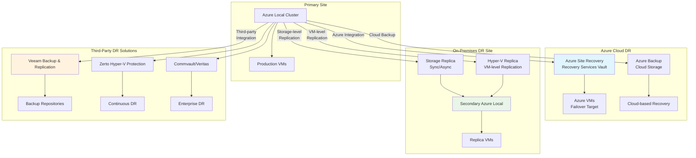

```text
Azure Local DR Options:
┌─────────────────────┐  ┌─────────────────────┐  ┌─────────────────────┐
│ Azure Integration   │  │ On-Premises DR      │  │ Third-Party Apps    │
├─────────────────────┤  ├─────────────────────┤  ├─────────────────────┤
│ • Azure Site        │  │ • Storage Replica   │  │ • Veeam B&R        │
│   Recovery (ASR)    │  │   (Sync/Async)      │  │ • Zerto (Hyper-V)   │
│ • Azure Local VM    │  │ • Hyper-V Replica   │  │ • Commvault DR      │
│   Backup            │  │ • Cluster-aware     │  │ • Veritas DR        │
│ • Third-party Backup│  │   Updating          │  │ • Rubrik DR         │
└─────────────────────┘  └─────────────────────┘  └─────────────────────┘
```

## Storage Replica for Azure Local Disaster Recovery

### Storage Replica Overview

Storage Replica provides synchronous and asynchronous replication for Azure Local clusters:

```text
Storage Replica Architecture:
┌─────────────────────────────────────┐    ┌─────────────────────────────────────┐
│         Primary Site                │    │       Secondary Site                │
│  ┌─────────────────────────────────┐│    │┌─────────────────────────────────┐  │
│  │     Azure Local Cluster         ││    ││     Azure Local Cluster         │  │
│  │  ┌─────────────────────────┐    ││    ││  ┌─────────────────────────┐    │  │
│  │  │      Node 1             │    ││    ││  │      Node 1             │    │  │
│  │  │  ┌─────────────────┐    │    ││    ││  │  ┌─────────────────┐    │    │  │
│  │  │  │ Storage Spaces  │    │    ││◄──►││  │  │ Storage Spaces  │    │    │  │
│  │  │  │ Direct (S2D)    │    │    ││    ││  │  │ Direct (S2D)    │    │    │  │
│  │  │  └─────────────────┘    │    ││    ││  │  └─────────────────┘    │    │  │
│  │  └─────────────────────────┘    ││    ││  └─────────────────────────┘    │  │
│  │  │      Node 2             │    ││    ││  │      Node 2             │    │  │
│  │  └─────────────────────────┘    ││    ││  └─────────────────────────┘    │  │
│  └─────────────────────────────────┘│    │└─────────────────────────────────┘  │
└─────────────────────────────────────┘    └─────────────────────────────────────┘
              │                                           │
              └─────── Storage Replication Network ───────┘
              (Dedicated high-bandwidth connection)
```

**Storage Replica Capabilities:**

| Feature | Synchronous Mode | Asynchronous Mode |
|---------|------------------|-------------------|
| **RPO** | Zero data loss | Configurable (seconds to hours) |
| **Network Requirements** | High bandwidth, low latency | Standard connectivity |
| **Distance Limitations** | Metropolitan area | Unlimited (internet capable) |
| **Performance Impact** | Write latency increase | Minimal impact |
| **Use Cases** | Mission-critical apps | General workloads |

### Storage Replica vs VMware vSAN Replication

**Comparison Matrix:**

| Aspect | VMware vSAN Replication | Storage Replica |
|--------|------------------------|-----------------|
| **Replication Granularity** | VM-level or policy-based | Volume-level replication |
| **Network Protocol** | vSAN proprietary | SMB 3.1.1 with encryption |
| **Supported Distances** | Limited by latency | Synchronous: <5ms, Async: unlimited |
| **Integration** | Native vCenter management | Windows Admin Center/PowerShell |
| **Licensing** | Included with vSAN Enterprise | Included with Datacenter Edition |

## Azure Site Recovery for Azure Local

### ASR Architecture for Azure Local

Azure Site Recovery provides cloud-based disaster recovery for Azure Local VMs:

```text
Azure Site Recovery Integration:
┌─────────────────────────────────────┐    ┌──────────────────────────────────┐
│           Azure Local               │    │             Azure                │
│  ┌─────────────────────────────────┐│    │┌────────────────────────────────┐│
│  │       Hyper-V Cluster           ││    ││     Recovery Services Vault    ││
│  │  ┌─────────────────────────┐    ││    │└────────────────────────────────┘│
│  │  │   Azure Local VMs       │    ││    │┌────────────────────────────────┐│
│  │  │  ┌─────────────────┐    │    ││    ││      Azure Storage Account     ││
│  │  │  │ Production VMs  │    │    ││    ││    (Replication Target)        ││
│  │  │  └─────────────────┘    │    ││    │└────────────────────────────────┘│
│  │  └─────────────────────────┘    ││    │┌────────────────────────────────┐│
│  │  ┌─────────────────────────┐    ││◄──►││      Azure Virtual Network     ││
│  │  │ Azure Site Recovery     │    ││    ││     (Failover Target)          ││
│  │  │ Provider + Agent        │    ││    │└────────────────────────────────┘│
│  │  └─────────────────────────┘    ││    │┌────────────────────────────────┐│
│  └─────────────────────────────────┘│    ││      Azure Virtual Machines    ││
└─────────────────────────────────────┘    ││    (Active during DR event)    ││
                                           │└────────────────────────────────┘│
                                           └──────────────────────────────────┘
```

**ASR for Azure Local Features:**

| Feature | Description |
|---------|-------------|
| **Agent Deployment** | Recovery Services agent on each Hyper-V host |
| **Replication Frequency** | 30 seconds, 5 minutes, or 15 minutes |
| **Recovery Points** | Up to 24 recovery points retained |
| **Network Integration** | Automatic Azure VNet creation and mapping |
| **Failback Support** | Re-protect and failback from Azure to on-premises |

### ASR vs VMware Site Recovery Manager

**Operational Differences:**

| Operation | VMware SRM | Azure Site Recovery |
|-----------|------------|-------------------|
| **DR Target** | On-premises secondary site | Azure cloud region |
| **Infrastructure Requirements** | Secondary datacenter hardware | Azure subscription only |
| **Replication Method** | vSphere Replication or array-based | Agent-based to cloud storage |
| **Testing** | Isolated on-premises networks | Azure test failover environment |
| **Cost Model** | Licensing + secondary hardware | Per-VM cloud service pricing |
| **Recovery Orchestration** | SRM recovery plans | Azure Automation runbooks |

## Third-Party DR Solutions: Zerto, Veeam, and Others

### Zerto for Hyper-V and Azure Local

While Zerto is popular in VMware environments, Hyper-V support provides migration path:

**Zerto Transition Strategy:**

| VMware Environment | Azure Local Equivalent |
|--------------------|------------------------|
| **Zerto Virtual Manager** | Zerto Virtual Manager (Windows) |
| **vSphere API Integration** | Hyper-V WMI/PowerShell integration |
| **ESXi Host Agents** | Hyper-V host replication agents |
| **vCenter Plugin** | Windows Admin Center integration |
| **Storage Integration** | CSV and Storage Spaces Direct support |

**Migration Considerations:**
```text
Zerto Migration Assessment:
┌─────────────────────────────────────┐
│ Current Zerto VMware Environment    │
├─────────────────────────────────────┤
│ • Protection groups analysis        │
│ • Replication policies audit        │
│ • Network mapping documentation     │
│ • Recovery procedures inventory     │
│ • Licensing model evaluation        │
└─────────────────────────────────────┘
               │
               ▼
┌─────────────────────────────────────┐
│ Azure Local + Zerto Planning       │
├─────────────────────────────────────┤
│ • Hyper-V Zerto agent deployment   │
│ • Protection group recreation       │
│ • Network reconfiguration          │
│ • Testing procedure updates        │
│ • Staff training requirements      │
└─────────────────────────────────────┘
```

### Veeam Backup & Replication DR Capabilities

Veeam provides comprehensive DR support for both VMware and Hyper-V:

**Veeam DR Features for Azure Local:**

| DR Capability | Description |
|---------------|-------------|
| **Instant VM Recovery** | Boot VMs directly from Veeam backup files |
| **Veeam Replication** | Schedule-based VM replication to secondary site |
| **Failover Orchestration** | Automated recovery plans and testing |
| **Azure Integration** | Cloud-based DR targets and hybrid scenarios |
| **Storage Integration** | Direct integration with Storage Spaces Direct |

**Veeam Migration Benefits:**
```text
VMware to Azure Local Veeam Migration:
┌──────────────────┐    ┌──────────────────┐    ┌──────────────────┐
│ VMware vSphere   │    │ Migration Phase  │    │ Azure Local      │
├──────────────────┤    ├──────────────────┤    ├──────────────────┤
│ • Existing Veeam │    │ • Backup format  │    │ • Native Hyper-V │
│   backup jobs    │────│   compatibility │────│   integration    │
│ • VM replication │    │ • Replication    │    │ • Enhanced CSV   │
│   policies       │    │   reconfiguration│    │   support        │
│ • Recovery plans │    │ • Testing        │    │ • Cloud Connect  │
│                  │    │   validation     │    │   options        │
└──────────────────┘    └──────────────────┘    └──────────────────┘
```

### Other Third-Party DR Solutions

**Enterprise DR Vendor Landscape:**

| Vendor | VMware Solution | Azure Local Support |
|--------|----------------|---------------------|
| **Commvault** | Complete Data Protection | HyperScale + Hyper-V integration |
| **Veritas** | NetBackup + Resiliency Platform | NetBackup Hyper-V agent |
| **Rubrik** | Cloud Data Management | Hyper-V backup and recovery |
| **Cohesity** | Data Platform | Hyper-V VM protection |

## Disaster Recovery Solution Selection Matrix

### Decision Framework

**Use Storage Replica When:**
- Synchronous replication required (RPO = 0)
- On-premises to on-premises DR preferred
- High-performance applications
- Metro-area distances (<5ms latency)
- Cost-effective solution needed

**Use Azure Site Recovery When:**
- Cloud-based DR acceptable
- Cost reduction from secondary hardware elimination
- Geographic disaster protection required
- Integration with Azure services needed
- Simplified management preferred

**Use Third-Party Solutions When:**
- Existing vendor relationship and expertise
- Advanced orchestration requirements
- Multi-hypervisor environment support
- Granular recovery capabilities needed
- Compliance requirements demand specific features

### Implementation Comparison

**Complexity Assessment:**

| DR Solution | Setup Complexity | Management Overhead | Staff Training Required |
|-------------|------------------|---------------------|------------------------|
| **Storage Replica** | Low | Low | Minimal |
| **Azure Site Recovery** | Medium | Medium | Moderate |
| **Zerto** | High | Medium | Significant |
| **Veeam DR** | Medium | Medium | Moderate |
| **Commvault** | High | High | Extensive |

## Migration Strategy Recommendations

### Phase 1: Current State Assessment
```text
VMware DR Environment Audit:
┌─────────────────────────────────────┐
│ Current DR Tool Inventory           │
├─────────────────────────────────────┤
│ • SRM deployments and dependencies │
│ • Third-party DR tools in use      │
│ • Storage replication relationships│
│ • Recovery time/point objectives   │
│ • Testing procedures and schedules │
│ • Licensing costs and contracts    │
└─────────────────────────────────────┘
```

### Phase 2: Azure Local DR Design
```text
DR Solution Architecture Planning:
┌─────────────────────────────────────┐
│ Solution Selection Criteria         │
├─────────────────────────────────────┤
│ • RTO/RPO requirements mapping      │
│ • Cost analysis and budgeting      │
│ • Integration complexity assessment │
│ • Staff skill gap identification   │
│ • Compliance and regulatory needs  │
│ • Vendor relationship strategy     │
└─────────────────────────────────────┘
```

### Phase 3: Implementation Roadmap
```text
Disaster Recovery Migration Timeline:
┌────────────┬────────────┬────────────┬────────────┐
│ Month 1-2  │ Month 3-4  │ Month 5-6  │ Month 7-8  │
├────────────┼────────────┼────────────┼────────────┤
│ Assessment │ Design &   │ Pilot      │ Production │
│ & Planning │ Procure    │ Deploy     │ Migration  |
│            │            │            │            |
│ • Current  │ • Solution │ • Test     │ • Full     │
│   state    │   design   │   workload │   workload │
│   analysis │ • Hardware │   setup    │   cutover  │
│ • Business │   order    │ • Initial  │ • Final    │
│   case     │ • Software │   testing  │   testing  │
│ • Training │   license  │ • Process  │ • Training │
│   complete │ • Testing  │ • Validation│   complete │
│   POC      │ • Validation│            |            |
└────────────┴────────────┴────────────┴────────────┘
```

This comprehensive disaster recovery transition strategy addresses the real-world complexity of VMware DR environments and provides clear paths to Azure Local-based solutions, whether through native capabilities like Storage Replica and Azure Site Recovery, or through continued use of familiar third-party tools with enhanced Azure Local integration.


[Back to Table of Contents](#table-of-contents)

---

## Section 8 - Monitoring, Performance & Resource Optimization

VMware customers utilize a diverse ecosystem of monitoring solutions ranging from VMware's native tools to third-party enterprise platforms. Using our hypothetical enterprise example of 90+ hosts managing 2,500+ VMs across 6 clusters, this section examines how various VMware monitoring approaches translate to Azure Local monitoring capabilities, including Azure Monitor integration, distributed cluster monitoring, and enterprise-scale performance analytics.

## Enterprise VMware Monitoring Ecosystem vs Azure Local Options

### Enterprise VMware Customer Monitoring Tool Landscape

Enterprise VMware environments with 2,500+ VMs typically employ multiple monitoring solutions depending on organization complexity and distributed infrastructure management requirements:

### Enterprise Monitoring Architecture Transition

```mermaid
graph TB
    subgraph "VMware Enterprise Monitoring (90+ hosts, 2,500+ VMs)"
        V1[vRealize Operations<br/>Centralized across infrastructure] --> V4[Predictive Analytics<br/>Infrastructure-wide capacity planning]
        V2[vCenter Events<br/>Unified monitoring across clusters] --> V5[Single-pane performance<br/>Global resource metrics]
        V3[Third-Party Enterprise Tools<br/>Datadog/SCOM/Dynatrace] --> V6[Enterprise monitoring<br/>Application performance management]
    end
    
    subgraph "Azure Local Enterprise Monitoring (6 clusters, 2,500+ VMs)"
        A1[Azure Monitor<br/>Cloud-integrated across clusters] --> A4[Log Analytics<br/>KQL queries across infrastructure]
        A2[Azure Monitor Insights<br/>Per-cluster resource monitoring] --> A5[Distributed performance metrics<br/>Cluster-aware analysis]
        A3[Windows Admin Center<br/>Local GUI per cluster] --> A6[Real-time monitoring<br/>Cluster-specific management]
        A7[Azure Workbooks<br/>Enterprise dashboards] --> A8[Cross-cluster visualization<br/>Consolidated reporting]
    end
    
    subgraph "Enterprise Hybrid & Third-Party Options"
        H1[SCOM Enterprise<br/>Traditional monitoring across DCs] --> H3[Familiar enterprise interface<br/>Windows infrastructure integration]
        H2[Third-Party Enterprise<br/>Datadog/Dynatrace at scale] --> H4[Vendor continuity<br/>Multi-platform enterprise visibility]
    end
    
    V1 -.->|Scale Transition| A1
    V2 -.->|Distributed Enhancement| A2
    V3 -.->|Enterprise Continuity| H2
    V3 -.->|Windows-native Alternative| H1
    
    style V1 fill:#e1f5fe
    style A1 fill:#e8f5e8
    style V2 fill:#fff3e0
    style A2 fill:#e8f5e8
    style H1 fill:#fff3e0
    style H2 fill:#fff3e0
```

**Enterprise Monitoring Paradigm Shift:** The fundamental change from vRealize Operations' centralized monitoring across 90+ hosts to Azure Local's distributed monitoring approach affects enterprise operational workflows:

**Enterprise Monitoring Architecture Evolution:**
- **vRealize Operations Centralized:** Single monitoring platform providing predictive analytics and capacity planning across entire 90+ host infrastructure with unified resource optimization recommendations
- **Azure Local Distributed:** Azure Monitor integration across 6 independent clusters with cluster-aware performance analytics and cloud-integrated monitoring capabilities
- **Management Complexity:** Enterprise monitoring shifts from single-pane visibility to distributed cluster monitoring with cloud-integrated dashboards for consolidated enterprise visibility

### Enterprise Performance Analytics Transformation

**Enterprise Resource Optimization Changes:** Managing 2,500+ VM performance optimization transitions from centralized vRealize Operations analytics to distributed Azure Monitor insights with cloud-integrated intelligence:

**Enterprise Performance Management Comparison:**

| Performance Aspect | VMware vRealize Operations (Enterprise) | Azure Local Monitoring (6 Clusters) | Enterprise Operational Impact |
|--------------------|----------------------------------------|-------------------------------------|------------------------------|
| **Resource Analytics** | Centralized across 90+ hosts with predictive modeling | Azure Monitor insights per cluster with cloud ML | Analytics distributed but enhanced with cloud intelligence |
| **Capacity Planning** | Infrastructure-wide capacity optimization | Cluster-aware capacity planning with Azure guidance | Capacity decisions distributed across cluster boundaries |
| **Performance Troubleshooting** | Single-pane analysis across entire infrastructure | Distributed cluster analysis with Azure correlation | Troubleshooting complexity increases but gains cloud insights |
| **Optimization Recommendations** | Global resource optimization across infrastructure | Per-cluster optimization with Azure best practices | Optimization scope reduced but cloud-enhanced |

**Enterprise Monitoring Tool Distribution:** Instead of centralized vRealize Operations monitoring across your entire infrastructure, enterprise teams monitor resource utilization across multiple Azure Local cluster resources with different tools and approaches:

### Enterprise Monitoring Strategy Matrix

| Monitoring Scenario | Enterprise VMware Approach | Azure Local Enterprise Approach | Scale Impact |
|--------------------|----------------------------|-----------------------------------|--------------|
| **Infrastructure Health** | vRealize Operations across 90+ hosts | Azure Monitor across 6 clusters | Health monitoring distributed but cloud-integrated |
| **Performance Analytics** | Centralized performance analysis | Distributed cluster analytics with Azure aggregation | Performance analysis requires cluster-aware approaches |
| **Capacity Planning** | Global resource planning | Per-cluster capacity planning with enterprise dashboards | Capacity planning complexity increases with cluster distribution |
| **Alerting & Notifications** | Unified alerting across infrastructure | Azure Monitor alerts per cluster with consolidated dashboards | Alert management distributed but cloud-coordinated |

### Enterprise Azure Monitor Integration at Scale

**Azure Monitor Enterprise Advantages:** For 2,500+ VM environments, Azure Monitor provides superior enterprise monitoring capabilities compared to traditional VMware monitoring approaches:

**Enterprise Azure Monitor Benefits:**
- **Cloud-Scale Analytics:** Azure Monitor processes telemetry from your 6-cluster infrastructure with cloud-based machine learning for predictive insights superior to on-premises vRealize Operations
- **Cross-Platform Integration:** Monitor Azure Local clusters alongside Azure services, providing unified hybrid monitoring that vRealize Operations cannot match
- **Cost-Effective Scale:** Azure Monitor's consumption-based pricing scales more efficiently than vRealize Operations licensing across large enterprise deployments
- **Global Availability:** Cloud-based monitoring provides geographic redundancy and availability that on-premises vRealize Operations requires additional infrastructure investment

### Enterprise Third-Party Monitoring Continuity

**Enterprise Vendor Strategy:** Many enterprise customers with existing third-party monitoring investments can maintain vendor continuity while gaining enhanced Windows integration:

**Enterprise Third-Party Integration Comparison:**

| Monitoring Vendor | VMware Integration | Azure Local Integration | Enterprise Advantage |
|-------------------|-------------------|-------------------------|---------------------|
| **Datadog** | vSphere integration via APIs | Native Windows integration + Azure cloud metrics | Superior Windows performance monitoring with cloud integration |
| **Dynatrace** | VMware API monitoring | Full Windows infrastructure monitoring + Azure services | Enhanced application performance monitoring across hybrid environments |
| **SCOM** | Limited VMware integration | Native Windows infrastructure monitoring | Complete Windows stack visibility with enterprise reporting |
| **Splunk** | vCenter log integration | Windows event log integration + Azure Monitor connector | Superior Windows log analytics with cloud correlation |

**Enterprise Monitoring Migration Strategy:** For organizations with significant monitoring tool investments, the transition often provides enhanced monitoring capabilities rather than feature loss:

### Enterprise Performance Optimization Evolution

**Enterprise DRS vs Azure Local Load Balancing:** The shift from vSphere DRS centralized optimization to Azure Local distributed load balancing affects enterprise resource management:

**Enterprise Resource Optimization Comparison:**

| Optimization Feature | VMware DRS (90+ hosts) | Azure Local (6 clusters) | Enterprise Impact |
|---------------------|------------------------|---------------------------|-------------------|
| **Load Balancing** | Continuous optimization across entire infrastructure | 30-minute cycles per cluster independently | Resource optimization scope reduced but more predictable |
| **Resource Pools** | Global resource pools across 90+ hosts | Independent resource pools per cluster | Resource allocation planning distributed across clusters |
| **VM Placement** | Infrastructure-wide optimal placement | Cluster-aware placement with manual cross-cluster planning | VM placement decisions require cluster boundary consideration |
| **Performance Thresholds** | Global performance thresholds | Per-cluster performance management | Performance management distributed but potentially more granular |

### Enterprise Monitoring Tool Selection Matrix

**Enterprise Monitoring Decision Framework:** Selecting appropriate monitoring tools for 2,500+ VM Azure Local deployments depends on existing investments and operational requirements:

### Enterprise Monitoring Tool Comparison

| Monitoring Approach | Best for Enterprise Scenario | Operational Complexity | Cloud Integration |
|--------------------|-------------------------------|------------------------|-------------------|
| **Azure Monitor + Insights** | New deployments, cloud-first strategy | Moderate - requires KQL learning | Excellent - native integration |
| **SCOM Enterprise** | Windows-centric shops, existing SCOM investments | Low - familiar interface | Limited - on-premises focused |
| **Third-Party Continuation** | Existing enterprise tool investments | Low - tool continuity | Varies by vendor |
| **Hybrid Approach** | Large enterprises with diverse requirements | High - multiple tool coordination | Good - best-of-breed integration |

### Enterprise Monitoring Architecture Summary

This hypothetical but realistic enterprise scenario demonstrates how monitoring transitions from centralized vRealize Operations to distributed Azure Monitor integration with cloud-enhanced analytics. While monitoring complexity increases with cluster distribution, the cloud integration provides superior enterprise monitoring capabilities with machine learning insights, global availability, and cost-effective scaling.

**Critical Enterprise Monitoring Considerations:**
- **Monitoring Distribution:** Accept cluster-boundary monitoring limitations while gaining cloud-integrated analytics
- **Tool Investment Strategy:** Leverage existing enterprise monitoring tools while integrating Azure Monitor for cloud services
- **Performance Analytics Evolution:** Adapt to per-cluster performance management while utilizing Azure's predictive analytics
- **Skills Development:** Develop KQL and Azure Monitor expertise while maintaining existing monitoring tool competencies

### Bottom Line

Enterprise monitoring shifts from centralized vRealize Operations across 90+ hosts to distributed Azure Monitor integration across 6 clusters, trading centralized visibility for cloud-enhanced analytics and superior Windows integration. The result is often superior monitoring capabilities with predictive insights, but operational teams must adapt to cluster-aware monitoring approaches and develop cloud-native monitoring skills.

> **Key Enterprise Takeaway:** Azure Monitor provides superior enterprise monitoring capabilities with cloud-scale analytics and machine learning insights that exceed traditional vRealize Operations capabilities. However, the distributed nature of cluster monitoring requires operational procedure changes and potentially different tool selection strategies for large-scale enterprise environments.

## VMware Monitoring Ecosystem vs Azure Local Options

### VMware Customer Monitoring Tool Landscape

VMware environments typically employ multiple monitoring solutions depending on organization size and complexity:

### Monitoring Architecture Transition

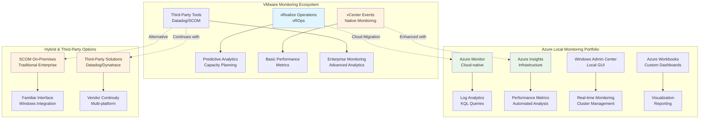

```text
VMware Monitoring Solutions Commonly Used:
┌─────────────────────┐  ┌─────────────────────┐  ┌─────────────────────┐
│ VMware Native       │  │ Enterprise Platforms│  │ Third-Party Apps    │
├─────────────────────┤  ├─────────────────────┤  ├─────────────────────┤
│ • vRealize Operations│  │ • Microsoft SCOM    │  │ • Datadog           │
│   Manager (vROps)   │  │ • IBM Tivoli        │  │ • New Relic         │
│ • vRealize Log      │  │ • BMC TrueSight     │  │ • AppDynamics       │
│   Insight (vRLI)    │  │ • CA UIM            │  │ • Dynatrace         │
│ • vRealize Network  │  │ • HP OpenView       │  │ • Splunk            │
│   Insight (vRNI)    │  │ • SolarWinds        │  │ • Elastic Stack     │
│ • vCenter Events    │  │ • Nagios/Icinga     │  │ • Zabbix            │
│ • vSAN Monitoring   │  │ • PRTG              │  │ • Virtual Metrics   │
└─────────────────────┘  └─────────────────────┘  └─────────────────────┘
```

### Azure Local Monitoring Solution Portfolio

Azure Local provides comprehensive monitoring through Azure-native services and supports third-party integrations:

```text
Azure Local Monitoring Options:
┌─────────────────────┐  ┌─────────────────────┐  ┌─────────────────────┐
│ Azure Native        │  │ Hybrid Solutions    │  │ Third-Party Apps    │
├─────────────────────┤  ├─────────────────────┤  ├─────────────────────┤
│ • Azure Monitor     │  │ • SCOM On-Premises  │  │ • Datadog           │
│ • Azure Insights    │  │ • SCOM MI (Cloud)   │  │ • New Relic         │
│ • Log Analytics     │  │ • Hybrid Gateway    │  │ • Dynatrace         │
│ • Azure Metrics     │  │ • WAC Monitoring    │  │ • Splunk            │
│ • Azure Workbooks   │  │ • PowerShell        │  │ • Virtual Metrics   │
│ • Azure Alerts      │  │   Automation        │  │ • SolarWinds        │
│ • Application       │  │ • Arc Integration   │  │ • Zabbix            │
│   Insights          │  │   Servers           │  │ • Elastic Stack     │
└─────────────────────┘  └─────────────────────┘  └─────────────────────┘
```

## VMware vRealize Operations Manager vs Azure Monitor

### vRealize Operations Manager (vROps) Capabilities

vROps provides comprehensive VMware infrastructure monitoring and analytics:

```text
vROps Architecture:
┌─────────────────────────────────────┐
│         vRealize Operations         │
│  ┌─────────────────────────────────┐│
│  │    Analytics Engine             ││
│  │  ┌─────────────────────────┐    ││
│  │  │ Predictive Analytics    │    ││
│  │  │ Anomaly Detection       │    ││
│  │  │ Capacity Planning       │    ││
│  │  │ Performance Baselines   │    ││
│  │  └─────────────────────────┘    ││
│  └─────────────────────────────────┘│
│  ┌─────────────────────────────────┐│
│  │      Data Collection            ││
│  │  ┌─────────────────────────┐    ││
│  │  │ vCenter Adapters        │    ││
│  │  │ NSX-T Adapters          │    ││
│  │  │ vSAN Adapters           │    ││
│  │  │ Third-party Adapters    │    ││
│  │  └─────────────────────────┘    ││
│  └─────────────────────────────────┘│
└─────────────────────────────────────┘
```

**vROps Key Features:**
- Automated baseline creation
- Predictive capacity planning
- Cross-stack correlation analysis
- Automated root cause analysis
- Custom dashboards and reports
- Policy-based alerting
- Cost analysis and optimization recommendations

### Azure Monitor for Azure Local

Azure Monitor provides cloud-native monitoring with Azure Local integration:

```text
Azure Monitor Architecture for Azure Local:
┌─────────────────────────────────────┐    ┌──────────────────────────────────┐
│           Azure Local               │    │            Azure                 │
│  ┌─────────────────────────────────┐│    │┌────────────────────────────────┐│
│  │     Windows Admin Center        ││    ││        Azure Monitor          ││
│  │  ┌─────────────────────────┐    ││    ││  ┌────────────────────────┐    ││
│  │  │ Local Performance       │    ││    ││  │ Log Analytics          │    ││
│  │  │ Monitoring              │    ││    ││  │ Workspace              │    ││
│  │  └─────────────────────────┘    ││    ││  └────────────────────────┘    ││
│  └─────────────────────────────────┘│    ││  ┌────────────────────────┐    ││
│  ┌─────────────────────────────────┐│◄──►││  │ Azure Metrics          │    ││
│  │     Azure Monitor Agent         ││    ││  │ Explorer               │    ││
│  │  ┌─────────────────────────┐    ││    ││  └────────────────────────┘    ││
│  │  │ Telemetry Collection    │    ││    ││  ┌────────────────────────┐    ││
│  │  │ Performance Counters    │    ││    ││  │ Azure Workbooks        │    ││
│  │  │ Event Logs              │    ││    ││  │ Custom Dashboards      │    ││
│  │  └─────────────────────────┘    ││    ││  └────────────────────────┘    ││
│  └─────────────────────────────────┘│    │└────────────────────────────────┘│
└─────────────────────────────────────┘    └──────────────────────────────────┘
```

**Azure Monitor Key Features:**
- Over 60 key metrics collected automatically
- Kusto Query Language (KQL) analytics
- Custom workbook creation
- Near real-time alerting
- Integration with Azure services
- Cost optimization through Azure Advisor
- Multi-system monitoring capability

### vROps vs Azure Monitor Comparison

**Functionality Comparison:**

| Capability | vRealize Operations | Azure Monitor | Migration Approach |
|------------|-------------------|---------------|-------------------|
| **Automated Baselines** | Dynamic performance baselines | Manual KQL query setup | Create custom KQL queries for baseline analysis |
| **Predictive Analytics** | Built-in ML algorithms | Azure Machine Learning integration | Implement custom ML models or alerts |
| **Capacity Planning** | Automated recommendations | Azure Advisor + custom analysis | Use Azure Advisor with custom workbooks |
| **Root Cause Analysis** | Cross-stack correlation | Manual log correlation | Design correlation queries in KQL |
| **Custom Dashboards** | vROps dashboards | Azure Workbooks | Recreate dashboards using workbook templates |
| **Policy-based Alerts** | Built-in policies | Metric/log-based alerts | Convert policies to alert rules |

## System Center Operations Manager (SCOM) Options

### SCOM On-Premises for Azure Local

SCOM provides comprehensive monitoring for Azure Local with specialized management packs:

**SCOM Management Packs for Azure Local:**
- Windows Server Operating System 2016+ (Base OS monitoring)
- Microsoft System Center Management Pack for Windows Server Cluster 2016+
- Microsoft System Center 2019 Management Pack for Hyper-V
- AzS HCI S2D MP for Storage Spaces Direct (S2D)
- Azure Local disconnected operations management pack

**SCOM Architecture for Azure Local:**
```text
SCOM Monitoring Architecture:
┌─────────────────────────────────────┐    ┌──────────────────────────────────┐
│           Azure Local               │    │          SCOM Infrastructure     │
│  ┌─────────────────────────────────┐│    │┌────────────────────────────────┐│
│  │       Cluster Nodes             ││    ││     Management Servers         ││
│  │  ┌─────────────────────────┐    ││    ││  ┌────────────────────────┐    ││
│  │  │ SCOM Agent              │    ││    ││  │ Operations Manager     │    ││
│  │  │ (Windows Service)       │    ││    ││  │ Management Server      │    ││
│  │  └─────────────────────────┘    ││    ││  └────────────────────────┘    ││
│  │  ┌─────────────────────────┐    ││    ││  ┌────────────────────────┐    ││
│  │  │ Performance Collection  │    ││    ││  │ SQL Server Database    │    ││
│  │  │ Event Log Monitoring    │    ││    ││  │ (Operations Manager    │    ││
│  │  │ Health Service          │    ││    ││  │  Database)             │    ││
│  │  └─────────────────────────┘    ││    ││  └────────────────────────┘    ││
│  └─────────────────────────────────┘│    │└────────────────────────────────┘│
└─────────────────────────────────────┘    └──────────────────────────────────┘
```

### SCOM Managed Instance (Cloud-based)

Azure Monitor SCOM Managed Instance provides cloud-based SCOM functionality:

**SCOM MI Benefits:**
- Preserves existing SCOM management pack investments
- Azure-managed infrastructure (no hardware management)
- Automatic patching and updates
- Integration with Azure Monitor alerts
- Support for Arc-enabled servers
- Built-in templates for Azure Workbooks and Grafana

**SCOM vs SCOM MI Comparison:**

| Aspect | SCOM On-Premises | SCOM Managed Instance |
|--------|------------------|----------------------|
| **Infrastructure Management** | Customer managed | Microsoft managed |
| **Patching** | Manual quarterly updates | Automatic every 15-20 days |
| **Agent Management** | Manual deployment | Azure VM extensions |
| **High Availability** | Customer responsibility | Built-in availability |
| **Integration** | SSRS reporting | Azure Workbooks/Grafana |
| **Cost Model** | CapEx + OpEx | OpEx subscription |

## Third-Party Monitoring Solutions

### Datadog for Azure Local

Datadog provides comprehensive monitoring with Azure Local integration:

**Datadog Capabilities:**
- Infrastructure monitoring with 400+ integrations
- Application performance monitoring (APM)
- Log management and analysis
- Real-time dashboards and alerting
- Machine learning-based anomaly detection
- Azure Native Integration available

**Datadog Integration Benefits:**
```text
Datadog Azure Local Integration:
┌─────────────────────────────────────┐
│ Datadog Monitoring Platform         │
├─────────────────────────────────────┤
│ • Azure Local metrics collection    │
│ • Hyper-V performance monitoring    │
│ • Storage Spaces Direct analytics   │
│ • Windows performance counters      │
│ • Application-level monitoring      │
│ • Log aggregation and analysis      │
│ • Custom dashboard creation         │
│ • AI-powered alerting              │
└─────────────────────────────────────┘
```

### Virtual Metrics for Hyper-V Monitoring

Virtual Metrics provides specialized Hyper-V and Azure Local monitoring:

**Virtual Metrics Features:**
- Real-time Hyper-V performance monitoring
- Storage Spaces Direct optimization
- VM-level resource tracking
- Capacity planning and analysis
- Performance baselines and trending
- Custom alerting and notifications
- Integration with existing monitoring tools


**Virtual Metrics vs vROps:**

| Feature | VMware vROps | Virtual Metrics |
|---------|-------------|----------------|
| **Hypervisor Focus** | vSphere optimized | Hyper-V specialized |
| **Storage Integration** | vSAN monitoring | Storage Spaces Direct focus |
| **Performance Analysis** | VMware metrics | Windows performance counters |
| **Predictive Analytics** | Built-in ML | Third-party integration |
| **Cost Model** | Per-VM licensing | Subscription-based |

### Other Enterprise Monitoring Solutions

**Enterprise Platform Support Matrix:**

| Vendor | VMware Support | Azure Local Support | Migration Path |
|--------|---------------|-------------------|----------------|
| **SolarWinds** | Comprehensive VMware modules | Windows/Hyper-V monitoring | Agent-based transition |
| **Dynatrace** | vSphere OneAgent | Azure/Hyper-V OneAgent | Unified agent deployment |
| **New Relic** | VMware integrations | Azure Monitor integration | API-based data collection |
| **Splunk** | vCenter log ingestion | Windows event forwarding | Log source reconfiguration |
| **Zabbix** | VMware templates | Windows/SNMP monitoring | Template migration |

## Windows Admin Center Local Monitoring

### WAC Performance Monitoring Capabilities

Windows Admin Center provides built-in local monitoring for Azure Local:

```text
Windows Admin Center Monitoring Features:
┌─────────────────────────────────────┐
│    Windows Admin Center             │
│  ┌───────────────────────────────┐  │
│  │      System Overview          │  │
│  │  ┌─────────────────────────┐  │  │
│  │  │ CPU Utilization         │  │  │
│  │  │ Memory Usage            │  │  │
│  │  │ Storage Performance     │  │  │
│  │  │ Network Throughput      │  │  │
│  │  └─────────────────────────┘  │  │
│  └───────────────────────────────┘  │
│  ┌───────────────────────────────┐  │
│  │   Virtual Machine Management  │  │
│  │  ┌─────────────────────────┐  │  │
│  │  │ VM Performance Charts   │  │  │
│  │  │ Resource Allocation     │  │  │
│  │  │ Health Monitoring       │  │  │
│  │  │ Historical Data         │  │  │
│  │  └─────────────────────────┘  │  │
│  └───────────────────────────────┘  │
│  ┌───────────────────────────────┐  │
│  │      Cluster Management       │  │
│  │  ┌─────────────────────────┐  │  │
│  │  │ Node Health Status      │  │  │
│  │  │ Storage Pool Analytics  │  │  │
│  │  │ Network Connectivity    │  │  │
│  │  │ Alert Management        │  │  │
│  │  └─────────────────────────┘  │  │
│  └───────────────────────────────┘  │
└─────────────────────────────────────┘
```

**WAC Monitoring Benefits:**
- No additional licensing required
- Real-time performance charts
- Historical data retention
- Built-in alerting capabilities
- Mobile-responsive web interface
- Extension ecosystem for specialized monitoring

## Resource Management and Performance Optimization

### VMware DRS vs Manual Resource Management

**VMware DRS Capabilities:**
- Automatic load balancing across hosts
- VM placement optimization
- Resource pool management
- Admission control policies
- Power management integration

**Azure Local Resource Management:**
```text
Azure Local Resource Management Options:
┌─────────────────────────────────────┐
│ Manual Resource Management          │
├─────────────────────────────────────┤
│ • Windows Admin Center GUI          │
│ • PowerShell Live Migration         │
│ • Failover Cluster Manager          │
│ • Custom automation scripts         │
│ • Azure Monitor alerting triggers   │
└─────────────────────────────────────┘
               │
               ▼
┌─────────────────────────────────────┐
│ PowerShell Automation Examples     │
├─────────────────────────────────────┤
│ • Host utilization monitoring       │
│ • Automated VM migration scripts    │
│ • Load balancing algorithms         │
│ • Scheduled resource rebalancing    │
│ • Integration with monitoring APIs  │
└─────────────────────────────────────┘
```

**DRS Replacement Strategies:**

| DRS Feature | Azure Local Equivalent | Implementation |
|-------------|----------------------|----------------|
| **Automatic Load Balancing** | Built-in VM load balancing every 30 minutes | Custom scripts with utilization thresholds |
| **Resource Pools** | Manual VM grouping | Organizational policies and procedures |
| **Admission Control** | Cluster resource validation | Pre-deployment capacity checks |
| **Power Management** | Manual host management | Scheduled PowerShell scripts |
| **Affinity Rules** | Manual VM placement | Documentation and operational procedures |

### Memory Management Evolution

**Memory Technology Comparison:**

| Feature | VMware vSphere | Azure Local (Hyper-V) |
|---------|---------------|----------------------|
| **Transparent Page Sharing** | TPS across VMs | Not available |
| **Memory Ballooning** | VMware balloon driver | Not used |
| **Memory Compression** | ESXi memory compression | Not available |
| **Dynamic Memory** | Not available | Hyper-V Dynamic Memory |
| **NUMA Optimization** | vNUMA topology | Automatic NUMA awareness |
| **Memory Overcommit** | Advanced settings | Dynamic Memory allocation |

## Migration Strategy and Implementation

### Phase 1: Monitoring Assessment
```text
Current VMware Monitoring Inventory:
┌─────────────────────────────────────┐
│ Monitoring Tool Audit               │
├─────────────────────────────────────┤
│ • vROps deployment and dashboards   │
│ • Third-party tool integrations     │
│ • Custom monitoring scripts         │
│ • Alert configurations and runbooks │
│ • Performance baseline data         │
│ • Reporting and compliance needs    │
│ • Staff skills and tool expertise   │
└─────────────────────────────────────┘
```

### Phase 2: Azure Local Monitoring Design
```text
Monitoring Solution Architecture:
┌─────────────────────────────────────┐
│ Solution Selection Matrix           │
├─────────────────────────────────────┤
│ • Azure Monitor vs third-party      │
│ • SCOM on-premises vs SCOM MI       │
│ • Integration complexity assessment │
│ • Cost analysis and budgeting      │
│ • Staff training requirements      │
│ • Data retention and compliance    │
└─────────────────────────────────────┘
```

### Phase 3: Implementation Roadmap
```text
Monitoring Migration Timeline:
┌────────────┬────────────┬────────────┬────────────┐
│ Month 1-2  │ Month 3-4  │ Month 5-6  │ Month 7-8  │
├────────────┼────────────┼────────────┼────────────┤
│ Assessment │ Setup      │ Migration  │ Optimization│
│ & Design   │ & Config   │ & Testing  │ & Cutover  │
│            │            │            │            │
│ • Tool     │ • Azure    │ • Parallel │ • Final    │
│   inventory│   Monitor  │   running  │   cutover  │
│ • Solution │   setup    │ • Dashboard│ • Legacy   │
│   selection│ • Agent    │   creation │   tool     │
│ • Team     │   deploy   │ • Alert    │   decom    │
│   training │ • Initial  │   tuning   │ • Process  │
│ • POC      │   config   │ • Process  │   final    │
│   setup    │ • Testing  │   update   │   validation│
└────────────┴────────────┴────────────┴────────────┘
```

This comprehensive monitoring transition strategy addresses the complexity of VMware monitoring environments and provides multiple pathways to Azure Local monitoring, whether through Azure-native solutions, hybrid SCOM deployments, or familiar third-party tools with enhanced Azure Local integration.

[Back to Table of Contents](#table-of-contents)

---

## Section 9 - Automation and Scripting

This section addresses the critical transition from VMware PowerCLI-based automation to Azure Local's PowerShell and cloud-integrated scripting environment. We'll examine how your existing automation workflows, vRealize Automation blueprints, and configuration management processes translate to Microsoft's API-driven infrastructure model, ensuring your team can maintain operational efficiency while gaining enhanced automation capabilities.

**Key Insight:** Many familiar cross-platform automation tools like **Terraform**, **Ansible**, and **Bicep** work seamlessly with Azure Local, allowing you to leverage existing infrastructure-as-code investments while gaining cloud-scale automation capabilities that often exceed VMware's automation potential.

Your PowerCLI-based automation workflows transition to PowerShell with Hyper-V modules, Azure CLI/PowerShell for cloud integration, plus cross-platform tools like Terraform and Ansible for infrastructure-as-code, providing equivalent scripting capabilities with enhanced hybrid operations and multi-cloud portability.

**Enterprise Context:** PowerCLI script migration becomes a significant undertaking when managing 90+ hosts across 6 distributed Azure Local clusters. Your centralized vCenter PowerCLI automation library—built around single-connection contexts—requires conversion to multi-cluster Azure Arc resource management patterns. PowerShell scripts must now authenticate to multiple Azure Local clusters individually, query distributed VM inventories, and coordinate operations across independent cluster boundaries rather than a unified vSphere inventory tree.

Understanding how VMware automation translates to Microsoft's PowerShell ecosystem—combined with proven cross-platform tools—helps you maintain operational efficiency while gaining cloud integration capabilities that often exceed VMware's automation potential.

### Core PowerShell Module Transition

**Essential PowerShell Module Transition:**

### Automation Framework Evolution

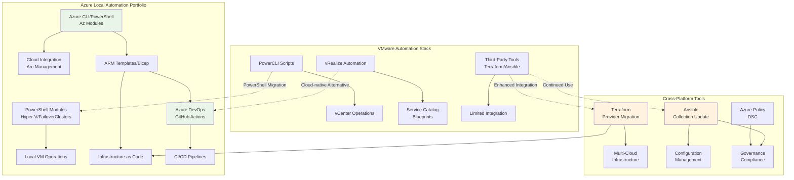

| VMware PowerCLI Module | Azure Local PowerShell Module | Core Capabilities | Learning Curve |
|------------------------|-------------------------------|-------------------|----------------|
| **VMware.PowerCLI** | **Hyper-V Module** | VM lifecycle, configuration, snapshots | Low - similar cmdlet patterns |
| **VMware.VimAutomation.Core** | **FailoverClusters Module** | Cluster operations, resource management | Moderate - different clustering concepts |
| **VMware.VimAutomation.Vds** | **NetAdapter, NetTCPIP Modules** | Network configuration, VLANs | Moderate - different network abstractions |
| **VMware.VumAutomation** | **Azure PowerShell (Az)** | Update management, cloud integration | High - completely different approach |

### PowerCLI to PowerShell Script Migration Patterns

**Critical PowerCLI to PowerShell Command Translation:**

| Automation Task | VMware PowerCLI Pattern | Azure Local PowerShell Pattern | Migration Complexity |
|-----------------|------------------------|---------------------------------|---------------------|
| **VM Creation** | `New-VM -Template $template -VMHost $vmhost` | `New-VM -VHDPath $vhdPath -Path $vmPath` | Moderate - template to VHD model change |
| **VM State Management** | `Start-VM $vm`, `Stop-VM $vm -Confirm:$false` | `Start-VM -Name $vmName`, `Stop-VM -Name $vmName -Force` | Low - nearly identical cmdlet names |
| **VM Configuration** | `Set-VM -VM $vm -MemoryMB 8192 -NumCpu 4` | `Set-VM -Name $vmName -MemoryStartupBytes 8GB -ProcessorCount 4` | Low - similar parameter patterns with unit changes |
| **Live Migration** | `Move-VM -VM $vm -Destination $vmhost` | `Move-ClusterVirtualMachineRole -Name $vmName -Node $targetNode` | Moderate - cluster-aware migration approach |
| **Snapshot Management** | `New-Snapshot -VM $vm -Name "PreUpdate"` | `Checkpoint-VM -Name $vmName -SnapshotName "PreUpdate"` | Low - terminology change (snapshot to checkpoint) |
| **Performance Monitoring** | `Get-Stat -Entity $vm -Stat "cpu.usage.average"` | `Get-Counter -Counter "\\Hyper-V Hypervisor\\*"` | High - completely different performance data sources |

### Cross-Platform Automation Tools Integration

One of Azure Local's significant advantages is compatibility with industry-standard cross-platform automation tools that many VMware environments already use. This compatibility reduces migration complexity and leverages existing automation investments:

| Cross-Platform Tool | VMware Environment Usage | Azure Local Integration | Migration Advantage |
|---------------------|--------------------------|------------------------|---------------------|
| **Terraform** | vSphere Provider for infrastructure provisioning | Azure Provider + Azure Local templates | **Existing Terraform code largely transferable** |
| **Ansible** | VMware modules for configuration management | Azure collection + native Windows modules | **Playbook patterns remain consistent** |
| **Git-based CI/CD** | Custom PowerCLI pipeline scripts | Native Azure DevOps + GitHub Actions integration | **Enhanced pipeline capabilities with cloud integration** |
| **Monitoring Tools** | Third-party integrations via APIs | Native Azure Monitor + existing tool compatibility | **Improved telemetry with cloud-scale analytics** |
| **Configuration Management** | Limited native capabilities | PowerShell DSC + Azure Policy + Ansible | **Multiple configuration management options** |

**Example Tool Transition Patterns:**

- **Terraform:** `vsphere_virtual_machine` resources become `azurestackhci_virtual_machine` resources with similar syntax
- **Ansible:** VMware modules (`vmware_guest`) transition to Azure collection modules (`azure_rm_virtualmachine`) 
- **CI/CD Pipelines:** PowerCLI scripts in Jenkins/TeamCity become Azure CLI/PowerShell in Azure DevOps with enhanced capabilities

**Enterprise Automation Platform Migration:**

| Automation Capability | VMware vRealize Automation | Azure Local + Cloud Integration | Operational Enhancement |
|-----------------------|---------------------------|----------------------------------|------------------------|
| **Self-Service Portals** | vRA service catalog with approval workflows | Azure Portal + RBAC + Azure DevOps approval gates | Cloud-native self-service with developer integration |
| **Blueprint Management** | vRA blueprints with vSphere integration | ARM templates + Bicep with Azure Local VM deployment | Version-controlled Infrastructure-as-Code |
| **Approval Workflows** | vRA approval policies and notifications | Azure DevOps approval gates + Logic Apps | Integration with development and change management |
| **Configuration Management** | vRA day-2 operations + Host Profiles | Azure Policy + Azure Automation DSC | Cloud-scale configuration drift prevention |
| **Multi-Tenancy** | vRA tenant management | Azure subscriptions + resource groups + RBAC | Enterprise-scale isolation and governance |

**Blueprint to Template Translation Concepts:**
- **vRA Blueprints** → **ARM/Bicep Templates:** Declarative infrastructure definition with parameterization
- **vRA Service Catalog** → **Azure Portal + DevOps Pipelines:** Self-service with approval gates  
- **vRA Day-2 Operations** → **Azure Policy + Automation DSC:** Automated configuration management

### Azure Cloud Integration Automation

**Hybrid Management Capabilities Evolution:**

| Management Scenario | VMware Limitation | Azure Local + Cloud Integration | Operational Enhancement |
|--------------------|-------------------|----------------------------------|------------------------|
| **VM Lifecycle Management** | vCenter-only visibility | Azure Portal + local PowerShell + Arc integration | Cloud-visible VM management with local control |
| **Policy Enforcement** | vCenter roles and permissions only | Azure Policy + Azure RBAC + local permissions | Multi-layer governance with cloud-scale policy |
| **Monitoring Integration** | Third-party monitoring integrations required | Azure Monitor REST APIs + Log Analytics | Native cloud monitoring with on-premises correlation |
| **CI/CD Pipeline Integration** | Limited PowerCLI pipeline support | Azure DevOps + GitHub Actions + Az CLI | Full CI/CD integration with infrastructure deployment |
| **Configuration Drift Management** | Manual Host Profiles + compliance checking | Azure Automation DSC + Azure Policy + compliance reports | Automated drift detection and remediation |

**Azure Automation Integration Concepts:**
- **Hybrid Management:** Azure Automation runbooks execute on-premises via Hybrid Runbook Workers
- **Cloud Integration:** Local PowerShell operations reported to Azure Monitor for centralized visibility
- **Event-Driven Operations:** Azure Monitor alerts trigger automated responses and remediation workflows

### Infrastructure-as-Code Evolution

**Cross-Platform IaC Framework Comparison:**

| IaC Tool | VMware Support | Azure Local Support | Key Advantages | Migration Complexity |
|----------|----------------|---------------------|----------------|---------------------|
| **Terraform** | vSphere Provider + limited cloud integration | Azure Provider + AzureRM Provider + Azure Local templates | Multi-cloud portability, established community | Low - existing Terraform knowledge transfers |
| **Ansible** | VMware modules for vSphere operations | Azure collection + Hyper-V modules + native Azure integration | Agentless automation, existing playbooks reusable | Low - playbook patterns remain consistent |
| **Bicep** | Not applicable | Native ARM template abstraction for Azure Local | Type-safe templates, IntelliSense support, simplified syntax | Moderate - new language but intuitive for ARM users |
| **ARM Templates** | Not applicable | Native Azure Local support via Azure Local VMs | Direct Azure integration, official Microsoft support | Moderate - JSON-based declarative approach |
| **Azure DevOps** | PowerCLI scripts with limited integration | Native Azure Pipeline integration + Arc deployment | Cloud-native CI/CD with infrastructure deployment | Low - familiar pipeline concepts |
| **GitHub Actions** | Custom PowerCLI runners | Native Azure CLI/PowerShell integration | Developer-centric workflows, marketplace integrations | Low - YAML-based workflow approach |

### Orchestration and Workflow Automation

**Enterprise Workflow Platform Migration:**

| Orchestration Capability | VMware vRealize Automation | Azure Local + Cloud Automation | Integration Enhancement |
|--------------------------|---------------------------|--------------------------------|------------------------|
| **Complex Multi-Step Workflows** | vRA blueprints with multiple machine provisioning | Azure Automation runbooks + Logic Apps orchestration | Cloud-scale workflow execution with error handling |
| **Event-Driven Automation** | vCenter alarms + custom scripts | Azure Monitor alerts + Event Grid + Logic Apps | Real-time event processing with cloud-scale triggers |
| **Approval and Governance** | vRA approval policies with email notifications | Azure DevOps approval gates + Teams integration | Integration with development and change management processes |
| **Scheduled Operations** | vCenter scheduled tasks + PowerCLI scripts | Azure Automation schedules + Hybrid Runbook Workers | Cloud-managed scheduling with on-premises execution |
| **Cross-Platform Integration** | Limited third-party API integration | Logic Apps connectors + REST API integration | 200+ built-in connectors for enterprise systems |

### Configuration Management Evolution

**Configuration Management Evolution:**

| Configuration Approach | VMware Implementation | Azure Local Implementation | Enhancement |
|------------------------|----------------------|---------------------------|-------------|
| **Host Configuration** | vSphere Host Profiles + manual enforcement | PowerShell DSC + Azure Policy + compliance reporting | Automated drift detection and remediation |
| **VM Configuration** | VM templates + manual customization | ARM/Bicep templates + Azure VM Image Builder | Version-controlled, parameterized deployments |
| **Compliance Monitoring** | vCenter compliance checks + third-party tools | Azure Policy + Azure Security Center integration | Real-time compliance with automated remediation |

### Automation Migration Strategy

**4-Phase Migration Approach:**

| Phase | Focus Area | Key Activities | Success Criteria |
|-------|------------|---------------|-----------------|
| **Phase 1: Assessment** | Script inventory and analysis | Document PowerCLI scripts, vRA blueprints, custom workflows | Complete automation inventory with business impact analysis |
| **Phase 2: Foundation** | Skills and environment setup | PowerShell training, Azure integration learning, lab setup | Team competency established, development environment operational |
| **Phase 3: Migration** | Incremental script conversion | High-priority scripts first, parallel testing, gradual rollout | Mission-critical automation converted and validated |
| **Phase 4: Enhancement** | Cloud integration and optimization | CI/CD integration, Infrastructure-as-Code, monitoring enhancement | Cloud-enhanced automation delivering superior capabilities |

### Common Migration Challenges and Solutions

**Key Challenge Areas:**

| Challenge | VMware Context | Azure Local Solution | Migration Approach |
|-----------|----------------|---------------------|-------------------|
| **Object Model Differences** | VM objects have different properties/methods | Create PowerShell wrapper functions for consistency | Normalize object interfaces with custom functions |
| **Performance Data Collection** | vCenter performance statistics APIs | Windows Performance Counters + Azure Monitor APIs | Combine local counters with cloud analytics |
| **Centralized Resource Management** | VMware DRS automated balancing | Built-in VM load balancing logic | Scheduled runbooks for resource optimization |
| **Configuration Drift** | Host Profiles centralized management | Azure Policy + PowerShell DSC integration | Real-time drift detection with automated remediation |

### Bottom Line

Azure Local automation provides equivalent capabilities to PowerCLI through PowerShell modules and Azure CLI, with the significant advantage of supporting industry-standard cross-platform tools like **Terraform**, **Ansible**, and **Bicep**. This multi-tool approach often exceeds VMware's automation potential by providing:

- **PowerShell Module Transition:** Hyper-V and FailoverClusters modules deliver VM lifecycle management equivalent to PowerCLI with similar cmdlet patterns
- **Cross-Platform Tool Compatibility:** Existing Terraform configurations and Ansible playbooks often transfer with minimal modifications
- **Enhanced Cloud Integration:** Native Azure DevOps/GitHub Actions support provides superior CI/CD pipeline capabilities
- **Infrastructure-as-Code Excellence:** ARM templates, Bicep, and Terraform provide version-controlled, declarative infrastructure management
- **Automation Migration Path:** PowerCLI scripts require rewriting but PowerShell patterns are similar, while existing Terraform/Ansible investments largely transfer

**Key Migration Insight:** While PowerCLI scripts need conversion to PowerShell, customers already using Terraform or Ansible for VMware infrastructure automation will find their existing code patterns largely transferable to Azure Local, significantly reducing migration complexity.

> **Key Takeaway:** PowerShell automation replaces PowerCLI with enhanced cloud integration capabilities, while cross-platform tools like Terraform and Ansible provide continuity for existing Infrastructure-as-Code investments, often delivering more powerful hybrid management than VMware's automation ecosystem.


[Back to Table of Contents](#table-of-contents)

---

## Section 10 - Disconnected/Limited Connectivity

Understanding how VMware vSphere's offline capabilities compare to Azure Local's disconnected operations helps you plan for edge scenarios, intermittent connectivity, and air-gapped deployments while maintaining operational continuity.

**Enterprise Context:** Operating 6 distributed Azure Local clusters in disconnected scenarios presents coordination challenges absent from vSphere's independent offline operation. Where VMware hosts and vCenter operate indefinitely without cloud dependencies, Azure Local's 30-day sync requirement applies per cluster. Enterprise disconnected operations must coordinate sync schedules across all 6 clusters to prevent "Out of policy" status, whereas vSphere hosts maintain functionality regardless of connectivity duration. Fully Disconnected (Preview) mode addresses this but requires local control plane infrastructure to serve all 6 clusters.

### Connectivity Requirements Comparison

**VMware vSphere Offline Operations**
VMware vSphere operates independently of cloud connectivity with these characteristics:
- **Indefinite offline operation** - No cloud dependency for basic operations
- **vCenter management** - Full management capabilities through vCenter Server
- **Host-level access** - Direct ESXi host management when vCenter unavailable
- **No licensing dependencies** - Perpetual licenses don't require cloud check-ins

**Azure Local Connectivity Models**
Azure Local supports multiple connectivity scenarios with varying capabilities:

### Azure Local Connectivity Models Overview

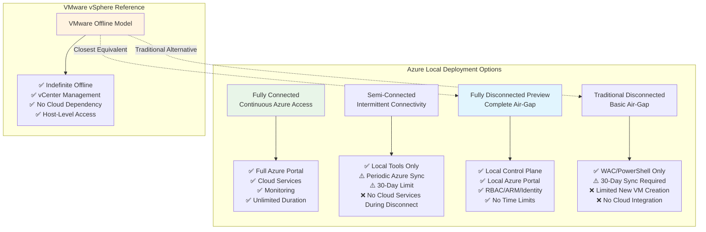

| Connectivity Mode | Description | Duration Limit | Management Capabilities |
|-------------------|-------------|----------------|------------------------|
| **Fully Connected** | Continuous Azure connectivity | Unlimited | Full Azure portal + local tools |
| **Semi-Connected** | Intermittent connectivity | 30 days maximum | Local tools + periodic Azure sync |
| **Fully Disconnected (Preview)** | Complete air-gap deployment | No Azure dependency | Local control plane + portal |
| **Traditional Offline** | Basic disconnected operations | 30 days sync requirement | Windows Admin Center + PowerShell |

### New Fully Disconnected Operations (Preview)

Microsoft has introduced comprehensive disconnected operations for Azure Local, enabling complete air-gapped deployments:

**Fully Disconnected Capabilities**
**Local Control Plane Services:**
- **Local Azure Portal** - Full portal experience without internet connectivity
- **Azure Resource Manager (ARM)** - Complete ARM template and CLI support
- **Role-Based Access Control** - Full RBAC for subscriptions and resource groups
- **Managed Identity** - System-assigned managed identity support
- **Azure Container Registry** - Local container image and artifact storage
- **Azure Key Vault** - Local secrets and key management

**Supported Workload Types:**
- Azure Local VMs (Windows Server 2025/2022, Windows 10 Enterprise, Ubuntu LTS)
- Arc-enabled Kubernetes clusters and AKS enabled by Arc
- Arc-enabled servers for VM guest management
- Containerized applications with local registry support

**Deployment Requirements for Air-Gapped Operations**
**Infrastructure Prerequisites:**
- Higher hardware requirements for local control plane hosting
- PKI infrastructure integration for secure endpoint management
- Domain controller integration for time synchronization and identity
- Network isolation with proper security controls

**Preparation Steps:**
```powershell
# Time server configuration for disconnected operations
w32tm /config /manualpeerlist:"dc.contoso.com" /syncfromflags:manual /reliable:yes /update
net stop w32time
net start w32time

# Environment variable for disconnected operations support
[Environment]::SetEnvironmentVariable("DISCONNECTED_OPS_SUPPORT", $true, [System.EnvironmentVariableTarget]::Machine)
```

### Traditional Disconnected Operations (30-Day Model)

**Operational Capabilities During Disconnection**
**Local Management Tools:**
- **Windows Admin Center** - Available offline for cluster management
- **PowerShell** - Full local cluster management capabilities  
- **Failover Cluster Manager** - Traditional Windows clustering tools
- **Hyper-V Manager** - Direct host management interface

**30-Day Grace Period Behavior:**
- ✅ Existing VMs continue running normally
- ✅ VM live migration between cluster nodes
- ✅ Virtual network and storage configuration changes
- ✅ Performance monitoring and troubleshooting
- ❌ New VM creation if 30-day sync requirement exceeded (cluster shows "Out of policy")
- ❌ Azure portal management and monitoring
- ❌ Azure Arc services and cloud extensions

**Important:** According to Microsoft documentation, Azure Local must sync successfully with Azure at least once every 30 consecutive days. If this requirement isn't met, the cluster shows "Out of policy" status and enters reduced functionality mode, blocking new VM creation until sync completes. All existing VMs continue running normally.

### Use Case Scenarios

**When to Choose Each Model**

**Fully Disconnected Operations (Preview):**
- Government and defense deployments requiring complete air-gap
- Remote locations with no internet infrastructure (oil rigs, manufacturing sites)
- Healthcare and finance with strict data sovereignty requirements
- High-security environments minimizing attack surfaces

**Semi-Connected Operations (30-Day):**
- Edge locations with intermittent connectivity
- Cost-conscious deployments with minimal cloud integration
- Temporary disconnection scenarios during maintenance
- Remote offices with periodic satellite/cellular connectivity

**Fully Connected Operations:**
- Primary datacenter deployments with reliable internet
- Maximum Azure service integration requirements
- Development and testing environments
- Scenarios requiring real-time cloud services

### Migration Strategy Comparison

**From VMware Indefinite Offline to Azure Local**

**Planning Considerations:**

| VMware Approach | Azure Local Traditional | Azure Local Disconnected (Preview) |
|-----------------|------------------------|-----------------------------------|
| No connectivity planning | Arrange 30-day periodic connections | Complete air-gap deployment |
| vCenter-only management | WAC + PowerShell local skills | Local portal + ARM template skills |
| Perpetual licensing | Cloud licensing check-ins | Local control plane licensing |
| Host-level fallback | Cluster management focus | Comprehensive local Azure services |

**Team Skill Development Requirements:**

**For Traditional Disconnected (30-Day):**
- Windows Admin Center proficiency for offline management
- PowerShell cluster management capabilities
- Understanding local vs cloud feature boundaries
- Incident response for extended disconnections

**For Fully Disconnected (Preview):**
- Local control plane architecture understanding
- PKI and certificate management expertise
- Air-gapped deployment and security procedures
- Local Azure portal and ARM template skills

### Operational Resilience Comparison

**VMware vSphere Resilience Model:**
- vCenter as primary control plane with ESXi host fallback
- No external dependencies for basic VM operations
- Unlimited offline operation duration
- Manual processes for extended outages

**Azure Local Resilience Model:**
- Choice between cloud-hybrid and fully disconnected architectures
- Local control plane capabilities matching cloud services
- Planned connectivity windows vs continuous operation options
- Consistent management experience across connectivity states

The evolution to fully disconnected operations (preview) bridges the gap between VMware's indefinite offline capabilities and Azure Local's cloud-integrated approach, providing flexibility to match your organization's connectivity requirements and security posture.

[Back to Table of Contents](#table-of-contents)

---

## Section 11 - Security and Compliance

Your VMware security model transitions from vSphere encryption and NSX micro-segmentation to Azure-integrated compliance with Guarded Fabric, automated security baselines, and cloud-native security operations.

**Enterprise Context:** Managing security compliance across 6 distributed Azure Local clusters presents unique challenges compared to centralized vSphere security management. Azure Policy enforcement provides granular security controls per cluster that exceed vCenter's global security settings capability. However, security policy consistency requires coordination across multiple Azure Local cluster boundaries, whereas NSX micro-segmentation operated from a single control plane for your entire 90+ host environment.

Understanding how traditional perimeter-based security translates to hybrid cloud security helps you maintain compliance while gaining cloud-native security capabilities and automated threat detection.

## Security Architecture Transformation

**Core Security Philosophy Shift:**
- **VMware vSphere:** Isolated security model with separate security tools and compliance frameworks
- **Azure Local:** Cloud-integrated security with unified policy management and 300+ automated security defaults

| Security Component | VMware Approach | Azure Local Approach | Integration Benefit |
|-------------------|-----------------|---------------------|-------------------|
| **VM Encryption** | vSphere VM encryption with KMS | Shielded VMs with BitLocker XTS-AES 256 | Automatic encryption with TPM 2.0 attestation |
| **Host Security** | Manual ESXi hardening guides | Windows Security Baseline (300+ settings) | Automated drift protection every 90 minutes |
| **Network Security** | NSX micro-segmentation | Network Security Groups + Arc policies | Cloud-managed network policies with compliance |
| **Identity Management** | vCenter SSO + AD integration | Azure RBAC + Microsoft Entra ID | Unified identity with MFA and conditional access |
| **Compliance Monitoring** | Third-party compliance tools | Azure Policy + Defender for Cloud | Continuous compliance assessment and remediation |

## Enhanced Security Features

### Secured-Core Hardware Foundation
Azure Local leverages secured-core server capabilities for hardware-based security:

| Security Layer | Implementation | Benefit |
|---------------|----------------|---------|
| **Hardware Root of Trust** | TPM 2.0 standard on all nodes | Protected storage for keys, certificates, and boot measurements |
| **Firmware Protection** | Dynamic Root of Trust (DRTM) | Hardware-based firmware sandbox with DMA protection |
| **Virtualization-Based Security** | Hypervisor-based Code Integrity (HVCI) | Memory isolation and kernel protection against attacks |
| **Secure Boot** | UEFI Secure Boot with attestation | Verified boot process preventing rootkit installation |

### Compliance Framework Integration

**Regulatory Compliance Support:**

| Compliance Standard | VMware Implementation | Azure Local Implementation | Automated Capabilities |
|---------------------|---------------------|---------------------------|---------------------|
| **HIPAA** | Manual compliance procedures | Built-in HIPAA guidance + BitLocker | Automated data-at-rest encryption |
| **PCI DSS** | Third-party compliance tools | PCI DSS baseline + security defaults | Continuous drift control and monitoring |
| **CIS Benchmark** | Manual hardening guides | Built-in CIS benchmark compliance | Automated baseline with 90-minute refresh |
| **DISA STIG** | Custom security configurations | Integrated STIG requirements | Security baseline with automated remediation |
| **GDPR** | Separate compliance frameworks | Shielded VM protection + encryption | Virtual TPM with BitLocker for data protection |

## Shielded Virtual Machines vs vSphere Encryption

**Protection Model Comparison:**

| Protection Feature | vSphere VM Encryption | Azure Local Shielded VMs | Enhanced Protection |
|-------------------|----------------------|--------------------------|-------------------|
| **Encryption Method** | External KMS integration | BitLocker with virtual TPM | Hardware-attested encryption keys |
| **Administrator Protection** | Limited protection from admins | Complete protection from fabric admins | Host Guardian Service attestation |
| **Boot Protection** | vTPM with secure boot | UEFI Secure Boot + measured boot | Hardware-validated boot chain |
| **Key Management** | External key management | Host Guardian Service (HGS) | Integrated key escrow and attestation |
| **Migration Security** | Key management complexity | Automated key protection updates | Seamless secure migration between hosts |

### Advanced Security Integration

**Microsoft Security Ecosystem Benefits:**

| Security Tool | Integration Capability | Operational Advantage |
|--------------|----------------------|---------------------|
| **Microsoft Defender for Cloud** | Native Azure Local protection | Continuous security posture assessment with automated remediation |
| **Microsoft Sentinel** | Deep log integration and analytics | AI-powered threat hunting with automated incident response |
| **Azure Policy** | Automated compliance enforcement | Continuous configuration drift detection across hybrid resources |
| **Microsoft Entra ID** | Seamless identity integration | Unified access management with MFA and privileged identity management |

## Security Operations Workflow Evolution

**Management Transition Strategy:**

| Security Task | VMware Security Operations | Azure Local Security Operations | Automation Improvement |
|---------------|---------------------------|--------------------------------|----------------------|
| **Threat Detection** | vCenter + third-party SIEM | Microsoft Sentinel + Defender | AI-powered threat hunting |
| **Compliance Reporting** | Manual compliance dashboards | Azure Policy compliance dashboard | Automated policy compliance with drift protection |
| **Vulnerability Management** | Separate scanning tools | Defender for Cloud recommendations | Integrated threat detection with automated response |
| **Security Baseline** | Manual host profiles | Automated security defaults | 300+ settings with 90-minute refresh cycle |
| **Identity Management** | vCenter SSO management | Azure RBAC + Entra ID PIM | Time-bound privileged access with audit history |

## Migration Security Considerations

**Architecture Decision Framework:**
1. **Security Model Acceptance:** Transition from air-gapped security to cloud-integrated security with enhanced protection
2. **Identity Integration:** Consolidate vCenter SSO and AD into unified Azure RBAC and Microsoft Entra ID
3. **Compliance Automation:** Shift from manual compliance to automated policy enforcement with continuous monitoring
4. **Security Operations:** Consolidate security tools into Microsoft security ecosystem with automated response capabilities

**What Enhances:**
- Security baseline automation replaces manual ESXi hardening procedures
- Continuous compliance monitoring instead of periodic VMware assessments
- AI-powered threat detection versus traditional signature-based approaches
- Automated incident response through Azure Logic Apps and Sentinel playbooks

**What Continues:**
- Application-level security configurations and policies remain unchanged
- User access patterns and role definitions transfer to Azure RBAC
- Compliance framework requirements maintain same rigor with enhanced automation
- VM-level encryption continues with improved key management through HGS

The transformation to Azure Local provides enhanced security through cloud integration, automated compliance enforcement, and continuous monitoring that often exceeds traditional perimeter-based security capabilities while maintaining familiar compliance frameworks.

### Bottom Line

Azure Local transforms security from VMware's isolated model to cloud-integrated security with Microsoft Defender, Sentinel, and Azure Policy providing automated threat detection, compliance enforcement, and unified security operations that often exceed traditional perimeter-based security capabilities.

> **Key Takeaway:** Azure Local provides enhanced security through cloud integration while maintaining compliance requirements with automated policy enforcement and continuous monitoring.

[Back to Table of Contents](#table-of-contents)

---

## Section 12 - GPU and Hardware Acceleration

Your VMware vGPU workloads migrate from NVIDIA GRID profiles to Azure Local's GPU-P partitioning with live migration support when prerequisites are met, or DDA for maximum performance.

Understanding how vGPU profiles translate to GPU partitions helps you maintain GPU workload performance while gaining improved VM mobility where supported.

## GPU Technology Architecture Shift

**Core GPU Virtualization Philosophy:**
- **VMware vSphere:** NVIDIA GRID vGPU profiles with fixed resource allocation
- **Azure Local:** GPU-P partitioning with flexible resource allocation and live migration support (when prerequisites are met)

| GPU Technology | VMware vSphere | Azure Local | Migration Benefit |
|----------------|---------------|-------------|-------------------|
| **Shared GPU** | NVIDIA GRID vGPU profiles | GPU-P (GPU Partitioning) | Flexible partition sizing with live migration |
| **Dedicated GPU** | DirectPath I/O passthrough | DDA (Discrete Device Assignment) | Full GPU assignment to single VM |
| **Live Migration** | Limited vGPU vMotion support | GPU-P: Live migration supported (prerequisites required); DDA: Not supported | Enhanced VM mobility with GPU-P only |
| **Management** | vCenter GPU management | Windows Admin Center + PowerShell | Different tools, equivalent functionality |

## GPU Workload Translation

**Workload Type Migration Mapping:**

| Workload Type | VMware vGPU Approach | Azure Local Approach | Performance Expectation |
|---------------|---------------------|---------------------|------------------------|
| **VDI/Desktop** | NVIDIA GRID vGPU profiles (1B, 2B, 4B, 8B) | GPU-P with memory allocation policies | Equivalent desktop acceleration performance |
| **AI Training** | DirectPath I/O for full GPU access | DDA for dedicated GPU access | Full GPU performance retained |
| **AI Inference** | vGPU sharing for multiple inference VMs | GPU-P for concurrent inference loads | Similar shared GPU efficiency with improved density |
| **CAD/Engineering** | High-memory vGPU profiles (8Q, 16Q) | GPU-P with large memory allocations | Professional graphics support equivalent |
| **HPC Workloads** | Multiple GPU assignment through DirectPath | Multiple DDA assignments or GPU-P clustering | Equivalent high-performance computing support |

## Hardware Compatibility and Driver Management

**Supported GPU Models and Compatibility Matrix:**

| GPU Generation | VMware vGPU Support | Azure Local DDA Support | Azure Local GPU-P Support | Migration Strategy |
|----------------|--------------------|-----------------------|-------------------------|-------------------|
| **NVIDIA T4** | GRID vGPU supported | ✅ Supported | ❌ Not supported | Migrate to DDA only |
| **NVIDIA A2** | vGPU supported | ✅ Supported | ✅ Supported | Choose based on consolidation needs |
| **NVIDIA A10** | vGPU supported | ✅ Supported | ✅ Supported | GPU-P recommended for live migration capability |
| **NVIDIA A16** | vGPU supported | ✅ Supported | ✅ Supported | Enhanced performance with GPU-P |
| **NVIDIA A40** | vGPU supported | ✅ Supported | ✅ Supported | GPU-P for managed Arc-enabled VMs with live migration |
| **NVIDIA L2** | vGPU supported | ✅ Supported | ✅ Supported | Latest generation GPU-P capabilities |
| **NVIDIA L4** | vGPU supported | ✅ Supported | ✅ Supported | Latest generation GPU-P capabilities |
| **NVIDIA L40/L40S** | vGPU supported | ✅ Supported | ✅ Supported | Premium GPU-P performance |

**Driver Management Evolution:**

| Driver Component | VMware vGPU | Azure Local GPU-P | Azure Local DDA | Operational Change |
|-----------------|-------------|-------------------|------------------|-------------------|
| **Host Drivers** | NVIDIA GRID host drivers via vLCM | NVIDIA vGPU software drivers | Standard GPU drivers | Different update mechanisms |
| **Guest Drivers** | GRID guest drivers in VMs | NVIDIA vGPU guest drivers | Standard NVIDIA drivers | Simplified for DDA workloads |
| **Version Synchronization** | Host/guest version matching required | Host/guest compatibility required | Independent versioning | Easier maintenance for DDA |
| **Licensing Requirements** | NVIDIA GRID license required | NVIDIA vGPU software license | No vGPU licensing needed | Cost reduction for DDA scenarios |

## Performance and Scaling Characteristics

**GPU Resource Allocation Enhancement:**

| Performance Metric | VMware vGPU | Azure Local GPU-P | Azure Local DDA | Performance Impact |
|--------------------|-------------|-------------------|------------------|-------------------|
| **Graphics Memory** | GRID profile-based (1-24GB) | Configurable partitions (up to GPU limit) | Full GPU VRAM | More flexible allocation with GPU-P |
| **VM Consolidation** | Up to 16 VMs per GPU | Up to 16 partitions per supported GPU | 1 VM per GPU | Similar consolidation for shared scenarios |
| **Live Migration** | Limited vGPU vMotion support | **Live migration supported (prerequisites required)** | ❌ Not supported | Mobility improvement with GPU-P when configured properly |
| **Failover** | vSphere HA with GPU considerations | Automatic restart with GPU resource pools | Automatic restart with available GPU | Improved availability |
| **Performance Isolation** | Profile-based resource guarantees | Hardware-backed SR-IOV partitions | Dedicated GPU access | Enhanced security with GPU-P |

## Live Migration and High Availability Improvements

**VM Mobility Enhancement Capabilities:**

| Mobility Feature | VMware vSphere vGPU | Azure Local GPU-P | Azure Local DDA | Operational Advantage |
|------------------|---------------------|-------------------|------------------|---------------------|
| **Planned Migration** | Limited vGPU vMotion support | **Live migration with zero downtime (when prerequisites met)** | VM restart required | Zero-downtime maintenance with GPU-P when properly configured |
| **Unplanned Failover** | vSphere HA restart on available resources | Automatic restart with GPU pools | Restart on available GPU nodes | Consistent high availability |
| **Load Balancing** | Manual DRS with GPU constraints | Cluster Aware Updating with GPU support | Manual redistribution | Automated workload distribution |
| **Maintenance Windows** | Coordinate vMotion limitations | Live migration during maintenance | Planned downtime required | Operational flexibility improvement |

**Live Migration Requirements for GPU-P:**
- OS build 26100.xxxx+ (Windows Server 2025-based Azure Local solution version 12.25xx) required
- NVIDIA vGPU Software v18.x+ drivers on both host and VMs  
- Homogeneous GPU configuration across cluster nodes (same make/model/size)
- Automatic TCP/IP compression fallback during migration (may increase CPU utilization)
- Live migration is within same cluster only (cross-cluster not supported)

## Architecture Decision Framework

**GPU Assignment Strategy:**
1. **Use GPU-P (Partitioning) when:**
   - Multiple VMs need GPU acceleration
   - Live migration capability is required
   - VDI or development workloads
   - Resource sharing and efficiency are priorities

2. **Use DDA (Discrete Device Assignment) when:**
   - Maximum GPU performance is required
   - AI training or high-performance computing workloads
   - Application requires full GPU access
   - Live migration is not critical

## Migration Planning Considerations

**What Continues Working:**
- Existing GPU-accelerated applications
- Current performance requirements and SLAs
- GPU resource planning and capacity models
- User access patterns for GPU workloads

**What Changes:**
- GPU resource allocation moves from profiles to partitions
- Live migration becomes available for shared GPU workloads
- Driver management simplifies with less strict version matching
- Licensing model changes from GRID to vGPU software licensing

**Migration Steps:**
1. Assess current vGPU profile usage and performance requirements
2. Map VMware vGPU profiles to Azure Local GPU-P partitions
3. Plan driver updates and licensing transitions
4. Test workload performance with GPU-P partitioning
5. Implement phased migration with live migration capabilities

## Cost and Licensing Impact

**GPU Licensing Changes:**

| Licensing Component | VMware Environment | Azure Local Environment | Cost Impact |
|---------------------|-------------------|-------------------------|-------------|
| **NVIDIA GRID License** | Required for vGPU functionality | Not required for DDA | Cost reduction for DDA workloads |
| **NVIDIA vGPU Software** | GRID driver support subscription | Required for GPU-P only | Different licensing structure |
| **Virtualization License** | vSphere Enterprise Plus required | Azure Local subscription model | Subscription-based pricing |

### Bottom Line

Azure Local's GPU-P provides equivalent functionality to VMware vGPU with enhanced live migration capabilities and simplified driver management, while DDA offers dedicated GPU performance for high-performance workloads without vGPU licensing requirements.

> **Key Takeaway:** GPU workload migration to Azure Local maintains performance while gaining live migration capabilities and more flexible resource allocation through GPU partitioning.


[Back to Table of Contents](#table-of-contents)

---

## Section 13 - Software-Defined Networking (SDN)

Your NSX-powered network virtualization translates to Azure Local's cloud-managed approach with significant architectural changes. This isn't a feature-equivalent migration—it's a shift from comprehensive on-premises SDN to essential networking with cloud service integration.

> **Critical Decision Alert:** SDN enabled by Azure Arc requires Azure Local solution version 12.25xx (OS build 26100.xxxx+ - Windows Server 2025-based) and is a permanent, irreversible choice that eliminates on-premises load balancing, VPN gateways, and advanced overlay networking capabilities you currently rely on with NSX. Once enabled, it cannot be disabled, and Network Controller runs as a Failover Cluster service instead of traditional VMs.

> **Alternative SDN Approach Note:** Azure Local also supports traditional on-premises SDN deployment using Windows Admin Center, documented in Microsoft's [Azure Local 23H2 SDN concepts](https://learn.microsoft.com/en-us/azure/azure-local/concepts/software-defined-networking-23h2?view=azloc-2507). This approach provides more comprehensive on-premises networking capabilities but contradicts the cloud-first architectural direction of this comparison. **Important:** These two SDN approaches are mutually exclusive—you must choose either Arc-enabled SDN or traditional on-premises SDN during initial deployment. This analysis focuses exclusively on SDN enabled by Azure Arc as Microsoft's strategic direction.

## SDN Architecture Philosophy Shift

**VMware NSX Comprehensive Platform vs Azure Arc Cloud-Native Approach:**

The fundamental difference between VMware NSX and Azure Local's SDN enabled by Azure Arc reflects contrasting architectural philosophies. VMware NSX provides a complete network virtualization platform with distributed routing, advanced load balancing, VPN gateways, and comprehensive security services managed through on-premises NSX Manager. Azure Local's SDN enabled by Azure Arc takes a cloud-first approach, providing core micro-segmentation through Network Controller while integrating with Azure cloud services for advanced networking capabilities.

This architectural shift represents Microsoft's strategic direction: instead of replicating every NSX capability locally, Azure Local provides essential network security through Azure Arc integration while leveraging Azure's native cloud services for advanced networking requirements that exceed basic micro-segmentation and load balancing.

Your network operations evolve from NSX Manager's centralized on-premises control to Azure Portal's cloud-managed approach, requiring internet connectivity for network policy changes but providing global consistency and Azure service integration that on-premises NSX cannot match.

## Feature Capability Direct Comparison

**SDN Components Mapping - NSX-T vs Azure Arc SDN:**

| SDN Capability | VMware NSX-T 4.1+ | Azure Local SDN (Arc-enabled) | Operational Impact |
|----------------|-------------------|-------------------------------|-------------------|
| **Network Segmentation** | NSX Segments with Distributed Firewall | Logical Networks with Network Security Groups | Similar micro-segmentation capability |
| **Micro-segmentation Rules** | Distributed Firewall with application-layer inspection | NSGs with stateful Layer 4 inspection | Reduced application awareness, vSwitch port-level enforcement |
| **Load Balancing** | NSX Advanced Load Balancer (L4/L7) | Software Load Balancer (L4 only) | **No Layer 7 features, no SSL termination** |
| **VPN Gateway Services** | NSX Edge VPN (L2VPN, IPSec, SSL-VPN) | RAS Gateway (IPSec, GRE) with BGP | **Reduced VPN types, BGP routing support** |
| **Distributed Routing** | NSX Distributed Logical Router with ECMP | ❌ **Not Supported** | **Basic routing only** |
| **Virtual Network Overlays** | NVGRE, VXLAN, STT | NVGRE, VXLAN support | **Similar overlay support** |
| **Dynamic Security Groups** | Security groups with VM attribute-based membership | ❌ **Not Supported** | **Static NSG assignments only** |
| **Management Interface** | NSX Manager (on-premises GUI/API) | Azure Portal, CLI, ARM templates | **Cloud-managed approach** |
| **Network Monitoring** | NSX Intelligence with flow analytics | Azure Monitor and Log Analytics | **Cloud-integrated monitoring** |
| **Virtual Appliance Chaining** | Service insertion on Tier-0/Tier-1 | Network Controller-based chaining | **Different implementation model** |

## Core Networking Architecture Changes

**What Changes in Your Daily Operations:**

| Your Current NSX Workflow | Azure Local Equivalent | Key Operational Change |
|---------------------------|------------------------|----------------------|
| **NSX Manager GUI/API** → Network policy management | **Azure Portal/CLI** → Cloud-based policy management | Requires internet connectivity for changes |
| **Dynamic Security Groups** → VM tags automatically assign policies | **Network Security Groups** → Manual assignment to VMs | More manual security policy management |
| **NSX Advanced Load Balancer** → On-premises L4/L7 load balancing | **Software Load Balancer** → L4 load balancing only | No SSL termination, health monitoring differences |
| **NSX Edge VPN** → Multiple VPN types and SSL VPN | **RAS Gateway** → IPSec and GRE with BGP | Fewer VPN options, no SSL VPN |
| **NSX Intelligence** → Local network analytics | **Azure Monitor** → Cloud-based monitoring | Different troubleshooting workflow |

## Micro-Segmentation Translation

Your NSX distributed firewall rules translate to Azure Local Network Security Groups (NSGs) with different enforcement model:

**NSX Distributed Firewall (Current):**
- Hypervisor-level stateful inspection
- Web-Tier-SG: VMs tagged "web-tier" automatically included
- Rules apply based on VM attributes and discovered services
- Zero-downtime policy updates

**Azure Local NSGs (New Model):**
- vSwitch port-level rule enforcement
- Web-VMs-NSG: Manually assigned to specific VM network interfaces  
- Rules based on IP addresses and port ranges only
- Rules move with workloads across the datacenter

**Operational Impact:** You'll manage security group membership manually rather than through dynamic VM tagging, but rules are still distributed across your workloads and move with VMs during migration.

## Critical Capabilities Changes

**NSX Advanced Features You'll Lose:**
- **Layer 7 Load Balancing:** No SSL termination, advanced health checks, or application delivery features
- **Dynamic Security Groups:** No automatic membership based on VM attributes or application discovery  
- **Advanced Overlay Networking:** Reduced to basic NVGRE/VXLAN support
- **Identity Firewall:** No Active Directory user-based network policies
- **NSX Federation:** No multi-site SDN management

**Azure Local SDN Provides Instead:**
- Software Load Balancer with Layer 4 NAT and high availability
- RAS Gateway with BGP routing for site-to-site connectivity
- Network Controller REST API for automation
- Virtual network appliance chaining support for third-party solutions

## Management Workflow Changes

**Current NSX Workflow:**
1. Connect to NSX Manager locally
2. Create dynamic security groups with VM queries
3. Apply policies immediately to ESXi hosts
4. Monitor with NSX Intelligence locally

**New Azure Local Workflow:**
1. Access Azure Portal (internet required)
2. Create NSGs through Network Controller API  
3. Policies sync through Azure Arc to local Hyper-V hosts
4. Monitor through Azure Monitor and Log Analytics

## Architecture Deployment Considerations

**Network Controller Architecture (Azure Local SDN):**
- Runs as Failover Cluster service (minimum 3 nodes for HA)
- REST API Northbound interface for management
- Service Fabric-based distributed application platform
- Cannot be deployed on physical hosts (dedicated VMs required)

**NSX-T Architecture (Current):**
- VM-based NSX Manager cluster
- Multiple management components (Manager, Controller, Edge)
- Local administrative control and offline capabilities
- Reversible configuration changes

## Planning Your Transition

**Architecture Decisions to Make:**
1. **Cloud Dependency:** Accept internet connectivity requirement for network policy changes
2. **Load Balancing Strategy:** Plan for Layer 4-only capabilities or third-party solutions
3. **Security Group Management:** Develop processes for manual NSG assignment
4. **VPN Services:** Migrate to IPSec/GRE with BGP or use Azure VPN Gateway
5. **Third-Party Integration:** Evaluate virtual appliance chaining for advanced features

**What Continues Working Offline:**
- Existing network policies remain active through Network Controller
- VM-to-VM traffic continues normally with distributed enforcement
- Current security rules stay enforced at vSwitch ports
- Local troubleshooting of running workloads

**What Requires Cloud Connectivity:**
- Creating or modifying network security policies through Azure Portal
- Adding new logical networks or NSG configurations
- Monitoring and analytics access through Azure services
- Network Controller management operations

### Bottom Line

Azure Local SDN enabled by Arc represents Microsoft's cloud-first approach to networking with essential features rather than comprehensive platform replacement. You gain Azure integration and simplified management model but lose advanced NSX capabilities like Layer 7 load balancing, dynamic security groups, and comprehensive on-premises networking services.

**This is a permanent, irreversible architectural decision requiring OS build 26100.xxxx+ (Windows Server 2025-based Azure Local solution version 12.25xx).** Ensure your organization is prepared for cloud-managed networking and potential third-party solutions for advanced requirements before enabling SDN by Azure Arc.

> **Key Takeaway:** Azure Local SDN provides essential micro-segmentation and basic load balancing through cloud management, but advanced NSX capabilities require Azure cloud services or third-party solutions.


[Back to Table of Contents](#table-of-contents)

---

## Section 14 - Scalability and Limits

Your large vSphere clusters translate to Azure Local's smaller cluster architecture with different scaling patterns. This isn't just smaller numbers—it's a fundamental shift from scale-up clustering to scale-out multi-cluster architecture.

**Enterprise Context:** Your 90+ host environment presents unique scaling challenges with Azure Local's 16-host cluster limitation. Where vSphere accommodates your entire infrastructure in 1-2 large clusters with unified DRS resource balancing, Azure Local requires 6+ independent clusters, each operating with separate resource pools, storage boundaries, and management contexts. This architecture shift transforms centralized resource optimization into distributed capacity planning across multiple smaller clusters—fundamentally changing operational workflows from unified vCenter management to coordinated multi-cluster operations.

> **Critical Scaling Change:** Azure Local supports maximum 16 hosts per cluster compared to your current VMware clusters that can scale to 96 hosts (16 hosts for Azure VMware Solution). Large environments require multiple smaller clusters rather than single large clusters, changing your operational approach.

Azure Local maximum supported hardware (official): up to 16 physical machines per system; 4 PB storage per system; 400 TB per machine; 64 volumes (up to 64 TB each); per-host: 512 logical processors, 24 TB RAM, and 2,048 virtual processors. Sizing VMs is bounded by Azure Local supportability and guest OS limits. See Microsoft Learn (2506/2507) for details.

## Cluster Size Architectural Shift

**VMware vSphere Scale-Up vs Azure Local Scale-Out:**

Your VMware environment likely benefits from large resource pools where DRS automatically balances workloads across many hosts within single clusters. Azure Local's 16-host limit requires rethinking this into multiple smaller resource pools, each managed independently but coordinated through Azure Arc.

> **Real-World Best Practice:** While Azure Local supports up to 16 hosts per cluster, **most production deployments use 6-8 nodes for optimal performance** based on operational experience:
>
> **Why 6-8 nodes works best in practice:**
> - **Fault tolerance doesn't improve**: Three-way mirror tolerates 2 failures whether you have 6 or 16 nodes
> - **Management overhead increases**: Cluster updates take 4-6 hours on 6-node clusters vs 16-20 hours on 16-node clusters (even longer with OEM Solution Builder Extensions)
> - **Rebuild complexity**: Storage resync operations become more complex and slower with more nodes participating
> - **Operational sweet spot**: Beyond 6-8 nodes, you add complexity without meaningful resiliency gains
>
> **Microsoft's official position**: Microsoft documents support for 16 servers with "predictably improved performance and efficiency" up to 4PB per cluster. However, this guidance comes from engineering teams optimizing for theoretical maximums, not operations teams managing production workloads with real maintenance windows and availability requirements.

| Scale Factor | VMware vSphere 8.0 | Azure Local (Technical vs Practical) | Migration Impact |
|-------------|-------------------|-------------|-------------------|
| **Hosts per Cluster** | Up to 96 hosts (standard vSphere) | **16 hosts maximum** / **6-8 hosts optimal** | **Requires multiple smaller clusters** |
| **Storage Resiliency Scaling** | Scales with cluster size | **No benefit beyond 6-8 nodes** | Different scaling philosophy required |
| **VMs per Host** | 1,024 VMs per host | 1,024 VMs per host | Same VM density per host |
| **Total Cluster VMs** | Up to 8,000 VMs | 8,000+ VMs (more clusters needed) | More clusters for same capacity |

**Your Large Environment Translation:**

**Current VMware (96 hosts):** Single large cluster → centralized DRS → shared vSAN storage pool

**Azure Local Architecture (Optimal Sizing):**
- **8-10 clusters** of 6-8 hosts each → independent resource management → distributed storage per cluster
- **Azure Arc coordination** provides unified management view across all clusters
- **Storage Spaces Direct optimization:** Each cluster sized for optimal rebuild/sync performance
- **Different operational model** requiring cluster-aware application placement

**Storage Resiliency Reality Check:**

Storage Spaces Direct provides the same fault tolerance (dual parity or three-way mirroring) whether you have 6 nodes or 16 nodes in a cluster. Beyond 6-8 nodes:
- **No additional storage resiliency benefit**
- **Storage pool rebuilds become more complex and slower**
- **Synchronization operations can be negatively impacted**
- **More failure points without additional protection**

**Why 6-8 Nodes Works Better:**
- **Three-way mirroring:** Optimal with 6 nodes (3 copies across fault domains)
- **Dual parity:** Best efficiency reached by 6-7 nodes
- **Rebuild performance:** Smaller pools rebuild faster with less network traffic
- **Management simplicity:** Easier troubleshooting and maintenance operations

## Virtual Machine Resource Limits

**Individual VM Scalability Comparison:**

| VM Resource | VMware vSphere 8.0 | Azure Local (Hyper-V) | Migration Considerations |
|-------------|-------------------|------------------------|-------------------------|
| **vCPUs per VM** | 768 vCPUs maximum | **2048 vCPUs maximum** | **Large VMs supported with increased limits** |
| **Memory per VM** | 24TB maximum | **240TB maximum** | **Enhanced VM memory capacity over VMware** |
| **Virtual Disks per VM** | 256 disks | 256 disks | Equivalent storage flexibility |
| **Network Adapters** | 10 adapters | **12 adapters** | Slightly more networking capability per VM |

**Large VM Strategy Changes:**

**Current Approach:** Single monolithic VMs with 128+ vCPUs for database or ERP systems

**Azure Local Advantages:**
1. **Enhanced Scaling:** Use up to 2048 vCPU and 240TB memory VMs (exceeds VMware limits)
2. **Simplified Architecture:** Larger VM support reduces need for application clustering
3. **Better Consolidation:** Higher per-VM limits enable better resource utilization

## Storage Scalability Differences

**Storage Architecture Scale Comparison:**

| Storage Metric | VMware vSAN | Azure Local Storage Spaces Direct | Capacity Planning Impact |
|----------------|-------------|----------------------------------|-------------------------|
| **Raw Storage per Cluster** | 70PB+ (large clusters) | **4PB per cluster maximum** | **May require multiple clusters** |
| **Usable Storage** | 33-50% of raw (policy dependent) | 33-50% of raw (resiliency dependent) | Similar usable ratios |
| **Storage Performance** | 55M+ IOPS potential | 13M+ IOPS per cluster | Different performance scaling |
| **Storage per Host** | 70TB maximum (vSAN datastore limit) | **400TB maximum per server** | **Higher capacity per host possible** |

**Storage Scaling Strategy:**

**Your Current vSAN:** Large shared storage pools across many hosts in single cluster

**Azure Local S2D (Optimal Approach):** Independent storage pools per 6-8 host cluster requiring:
- **Cross-cluster storage planning** for applications that span clusters
- **Different backup/replication strategies** across multiple storage pools
- **Storage performance distribution** across smaller independent pools
- **Faster rebuild times** with smaller, optimized pools

**Storage Spaces Direct Efficiency by Cluster Size:**

| Cluster Size | Storage Efficiency (Dual Parity) | Rebuild Performance | Recommended Use |
|--------------|----------------------------------|-------------------|-----------------|
| **4 nodes** | 50% efficiency | Fast rebuilds | **Minimal deployments** |
| **6-8 nodes** | 66.7% efficiency | **Optimal rebuild performance** | **Recommended production size** |
| **12+ nodes** | 72.7% efficiency | Slower, more complex rebuilds | **Avoid unless specific requirement** |

> **Critical Insight:** The efficiency gains beyond 8 nodes are minimal (66.7% vs 72.7%) but the operational complexity and rebuild performance penalties are significant. Most successful Azure Local deployments standardize on 6-8 node clusters.

## Multi-Cluster Management Implications

**Operational Changes for Large Environments:**

| Management Aspect | Current VMware | Azure Local Multi-Cluster | Operational Impact |
|-------------------|----------------|---------------------------|-------------------|
| **Resource Balancing** | DRS across entire large cluster | Manual balancing between clusters | More planning required |
| **High Availability** | HA across all cluster hosts | HA within each 16-host cluster | Different failure isolation |
| **Maintenance** | Rolling maintenance across cluster | Per-cluster maintenance windows | Different scheduling approach |
| **Capacity Planning** | Single large resource pool | Multiple independent resource pools | Need buffer capacity per cluster |

## Performance at Scale Considerations

**How Your Performance Profile Changes:**

**Database Workloads:** Instead of single large cluster with shared storage, plan for:
- Database clustering across Azure Local clusters for very large systems
- Storage performance distributed across multiple Storage Spaces Direct pools
- Different IOPS and throughput patterns

**VDI/Desktop Workloads:** Your 1,000+ desktop environment becomes:
- Multiple clusters handling desktop populations
- Storage boot storm management per cluster
- Different user assignment strategies across clusters

## Migration Architecture Planning

**Large Environment Scaling Strategy (Practical Approach):**

**Phase 1: Optimal Cluster Sizing**
- Map your current large clusters to multiple **6-8 host** Azure Local clusters (not 16-host clusters)
- Plan 8-10 smaller clusters instead of 4 larger ones for your 64-host environment
- Design network connectivity between new optimally-sized clusters
- Account for better rebuild performance and operational simplicity

**Phase 2: Application Placement**
- Group related VMs to migrate together within **6-8 node cluster boundaries**
- Plan for applications that may need to span multiple optimally-sized clusters
- Consider storage locality for application performance within smaller pools
- Design for faster maintenance windows with smaller cluster sizes

**Phase 3: Operational Model**
- Develop cluster-aware operational procedures for multiple smaller clusters
- Plan monitoring and management across 8-10 clusters instead of 4
- Design capacity management for distributed architecture with optimal cluster sizes
- Implement faster troubleshooting processes with smaller, simpler clusters

### Bottom Line

Azure Local scales differently with **6-8 node clusters being the practical optimum** despite the 16-host technical maximum. Storage Spaces Direct provides no additional resiliency beyond 6-8 nodes, and larger clusters negatively impact rebuild performance and operational complexity.

**This is about scaling smarter, not just differently.** Plan for multiple **optimally-sized clusters** (6-8 nodes each) rather than trying to maximize cluster size or replicate single large VMware clusters. Your 64-host VMware environment becomes 8-10 smaller, more efficient Azure Local clusters managed through Azure Arc.

**The trade-off is worth it:** Slightly more clusters to manage, but significantly faster rebuilds, simpler troubleshooting, and optimal Storage Spaces Direct performance.

> **Key Takeaway:** Azure Local's 16-host limit isn't a constraint—it's an optimization opportunity. Use 6-8 node clusters for the best balance of efficiency, performance, and manageability.


[Back to Table of Contents](#table-of-contents)

---

## Section 15 - Cloud Integration and Hybrid Services

Your cloud integration journey moves from VMware's limited cloud connectivity to Azure Local's native cloud-first architecture that fundamentally changes how you enhance infrastructure with cloud services and hybrid capabilities.

> **Critical Integration Shift:** VMware vSphere requires third-party connectors and add-on solutions for cloud services. Azure Local provides **native Azure integration through Azure Arc**, fundamentally changing your operational model from on-premises-centric to cloud-native hybrid management.

### Identity Integration Evolution

**Active Directory vs Microsoft Entra ID Integration:**

Your current identity model evolves from basic Active Directory to cloud-enhanced identity management:

> **Important Correction:** Azure AD was rebranded to **Microsoft Entra ID** in August 2023. All references to "Azure AD" in this document should be understood as Microsoft Entra ID, which is the current product name for Microsoft's cloud identity service.

| Identity Capability | VMware vSphere | Azure Local Integration | Migration Impact |
|-------------------|----------------|------------------------|------------------|
| **Authentication** | Local AD domain authentication | **Microsoft Entra ID + hybrid identity sync** | **Single sign-on across cloud and on-premises** |
| **Multi-Factor Authentication** | Third-party MFA solutions required | **Native Microsoft Entra MFA integration** | **Built-in cloud MFA capabilities** |
| **Conditional Access** | Not available without third-party tools | **Microsoft Entra Conditional Access policies** | **Policy-based access control** |
| **Privileged Access** | Local administrator accounts | **Microsoft Entra PIM (Privileged Identity Management)** | **Time-bound privileged access with approval workflows** |
| **Certificate Management** | Manual certificate lifecycle | **Azure Key Vault integration** | **Automated certificate management** |

**Reality Check on Azure Local Identity:**
- **Azure Local hosts** are automatically domain-joined during deployment to your Active Directory domain (using the Lifecycle Manager account)
- **VMs on Azure Local** can use traditional AD authentication, Microsoft Entra hybrid join, or pure cloud authentication depending on your configuration
- **Azure Arc integration** provides the cloud management layer and registers the cluster with Microsoft Entra ID for cloud services
- **Hybrid identity** is optional - you can choose to extend your on-premises AD to the cloud using Microsoft Entra Connect

**Authentication Options:**
1. **Traditional AD only:** Azure Local hosts join your on-premises Active Directory domain
2. **Hybrid identity:** Use Microsoft Entra Connect to synchronize identities between on-premises AD and Microsoft Entra ID
3. **Cloud services:** Azure Arc provides cloud management capabilities regardless of your identity choice

### Native Azure Arc Integration

**Beyond Traditional VM Management:**

Your VM management transforms from vCenter's isolated approach to Azure Arc's cloud-native capabilities:

**Azure Local VM Management Benefits:**
- **Azure Portal Management:** Manage on-premises VMs through the same interface as Azure VMs
- **Azure RBAC:** Apply cloud-native role-based access control to on-premises infrastructure
- **Azure Policy:** Enforce governance policies consistently across hybrid environment
- **Azure Resource Manager:** Use ARM templates and Bicep for infrastructure as code
- **Azure Monitor:** Unified monitoring across on-premises and cloud resources

**Arc-Enabled Server Capabilities:**
- **System-assigned managed identity:** Secure access to Azure resources without storing credentials
- **Azure extensions:** Install Azure services directly on Azure Local hosts
- **Update management:** Cloud-managed patching and updates through Azure Update Manager
- **Security configuration:** Azure Security Center integration with continuous compliance monitoring

### Azure Hybrid Services Integration

**Built-In Azure Service Extensions:**

Azure Local includes native integration with Azure services that VMware requires separate solutions for:

| Service Category | VMware Approach | Azure Local Native Integration | Business Value |
|------------------|-----------------|--------------------------------|----------------|
| **Backup and Recovery** | Third-party backup vendors + cloud connectors | **Native Azure Backup + Azure Site Recovery** | **Simplified backup with cloud storage and global replication** |
| **Update Management** | WSUS + third-party patch management | **Azure Update Manager** | **Cloud-managed patching across all systems** |
| **Security and Compliance** | Third-party security tools + separate compliance | **Azure Security Center + Azure Policy** | **Continuous security assessment and automated compliance** |
| **Monitoring and Analytics** | vRealize Operations + third-party tools | **Native Azure Monitor integration** | **Cloud intelligence and machine learning-based insights** |

**Azure Backup Integration:**
- **Azure Backup:** Backup Azure Local hosts and VMs directly to Azure
- **Azure Site Recovery:** Continuous replication from Azure Local to Azure with automated failover
- **Cloud storage targets:** Leverage Azure's global storage infrastructure for backup retention

**Azure Update Manager Benefits:**
- **Centralized update management:** View and manage updates across entire Azure Local fleet
- **Maintenance windows:** Schedule updates during business-appropriate times
- **Update compliance reporting:** Track update status across hybrid infrastructure

### Hybrid Networking Architecture

**Network Connectivity Options:**

Your network connectivity expands from traditional data center networking to hybrid cloud connectivity:

**ExpressRoute Integration:**
- **Private connectivity:** Direct, dedicated connection to Azure without internet transit
- **Consistent performance:** Predictable latency and bandwidth for hybrid workloads
- **Azure service access:** Direct access to Azure PaaS services over private connection
- **Global connectivity:** Connect multiple Azure Local sites through ExpressRoute Global Reach

**VPN Gateway Connectivity:**
- **Site-to-site VPN:** Secure connectivity for smaller deployments or backup connectivity
- **Point-to-site VPN:** Individual user access to Azure Local resources from anywhere
- **Coexistence:** Run VPN and ExpressRoute simultaneously for redundancy

**Azure Virtual WAN:**
- **Global network management:** Manage connectivity across multiple Azure Local sites
- **Branch connectivity:** Integrate remote sites with centralized Azure Local clusters
- **Traffic optimization:** Intelligent routing between sites and Azure regions

### Infrastructure as Code and DevOps Integration

**VMware Templates vs Azure Resource Manager:**

Your infrastructure deployment evolves from VM templates to cloud-native Infrastructure as Code:

**Current VMware Approach:**
- VM templates stored locally or in vCenter content library
- PowerCLI scripts for automated deployment
- Limited integration with modern DevOps pipelines
- Manual configuration management

**Azure Local DevOps Integration:**
- **Azure Resource Manager (ARM) templates:** Declarative VM and infrastructure deployment
- **Bicep language:** Simplified ARM template creation with Azure Local support
- **Azure DevOps Pipelines:** Automated VM deployment using Azure Arc APIs
- **GitHub Actions:** Infrastructure as Code workflows with version control
- **PowerShell Desired State Configuration:** Automated configuration management

**DevOps Pipeline Transformation:**

| Development Stage | VMware Process | Azure Local + Azure DevOps |
|-------------------|----------------|----------------------------|
| **Code Commit** | Manual PowerCLI script execution | **Automated pipeline trigger** |
| **Infrastructure Deployment** | vCenter template deployment | **ARM/Bicep template deployment via Azure API** |
| **Configuration Management** | Manual VM configuration | **PowerShell DSC automated configuration** |
| **Testing and Validation** | Manual testing procedures | **Automated testing with Azure Test Plans** |
| **Production Deployment** | Manual vCenter operations | **Azure Arc API-driven deployment** |

### Azure Hybrid Benefit and Licensing Integration

**Licensing Cost Optimization:**

Azure Local provides significant licensing advantages over traditional VMware approaches:

**Azure Hybrid Benefit Applications:**
- **Windows Server licensing:** Use existing Windows Server licenses for Azure Local VMs
- **SQL Server integration:** Apply SQL Server licenses to Hyper-V VMs with Azure tracking
- **Cost optimization:** Significant licensing cost reduction compared to traditional approaches
- **Compliance tracking:** Automated license compliance reporting through Azure portal

**Hybrid Licensing Benefits:**
- **License mobility:** Move licenses between on-premises and cloud seamlessly
- **Usage tracking:** Detailed reporting on license utilization across hybrid environment
- **Cost visibility:** Clear understanding of licensing costs across infrastructure

### Migration and Modernization Services

**Azure Migrate Integration:**

Your migration planning integrates with Azure's migration services:

**Migration Service Benefits:**
- **Azure Migrate:** Assessment and migration planning tools for Azure Local
- **App modernization:** Containerize applications for deployment across Azure Local and Azure
- **Database migration:** Seamless SQL migration between on-premises and Azure
- **Azure Kubernetes Service:** Deploy AKS on Azure Local for container orchestration

### Cloud Service Extension Capabilities

**PaaS Service Integration:**

Azure Local enables integration with Azure Platform-as-a-Service offerings unavailable in VMware:

**Enhanced Database Services:**
- **Current VMware:** SQL Server VMs on VMware infrastructure
- **Azure Local Enhanced:** Azure Arc-enabled SQL Server with cloud management and Azure SQL Database hybrid connectivity

**Advanced Analytics and AI:**
- **Current VMware:** Limited analytics capabilities
- **Azure Local Enhanced:** Azure Machine Learning integration, cognitive services access, and cloud-based analytics

### Bottom Line

Azure Local transforms infrastructure management from VMware's on-premises-centric approach to a **cloud-first hybrid model**. This provides comprehensive cloud integration that surpasses traditional VMware cloud connectivity through:

- **Native Azure Arc integration** for unified management
- **Cloud-enhanced identity** with Microsoft Entra ID and hybrid sync
- **Built-in Azure services** for backup, security, monitoring, and updates
- **Modern DevOps integration** with Infrastructure as Code and automated pipelines
- **Cost optimization** through Azure Hybrid Benefit and licensing mobility

**The result:** Your infrastructure becomes an extension of Azure rather than isolated on-premises systems, enabling modern cloud capabilities while maintaining on-premises control and data locality.

> **Key Takeaway:** Azure Local provides native cloud integration that fundamentally transforms infrastructure from isolated VMware systems to cloud-native hybrid architecture with comprehensive Azure service integration.

[Back to Table of Contents](#table-of-contents)

---

## Section 16 - Migration Planning and Strategy

Your VMware-to-Azure Local migration requires understanding Azure Migrate tools, cluster architecture limits, and phased deployment strategies that minimize business disruption while ensuring operational continuity.

**Enterprise Context:** Migrating 2,500+ VMs from your current 90+ host vSphere environment introduces complex architectural challenges. Where VMware supports 96 hosts per cluster, Azure Local's 16-host cluster limit necessitates 6+ separate clusters. Enterprise migration complexity multiplies exponentially—rather than moving VMs within a single vCenter inventory, you're planning distributed migrations across independent Azure Local clusters. Each cluster requires separate Azure Migrate projects, distinct network configurations, and individual management boundaries that fundamentally change operational planning scale.

Understanding the official migration tools and architectural constraints helps you plan the transition from VMware to Azure Local with realistic timelines and minimal service impact.

### Migration Tools and Process (Verified)

**Primary Migration Tool: Azure Migrate for Azure Local (Preview)**

Azure Migrate is the official Microsoft-supported migration tool for VMware to Azure Local migrations:

| Migration Capability | Azure Migrate Features | Migration Benefit |
|---------------------|------------------------|-------------------|
| **Agentless Migration** | No VMDK conversion or VM preparation required | Simplified process without guest OS changes |
| **Local Data Flow** | Migration traffic stays between on-premises environments | Reduced bandwidth requirements and faster transfers |
| **Azure Portal Control** | Cloud-based migration orchestration and tracking | Centralized migration management and progress monitoring |
| **Minimal Downtime** | Replication with brief cutover windows | Business continuity during migration |

**Migration Process (Four Phases):**
1. **Prepare:** Deploy and register Azure Local, create Azure Migrate project
2. **Discover:** Deploy source appliance on VMware to discover VMs
3. **Replicate:** Deploy target appliance on Azure Local, begin VM replication
4. **Migrate & Verify:** Complete cutover and validate VM functionality

**Alternative Migration Options:**
| Migration Tool | Use Case | Migration Method | Business Impact |
|----------------|----------|-----------------|----------------|
| **System Center VMM** | Enterprise environments with existing SCVMM | V2V conversion through VMM console | Familiar interface for VMM users |
| **Third-Party Tools** | Veeam, Commvault specialized migrations | Vendor-specific migration features | Additional licensing costs, specialized capabilities |

### Architectural Impact on Migration Planning

**Critical Scale Consideration: Different Cluster Limits**

VMware vSphere supports 96 hosts per cluster while Azure Local supports 16 hosts per cluster:

**Your Environment Architecture:**
- **Current:** 90+ hosts across fewer vSphere clusters (1-2 clusters required)  
- **Target:** 6+ Azure Local clusters (maximum 16 hosts each) - more clusters required

**Migration Complexity Implications:**

| Migration Approach | Architecture Impact | Risk Level | Timeline Consideration |
|-------------------|-------------------|------------|----------------------|
| **Parallel Build** | Build all 6 clusters simultaneously | Lower risk, higher hardware cost | 6-8 months with sufficient hardware |
| **Phased Replacement** | Replace one cluster at a time | Medium risk, lower hardware cost | 12-18 months gradual migration |
| **Hybrid Period** | Run both platforms during transition | Higher complexity, operational overhead | 8-12 months with dual management |

**Cross-Cluster Planning Impact:** Unlike VMware where VMs can vMotion between clusters under the same vCenter, Azure Local clusters operate independently. Plan VM placement carefully as VMs stay within their assigned cluster permanently.

### Migration Strategy Decision Framework

**Cluster-by-Cluster Migration Strategy:**

**Phase 1: Assessment and Planning (Months 1-2)**
- Application dependency mapping across current clusters
- Performance baseline establishment for 2,500+ VMs  
- Network connectivity planning between VMware and Azure Local environments
- Azure Migrate project setup and appliance deployment

**Phase 2: Pilot Cluster Migration (Months 3-4)**
- Select least critical cluster for initial migration
- Test Azure Migrate tools and processes at scale
- Validate performance and operational procedures
- Refine migration procedures based on lessons learned

**Phase 3: Production Migration Phases (Months 5-12)**  
- Migrate clusters in business priority order based on application criticality
- Execute planned maintenance windows for cutover
- Validate application functionality after each cluster migration
- Decommission source VMware clusters after verification

### Risk Mitigation and Validation Strategy

**Enterprise Migration Risk Framework:**

| Risk Category | Risk Factor | Mitigation Strategy | Validation Method |
|---------------|-------------|-------------------|-------------------|
| **Application Compatibility** | 2,500+ VMs with varied workloads | Pilot testing with representative applications | Performance benchmarking and functionality testing |
| **Cluster Isolation** | No cross-cluster Live Migration capability | Careful application placement planning | Application dependency mapping validation |
| **Data Integrity** | Large-scale data migration across clusters | Azure Migrate built-in validation and checksums | Post-migration data integrity verification |
| **Operational Learning** | New management tools and procedures | Structured training program and documentation | Operational readiness assessment |

### Business Continuity During Migration

**Service Level Maintenance Strategy:**

**Application Categorization for Migration Priority:**

| Application Tier | Migration Priority | Downtime Tolerance | Migration Approach |
|------------------|-------------------|-------------------|-------------------|
| **Business Critical** | Migrate last | Minimal downtime acceptable | Extended testing with planned maintenance windows |
| **Production Systems** | Medium priority | Planned maintenance windows | Standard Azure Migrate process |
| **Development/Test** | Migrate first | Extended downtime acceptable | Pilot migration for process refinement |
| **Legacy Systems** | Variable priority | Extended downtime acceptable | Manual assessment for modernization opportunities |

### Migration Timeline and Milestones (Enterprise-Scale)

**Realistic Timeline for 90+ Hosts, 2,500+ VMs:**

**Months 1-3: Foundation Phase**
- Azure Local cluster deployment and configuration
- Network connectivity between VMware and Azure Local environments
- Azure Migrate project setup and appliance deployment
- Team training on Azure Local management tools (Windows Admin Center, Azure Portal, PowerShell)

**Months 4-8: Application Migration Phase**  
- Pilot applications and development/test workloads (Azure Migrate process validation)
- Application performance validation and tuning
- Operational procedure refinement and documentation
- Backup and disaster recovery testing with new platform

**Months 9-15: Production Migration Phase**
- Business-critical application migration with extended testing periods
- Legacy system assessment for modernization opportunities
- VMware environment gradual decommissioning as clusters complete migration
- Post-migration optimization and team expertise development

**Learning Curve Expectations:**
- **VM Administration Team:** 3-4 months to achieve operational proficiency
- **PowerShell Automation:** 6-8 weeks intensive training for enterprise-scale management
- **Multi-Cluster Operations:** 4-6 weeks for Azure Portal and hybrid management expertise

### Post-Migration Validation Framework

**Success Criteria Validation:**

| Validation Area | Success Metric | Measurement Method | Timeline |
|----------------|---------------|-------------------|----------|
| **Application Performance** | Baseline performance maintained or improved | Performance benchmarking comparison | First 30 days post-migration |
| **Operational Efficiency** | Team productivity and incident response times | Operational metrics comparison | First 90 days |
| **Business Continuity** | Service availability and recovery time objectives | SLA compliance measurement | First 180 days |
| **Cost Optimization** | Infrastructure and operational cost analysis | Financial comparison with VMware environment | First year |

### Bottom Line

Azure Local migration requires understanding that cluster architecture limits are identical to VMware (16 hosts per cluster), but cross-cluster Live Migration is not available. Azure Migrate provides the primary migration path with agentless conversion for your 2,500+ VMs, demanding a realistic 12-15 month timeline with extensive validation and team training.

> **Key Takeaway:** Use Azure Migrate (preview) as the official Microsoft migration tool. Plan for identical cluster architecture (6+ clusters for 90 hosts) but prepare for cluster isolation - VMs cannot move between Azure Local clusters like they can with vCenter-managed VMware clusters.


[Back to Table of Contents](#table-of-contents)

---

## Section 17 - Lifecycle Management

Your vSphere Lifecycle Manager update orchestration transitions to Azure Local's orchestrator (Lifecycle Manager) with Azure Update Manager integration, providing automated solution updates with VM evacuation and cloud-based compliance reporting.

**Enterprise Context:** Lifecycle management across 6 distributed Azure Local clusters introduces coordination complexities absent from unified vSphere Lifecycle Manager (vLCM) operations. Where vLCM manages updates across your entire 90+ host environment from a single control plane with coordinated maintenance windows, Azure Local Orchestrator manages each cluster independently. Enterprise update orchestration requires scheduling across multiple separate clusters, each with independent maintenance windows, rather than vCenter's unified update rollout across your complete infrastructure.

Understanding how VMware's unified update management translates to Azure's orchestrated update approach helps you maintain security compliance while gaining cloud-integrated update tracking.

### Update Management Architecture Evolution

**Core Update Philosophy Shift:**
- **VMware vSphere:** Unified vLCM image management with desired-state configuration across ESXi hosts
- **Azure Local:** Orchestrator (Lifecycle Manager) manages OS, agents, services, drivers, and firmware with cloud integration

| Update Component | VMware vLCM | Azure Local Orchestrator | Integration Advantage |
|------------------|-------------|-------------------------|----------------------|
| **Update Orchestration** | vCenter-managed update coordination | Lifecycle Manager orchestrated updates | Centralized update management experience |
| **Host Maintenance** | ESXi maintenance mode with DRS | Cluster-Aware Updating coordination with Live Migration | Same VM evacuation outcome |
| **Update Scheduling** | vLCM remediation schedules | Azure Update Manager cloud scheduling | Cloud-based compliance dashboard |
| **Rollback Capability** | vLCM image rollback | Retry and remediation logic with recovery | Automated issue remediation |

### Solution Update Process Translation

**Orchestrated Update Workflow:**

| Update Phase | VMware vLCM Process | Azure Local Orchestrator Process | Operational Difference |
|--------------|-------------------|----------------------------------|------------------------|
| **Pre-Update Assessment** | vLCM compliance scan against image | Orchestrator readiness checks + health validation | Comprehensive system health assessment |
| **Update Staging** | vLCM downloads updates to vCenter | Orchestrator manages component downloads | Centralized update management |
| **Host Maintenance** | ESXi maintenance mode + vMotion | Cluster-Aware Updating coordination + Live Migration | Same VM evacuation behavior |
| **Update Installation** | vLCM applies image updates | Orchestrator installs OS, agents, drivers, firmware | Solution-wide update coordination |
| **Validation** | vLCM compliance verification | Orchestrator health checks + automatic remediation | Automated issue resolution |

### Lifecycle Manager Implementation

**Azure Local Orchestrator Capabilities:**
| Orchestrator Feature | Operational Benefit | VMware vLCM Equivalent |
|---------------------|-------------------|------------------------|
| **Centralized Management** | Single update experience for all components | vLCM unified image management |
| **Automatic Remediation** | Retry logic for failed updates | vLCM remediation workflows |
| **Health Validation** | Pre-update and post-update health checks | vLCM compliance verification |
| **Solution Integration** | Coordinates OS, agents, drivers, firmware | vLCM image-based updates |

### Supported Update Interfaces

**Azure Local Update Management:**

| Interface Type | Supported Method | Operational Use Case | VMware vLCM Equivalent |
|----------------|------------------|---------------------|------------------------|
| **Azure Portal** | Azure Update Manager | Cloud-based update scheduling and monitoring | vCenter update management |
| **PowerShell** | Azure Local PowerShell cmdlets | Command-line update operations | vCenter PowerCLI automation |
| **Automated Scheduling** | Azure Update Manager schedules | Enterprise update orchestration | vLCM scheduled remediation |

**Unsupported Update Methods (Per Microsoft Documentation):**
- Manual Cluster-Aware Updating runs
- Windows Admin Center updates
- Direct machine-level Azure Update Manager
- SConfig update interfaces
- Third-party update tools

### Azure Update Manager Integration

**Cloud-Based Update Management:**

| Management Capability | VMware vLCM Approach | Azure Update Manager Approach | Cloud Integration Benefit |
|---------------------|---------------------|-------------------------------|-------------------------|
| **Update Scheduling** | vLCM scheduled remediation | Cloud-based update schedules with Lifecycle Manager | Centralized scheduling across multiple clusters |
| **Compliance Reporting** | vCenter compliance dashboard | Automated compliance dashboards in Azure portal | Real-time compliance visibility |
| **Update Orchestration** | vCenter image management | Orchestrator-managed solution updates | Comprehensive solution lifecycle management |
| **Cross-Cluster Coordination** | Manual vCenter coordination | Unified Azure management across clusters | Enterprise-scale update coordination |

### Component Update Management

**Solution-Wide Update Coordination:**

| Update Category | VMware vLCM Approach | Azure Local Orchestrator Approach | Management Change |
|----------------|---------------------|-----------------------------------|-------------------|
| **Operating System** | vLCM includes OS in image | Orchestrator manages Azure Stack HCI OS | Separated but coordinated OS management |
| **Agents and Services** | Manual agent management | Orchestrator manages core agents automatically | Automated agent lifecycle |
| **Hardware Integration** | vLCM coordinates hardware updates | Solution Builder Extension (SBE) manages vendor-specific updates | Vendor-integrated hardware management |
| **Update Dependencies** | vLCM image ensures compatibility | Orchestrator ensures component compatibility | Automated dependency resolution |

### Solution Builder Extension (SBE) Integration

**Hardware Vendor Update Management:**

| SBE Capability | Operational Benefit | VMware vLCM Equivalent |
|----------------|-------------------|------------------------|
| **Driver and Firmware Updates** | Automated hardware vendor update integration | vLCM hardware coordination |
| **Hardware Monitoring** | Enhanced diagnostic tools and health monitoring | vCenter hardware status monitoring |
| **WDAC Policy Updates** | Windows Defender Application Control supplemental policies | Manual security policy management |
| **Pre-Update Health Checks** | Vendor-specific validation before updates | vLCM readiness assessments |

**SBE Update Discovery and Delivery:**

| SBE Feature | Implementation | VMware Equivalent |
|-------------|---------------|-------------------|
| **Automatic Discovery** | Online manifest endpoint queries for SBE updates | vLCM update repository queries |
| **Combined Updates** | SBE integrated with full solution updates | vLCM unified image updates |
| **Standalone Updates** | Hardware-specific updates independent of OS updates | vLCM selective remediation |
| **Vendor Authentication** | Hardware vendor credentials for SBE download | vCenter vendor extension authentication |

### Security and Compliance Integration

**Windows Defender Application Control (WDAC) Management:**

| Security Component | VMware Approach | Azure Local SBE Approach | Security Enhancement |
|-------------------|-----------------|--------------------------|----------------------|
| **Application Control** | Manual security policy management | WDAC policies via SBE updates | Automated security policy updates |
| **Driver Security** | Manual driver validation | WDAC driver blocklist updates | Automated malicious driver blocking |
| **Vendor Software** | Manual vendor tool security | SBE-delivered security policies | Hardware vendor security integration |
| **Policy Enforcement** | vSphere security policies | WDAC enforcement and audit modes | Comprehensive application control |

### Maintenance Window Orchestration

**Planned Maintenance Workflow:**

| Maintenance Task | VMware Workflow | Azure Local Workflow | Automation Difference |
|------------------|-----------------|---------------------|----------------------|
| **Pre-Maintenance** | Put host in maintenance mode | Orchestrator coordinates cluster node preparation | Automated cluster preparation |
| **Update Execution** | vLCM applies updates automatically | Orchestrator manages solution-wide updates | Comprehensive solution updates |
| **Health Validation** | vLCM compliance check | Orchestrator health monitoring | Automated health validation |
| **Service Restoration** | Exit maintenance mode | Orchestrator coordinates node return to service | Automated service restoration |

### Update Release Cadence

**Azure Local Update Schedule:**

| Update Type | Release Frequency | Content Scope | VMware vLCM Equivalent |
|-------------|------------------|---------------|------------------------|
| **Monthly Patch Updates** | Monthly quality and reliability fixes | Security and reliability improvements | vLCM regular patches |
| **Quarterly Baseline Updates** | Quarterly feature updates | New features and improvements | vLCM major updates |
| **Hotfixes** | As-needed critical updates | Critical security or stability fixes | vLCM emergency patches |
| **Solution Builder Extensions** | Hardware vendor-specific schedule | Drivers, firmware, WDAC policies, diagnostic tools | vLCM vendor-specific content |

### Hardware Vendor SBE Support

**Current SBE Implementation by Vendor:**

| Hardware Vendor | Platform Support | SBE Update Method | Advanced Capabilities |
|-----------------|------------------|-------------------|----------------------|
| **HPE** | DL380 Gen11, DL145 Gen11 (selected SKUs) | Standard SBE with full integration | Health service integration, download connectors |
| **HPE** | Other models | Minimal SBE + Windows Admin Center | Hybrid update approach |
| **Lenovo** | ThinkAgile MX Premier family | Full SBE integration | Hardware-specific validation logic |
| **Other Vendors** | Legacy systems | Windows Admin Center or vendor tools | Manual hardware update coordination |

### Compliance and Reporting Translation

**Update Compliance Tracking:**

| Compliance Area | VMware Reporting | Azure Local Reporting | Reporting Enhancement |
|----------------|------------------|----------------------|----------------------|
| **Update Status** | vLCM compliance dashboard | Azure Update Manager compliance view | Cloud-based compliance tracking |
| **Solution Health** | vCenter cluster health | Orchestrator health monitoring | Comprehensive solution health |
| **Security Compliance** | Azure Security Center integration | Automated security posture assessment |
| **Audit Trails** | vCenter events and logs | Azure Monitor + Windows Event logs | Enhanced audit capabilities |

### Operational Procedure Changes

**Day-to-Day Update Management:**

| Management Task | VMware vLCM Approach | Azure Local Orchestrator Approach | Tool Transition |
|----------------|---------------------|-----------------------------------|-----------------|
| **Update Planning** | vLCM image planning and scheduling | Azure Update Manager scheduling with orchestrator | Cloud-integrated planning |
| **SBE Update Discovery** | Manual vendor update checking | `Get-SolutionUpdate` PowerShell cmdlet discovery | Automated SBE update detection |
| **Combined Updates** | vLCM unified image updates | Solution updates with integrated SBE content | Orchestrator-coordinated updates |
| **Update Execution** | vCenter remediation initiation | PowerShell cmdlets or Azure portal scheduling | Supported interface compliance |
| **Progress Monitoring** | vCenter task monitoring | Azure Update Manager + SBE validation logs | Cloud and hardware vendor monitoring |
| **Security Validation** | Manual security policy updates | WDAC policy updates via SBE | Automated security policy management |

### SBE Update Workflow

**Solution Builder Extension Update Process:**

| Update Phase | Process Steps | Operational Benefit |
|--------------|---------------|-------------------|
| **Discovery** | Orchestrator queries vendor SBE manifest endpoints | Automatic detection of hardware-specific updates |
| **Content Acquisition** | Download via SBE connectors or manual import | Hardware vendor authenticated update delivery |
| **Validation** | SBE health checks and compatibility verification | Pre-update hardware validation |
| **Installation** | Integrated with solution update or standalone SBE update | Coordinated hardware and OS update management |
| **Security Policy Updates** | WDAC supplemental policies deployed via SBE | Automated security policy maintenance |

### Migration Strategy for Lifecycle Management

**Transition Planning:**

**Phase 1: Tool Familiarization**
- Understand Azure Local orchestrator (Lifecycle Manager) capabilities and SBE integration
- Configure Azure Update Manager integration for cloud-based scheduling
- Train team on supported update interfaces and Solution Builder Extension workflows
- Verify hardware vendor SBE support and download connector configuration

**Phase 2: Process Adaptation**
- Develop update schedules using Azure Update Manager with SBE coordination
- Establish maintenance window procedures with orchestrator and hardware vendor integration
- Create compliance reporting workflows with Azure integration and WDAC policy management
- Configure SBE credentials and vendor authentication for automated update delivery

**Phase 3: Operational Integration**
- Integrate Azure Update Manager and SBE reporting with existing compliance processes
- Establish automated remediation procedures with orchestrator and vendor health checks
- Validate solution-wide update procedures including hardware vendor security policies
- Implement WDAC supplemental policy management for vendor-specific software requirements

### Bottom Line

Azure Local lifecycle management transitions from vLCM's unified image approach to an orchestrator-managed solution with cloud-integrated scheduling, providing comprehensive automated updates across OS, agents, drivers, and firmware through Solution Builder Extensions (SBE), while gaining cloud-based compliance reporting, WDAC security policy automation, and enterprise-scale update governance.

> **Key Takeaway:** The Azure Local orchestrator (Lifecycle Manager) with Solution Builder Extension integration provides comprehensive solution lifecycle management equivalent to vLCM, enhanced with hardware vendor-specific updates, automated security policies, cloud-based scheduling, and integrated compliance reporting through Azure Update Manager.

[Back to Table of Contents](#table-of-contents)

---

## Section 18 - Licensing and Cost Considerations

Azure Local transitions from VMware's perpetual host-based licensing to Microsoft's subscription-based per-core licensing model with Azure Hybrid Benefits, fundamentally changing budget planning from CapEx to OpEx spending patterns.

**Enterprise Context:** Licensing 90+ hosts across 6 Azure Local clusters requires different budget modeling than your current vSphere Enterprise Plus environment. Per-physical-core licensing across multiple distributed clusters can result in higher licensing complexity compared to VMware's socket-based model. Azure Hybrid Benefit optimization becomes critical—your Windows Server Datacenter licenses must cover all physical cores across all 6 clusters for maximum cost effectiveness, rather than vSphere's per-socket licensing that scales differently across large single-cluster environments.

Understanding the licensing model shift helps enterprises evaluate total cost of ownership and optimize Windows Server guest VM licensing through Azure Hybrid Benefits.

### Licensing Model Architecture Evolution

**Core Licensing Philosophy Shift:**
- **VMware vSphere:** Perpetual socket-based licenses with annual maintenance contracts
- **Azure Local:** Subscription per physical core with integrated platform services

| Licensing Component | VMware vSphere Approach | Azure Local Approach | Budget Impact |
|-------------------|------------------------|---------------------|---------------|
| **Platform Licensing** | Per-socket perpetual licenses | Per-physical-core monthly subscription | CapEx to OpEx transition |
| **Feature Access** | Edition-based (Standard/Enterprise/Enterprise Plus) | Single comprehensive edition | Simplified feature licensing |
| **Maintenance/Support** | Annual 20-25% of license cost | Included in Azure subscription | Predictable support costs |
| **Advanced Features** | Add-on licenses (vSAN, NSX, vRealize) | Integrated platform capabilities | Reduced add-on complexity |

### Azure Hybrid Benefit Integration

**Critical Cost Optimization (Per Microsoft Documentation):**

| Licensing Scenario | Cost Impact | Requirements | Savings Potential |
|-------------------|-------------|--------------|------------------|
| **Without Azure Hybrid Benefit** | Pay full Azure Local subscription rate | No existing Windows Server licenses | Baseline cost model |
| **With Azure Hybrid Benefit** | Host fee and Windows Server subscription waived | Windows Server Datacenter + active Software Assurance | Up to 85% savings on platform costs |
| **Licensing Exchange Rate** | 1-to-1 core mapping | 1 Windows Server Datacenter core = 1 Azure Local physical core | Direct license portability |
| **Unlimited Virtualization** | No per-VM Windows licensing | All physical cores in cluster must be licensed | Comprehensive VM coverage |

### Windows Server VM Licensing Strategy

**Guest OS Licensing Requirements (Per Microsoft Documentation):**

| Windows Server VM Licensing | VMware Environment | Azure Local Environment | Optimization Strategy |
|----------------------------|-------------------|------------------------|---------------------|
| **Standard Licensing** | Per-VM or per-socket licensing | Windows Server subscription (per-core, all VMs) | Azure Hybrid Benefit application |
| **Datacenter Licensing** | Unlimited VMs with sufficient licensing | Unlimited VMs with Azure Hybrid Benefit | 1-to-1 license exchange to physical cores |
| **Activation Method** | KMS or MAK activation | AVMA (Automatic VM Activation) with Azure Local | Simplified activation process |
| **CAL Requirements** | User/Device CALs required | CALs included with subscription models | No separate CAL management |

### Cost Structure Translation

**VMware to Azure Local Budget Mapping:**

| Cost Category | VMware vSphere Model | Azure Local Model | Planning Difference |
|---------------|---------------------|-------------------|-------------------|
| **Platform Costs** | Perpetual licenses + 20-25% annual maintenance | Monthly per-core subscription | CapEx to OpEx shift |
| **Feature Licensing** | Add-on licenses (vSAN, NSX, vRealize) | Integrated platform features | Simplified licensing |
| **Support Contracts** | Separate vendor maintenance agreements | Included in Azure subscription | Unified support model |
| **Upgrade Costs** | Major version upgrade fees | Continuous updates included | No version upgrade fees |

### Azure Services Running on Azure Local

**Azure Virtual Desktop (AVD) on Azure Local:**
| Component | Cost Model | VMware Comparison | Budget Impact |
|-----------|------------|-------------------|---------------|
| **AVD User Access Rights** | Per-user licensing (M365 E3/E5, Windows E3/E5, or standalone VDA) | Horizon View per-user licensing | Similar per-user model |
| **Azure Local Service Fee** | Per physical core subscription | VMware vSphere Enterprise Plus + vSAN licensing | Consolidated platform cost |
| **AVD Service Fee** | Per active vCPU for session hosts on Azure Local | Horizon infrastructure licensing | Usage-based session host billing |
| **Windows Multi-session** | Included with qualifying AVD licenses | Additional Windows Server licensing for RDS | Licensing consolidation benefit |

**Azure Kubernetes Service (AKS) on Azure Local:**
| Component | Cost Model | VMware Comparison | Budget Planning |
|-----------|------------|-------------------|-----------------|
| **AKS Control Plane** | Free for Azure Local instances | VMware Tanzu Kubernetes Grid licensing | Operational cost elimination |
| **Node VM Licensing** | Covered by Azure Local + Azure Hybrid Benefit | Windows/Linux VM licensing on vSphere | Consolidated under Azure Local |
| **Container Runtime** | Included with Azure Local | Docker Enterprise or containerd licensing | No additional cost |
| **Azure Arc Integration** | No additional charge | Third-party Kubernetes management tools | Management cost reduction |

**SQL Server on Azure Local:**
| Licensing Model | Cost Structure | VMware Comparison | Optimization Strategy |
|-----------------|---------------|-------------------|----------------------|
| **Bring Your Own License (BYOL)** | Apply existing SQL Server licenses + Software Assurance | Same SQL licensing on VMware | Leverage existing investments |
| **Pay-as-you-go (PAYG)** | Hourly per-core billing through Azure Arc | New SQL licensing procurement | Flexible consumption model |
| **Azure Hybrid Benefit** | Up to 85% cost savings with SA-enabled licenses | Full SQL licensing costs | Maximize existing license value |
| **Extended Security Updates** | Free for end-of-support SQL versions on Azure Local | Third-party extended support costs | Significant legacy system savings |

**Azure Arc-enabled Data Services:**
| Service Type | Pricing Model | Infrastructure Requirements | VMware Alternative Cost |
|-------------|---------------|---------------------------|------------------------|
| **Azure SQL Managed Instance** | Per vCore + storage consumption | Minimum resource requirements on Azure Local | SQL Server Enterprise + HA/DR solutions |
| **PostgreSQL Hyperscale** | Per node + storage consumption | Container-based deployment | PostgreSQL Enterprise + clustering |
| **Data Controller** | No additional charge for Arc data controller | Kubernetes cluster on Azure Local | Database management platform costs |

**Azure Application Services on Azure Local:**
| Service | Cost Model | Resource Requirements | Traditional Alternative |
|---------|-----------|----------------------|------------------------|
| **Azure App Service** | Per App Service Plan unit | Windows/Linux VMs on Azure Local | IIS hosting + Windows licensing |
| **Azure Functions** | Consumption or Premium plan | Shared infrastructure on Azure Local | Custom serverless platform |
| **Logic Apps** | Per execution or Standard plan | Container-based deployment | BizTalk Server or custom integration |
| **Event Grid** | Per million operations | Minimal resource overhead | Custom messaging infrastructure |

### Hidden Costs and Dependencies

**Additional Azure Service Consumption:**
| Service Category | Cost Driver | VMware Environment | Azure Local Environment |
|------------------|-------------|-------------------|------------------------|
| **Monitoring & Logging** | Data ingestion to Log Analytics | Third-party monitoring tools (Veeam, SolarWinds) | Usage-based Azure Monitor pricing |
| **Backup & DR** | Azure Backup + Site Recovery consumption | Veeam Backup & Replication licensing | Azure service consumption + storage |
| **Security** | Microsoft Defender for Servers/SQL | Third-party antivirus + security tools | Per-resource monthly billing |
| **Compliance** | Microsoft Purview data governance | Custom compliance tooling | Per-GB scanned + per-asset pricing |

**Network and Connectivity Costs:**
| Component | Azure Local Model | VMware Model | Cost Impact |
|-----------|------------------|--------------|-------------|
| **Azure ExpressRoute** | Required for some Azure services | Internet or MPLS connectivity | Additional monthly circuit cost |
| **VPN Gateway** | Site-to-site connectivity to Azure | On-premises VPN appliances | Azure gateway hourly + data transfer |
| **Azure DNS** | Private DNS zones integration | On-premises DNS infrastructure | Per zone + query-based pricing |

### Enterprise Workload Cost Examples

**Virtual Desktop Infrastructure (VDI) Scenario:**
| Component | VMware Horizon Cost | Azure Local + AVD Cost | Optimization |
|-----------|-------------------|----------------------|-------------|
| **500 Users** | Horizon licensing + vSphere + vSAN | AVD user licenses + Azure Local subscription | Licensing model comparison |
| **Session Host VMs** | Windows Server + RDS CALs | Windows Multi-session included | CAL elimination benefit |
| **Storage** | vSAN capacity licensing | Storage Spaces Direct included | Storage consolidation |
| **Management** | vRealize Suite | Azure portal + native tools | Operational tool consolidation |

**Database Infrastructure Scenario:**
| Workload | VMware vSphere Cost | Azure Local Cost | Additional Considerations |
|----------|-------------------|------------------|--------------------------|
| **SQL Server Always On** | vSphere Enterprise + SQL Enterprise | Azure Local + SQL licensing optimization | Azure Hybrid Benefit maximization |
| **Backup & DR** | Veeam Backup & Replication | Azure Backup + Site Recovery | Consumption-based DR costs |
| **High Availability** | vSphere HA + DRS | Built-in failover clustering | Feature parity included |
| **Performance Monitoring** | SQL Server Management tools | Azure SQL Insights included | Enhanced cloud-native monitoring |

### Enterprise Cost Calculation Examples

**16-Host Cluster Scenario (Enterprise-Scale Deployment):**

| Configuration | VMware vSphere Costs | Azure Local Costs | Cost Comparison |
|--------------|---------------------|-------------------|-----------------|
| **Platform** | 16 hosts × 2 sockets × vSphere Enterprise Plus license | 16 hosts × 40 cores × Azure Local subscription | Varies by current VMware pricing |
| **With Azure Hybrid Benefit** | N/A | 16 hosts × 40 cores × reduced rate (85% savings) | Significant Azure Local advantage |
| **Annual Maintenance** | 20-25% of perpetual license cost | Included in subscription | Predictable OpEx model |
| **Advanced Features** | vSAN, NSX, vRealize add-on costs | Storage Spaces Direct, SDN included | Feature consolidation benefit |

### Budget Planning Transition Strategy

**Financial Model Evolution:**

| Planning Phase | VMware Approach | Azure Local Approach | Financial Impact |
|---------------|-----------------|---------------------|------------------|
| **Initial Investment** | Large CapEx for perpetual licenses | Monthly OpEx startup | Improved cash flow |
| **Ongoing Costs** | Annual maintenance renewals | Predictable monthly subscription | Budget predictability |
| **Scale Planning** | License procurement for growth | Linear scaling with hardware | Simplified expansion |
| **Technology Refresh** | License transfer or re-purchase | Subscription follows hardware | Flexible hardware refresh |

### Procurement Process Changes

**VMware Procurement Traditional Process:**

| Stage | VMware Process | Timeline | Complexity |
|-------|---------------|----------|------------|
| **License Calculation** | Socket-based counting + feature evaluation | 2-4 weeks | High - multiple SKU evaluation |
| **Vendor Negotiation** | Multi-vendor (VMware, hardware, support) | 4-8 weeks | Complex - separate contract terms |
| **Budget Approval** | Large CapEx justification | 2-6 weeks | High - substantial upfront investment |
| **Implementation** | Professional services engagement | 4-12 weeks | Multi-vendor coordination |

**Azure Local Procurement Simplified Process:**

| Stage | Azure Local Process | Timeline | Complexity |
|-------|-------------------|----------|------------|
| **License Calculation** | Physical core counting | 1-2 weeks | Low - straightforward core-based model |
| **Azure Subscription** | Single Microsoft relationship | 1-2 weeks | Simplified - unified contract |
| **Budget Approval** | OpEx subscription approval | 1-2 weeks | Lower - predictable monthly costs |
| **Implementation** | OEM-integrated deployment | 2-4 weeks | Streamlined - single-vendor solution |

### Migration Budget Planning Framework

**Phase-Based Cost Planning:**

| Migration Phase | Cost Category | VMware Budget | Azure Local Budget | Optimization Strategy |
|----------------|--------------|---------------|-------------------|----------------------|
| **Assessment** | Professional services | External consulting | Azure Migrate (free) | Leverage included tools |
| **Pilot** | Test environment licensing | Full license costs | Reduced pilot licensing | Start small, prove value |
| **Migration** | Parallel running costs | Dual licensing period | Gradual transition | Minimize overlap period |
| **Operations** | Ongoing maintenance | 20-25% annual maintenance | Included in subscription | Predictable operational costs |

### Cost Optimization Recommendations

**Immediate Azure Local Cost Benefits:**
1. **Azure Hybrid Benefit Maximization**
   - Apply existing Windows Server licenses for up to 85% savings
   - Include Software Assurance in current Windows Server licensing

2. **Feature Consolidation Value**
   - Storage Spaces Direct replaces vSAN licensing
   - Software-defined networking replaces NSX costs
   - Built-in disaster recovery reduces third-party solutions

3. **Operational Efficiency Gains**
   - Single-vendor support reduces coordination overhead
   - Cloud-native management tools eliminate additional licensing
   - Automated updates reduce maintenance windows and labor costs

### Next Steps for Cost Analysis

**For VMware Customers Considering Azure Local:**
1. **Current State Assessment**
   - Inventory existing VMware licenses and maintenance contracts
   - Calculate current Windows Server licensing position
   - Evaluate Software Assurance eligibility for Azure Hybrid Benefit

2. **Azure Local Sizing and Costing**
   - Physical core count for accurate subscription pricing
   - Plan Azure services consumption based on operational requirements
   - Model multi-year subscription commitment discounts

3. **Migration Budget Planning**
   - Factor in parallel running costs during transition
   - Plan professional services requirements for complex workloads
   - Budget for staff training and certification investments

[Back to Table of Contents](#table-of-contents)

---

## Section 19 - Conclusion: Embracing Azure Local – What the Team Should Expect

This comprehensive comparison demonstrates that migrating from VMware vSphere to Azure Local represents not just a platform change, but a strategic evolution toward cloud-integrated infrastructure management. Your team will discover that every critical capability has been preserved or enhanced through Microsoft's hybrid cloud approach, while gaining access to modern management tools, integrated security, and scalable cloud services.

**Enterprise Context:** The transition from your current 90+ host vSphere environment to 6+ distributed Azure Local clusters represents a fundamental operational architecture shift. Your centralized vCenter management approach—managing 2,500+ VMs through unified inventory views, DRS resource balancing across large resource pools, and site-wide SRM disaster recovery orchestration—transforms into distributed cluster management requiring coordination across independent boundaries. While individual capabilities remain equivalent, enterprise operational complexity increases as unified workflows become multi-cluster coordination challenges.

While the underlying platforms differ, every major capability your team relies on in VMware vSphere has an equivalent in Azure Local:

* **Management:** vCenter’s centralized management is replaced by Azure Portal (Arc) for a unified view, with Windows Admin Center as a complementary tool for on-premises control. Azure RBAC takes over from vCenter roles to delegate permissions.

* **Compute & VM Features:** Hyper-V provides robust virtualization comparable to ESXi, including live migration (vMotion), live VM adjustments, snapshots (checkpoints), dynamic memory (resource overcommit), and GPU virtualization. Admins will perform these tasks through new interfaces (Portal/WAC or PowerShell), but the results are the same – flexible, highly available VMs.

* **High Availability:** Failover clustering ensures VMs restart on another host on failure, just like HA. Load balancing moves VMs for optimal resource use, akin to DRS (though simpler). Affinity rules exist to fine-tune placement. Maintenance workflows (draining a host) mirror VMware’s approach.

* **Storage & Data:** A modern software-defined storage (S2D) underpins the cluster, much like vSAN. Familiar storage concepts (mirroring, resiliency, cache) apply. Backups are well-supported by both Microsoft and third-party solutions, leveraging VSS integration just as VMware backup leveraged VADP. Azure Backup Server can be employed for a first-party solution, while tools like Veeam, Commvault, etc., fully support Hyper-V environments.

* **Disaster Recovery:** Azure Site Recovery stands out as an enterprise DR solution, replacing VMware SRM with the ability to fail over to Microsoft Azure cloud. Alternative strategies (Hyper-V Replica or backup-based recovery) can be used for on-prem DR. Planning and testing DR will remain a critical task, but with new tools in the toolkit.

* **Monitoring:** Instead of checking vCenter performance charts or maintaining a separate vRealize Ops deployment, your friend’s team will use Azure Monitor’s integrated dashboards and alerts. This provides comprehensive visibility into both the cluster infrastructure and the VMs, with the added benefit of cloud-based intelligence (log analysis, alerting, etc.). The learning curve involves becoming familiar with Azure’s monitoring UI and possibly Kusto queries for custom logs, but it’s a powerful unified solution.

* **Automation & DevOps:** PowerShell scripting will be the go-to for many tasks, analogous to PowerCLI. Additionally, treating on-prem resources as code via Azure Resource Manager is a new paradigm that can bring greater consistency. The team might need to adapt their automation – for instance, replacing a vCenter Orchestrator workflow with an Azure Automation runbook or an Ansible playbook calling PowerShell – but once adapted, they’ll retain full control and the ability to automate large-scale operations (like provisioning dozens of VMs or patching hosts sequentially).

**Overall**, the move to Azure Local is not about sacrificing functionality, but rather adopting a new management approach and leveraging Azure’s capabilities for your on-prem environment. Microsoft’s investment in Azure Local (Azure Stack HCI) has made it a viable alternative to vSphere for enterprise virtualization. Your friend’s team should anticipate some retraining and re-tooling, especially around the Azure Portal, RBAC, and PowerShell, but they will gain a highly integrated hybrid cloud experience in return. And importantly – this isn’t about saying one platform is better than the other; it’s about achieving the same outcomes (robust virtualization, easy management, strong backup/DR, and clear monitoring) under a different ecosystem. With the information above, the team can map their VMware knowledge to Azure Local equivalents and approach the migration with confidence, knowing that “life after VMware” will still have all the tools and services needed to run a large-scale virtual environment effectively.

**Sources:** All technical information verified against Azure Local Build 2507 documentation, Microsoft official best practices guidance, and current Azure Arc management capabilities as of August 2025. Feature comparisons reflect production-ready functionality available in the latest Azure Local releases.

**Bottom Line:** Azure Local provides complete feature parity with VMware vSphere while introducing cloud-integrated management paradigms that often exceed traditional on-premises capabilities. Your migration represents an evolution from isolated virtualization infrastructure to hybrid cloud architecture, maintaining all critical capabilities while gaining Azure ecosystem benefits. Success depends on understanding the management model evolution and making informed architectural decisions that support long-term operational excellence.

**Important 2025 Updates:** Microsoft's current guidance prioritizes Azure Portal as the primary VM management interface through Azure Arc integration. The management tool hierarchy now clearly defines: Azure Portal (primary for Arc-enabled VMs), Azure CLI/PowerShell (automation), Windows Admin Center (local troubleshooting), and traditional tools (diagnostics only). VM creation method permanently determines management capabilities—choose carefully based on long-term operational needs.

[Back to Table of Contents](#table-of-contents)

---

## Section 20 - References

This section contains all the official documentation, technical resources, and authoritative sources used to verify the technical accuracy and feature comparisons throughout this blog. All information has been cross-referenced with Microsoft's official Azure Local documentation, VMware product documentation, and industry best practices to ensure enterprise-grade accuracy for production environments.

### Official Microsoft Documentation

#### Azure Local Core Documentation
- [Azure Local documentation hub](https://learn.microsoft.com/en-us/azure/azure-local/?view=azloc-2507) - Primary resource for Azure Local capabilities and configuration
- [Azure Local solution overview](https://learn.microsoft.com/en-us/azure/azure-local/overview?view=azloc-2507) - Architecture and positioning overview
- [System requirements for Azure Local](https://learn.microsoft.com/en-us/azure/azure-local/concepts/system-requirements-23h2?view=azloc-2507) - Hardware and software requirements
- [Cloud deployment network considerations - Determine cluster size](https://learn.microsoft.com/azure/azure-local/plan/cloud-deployment-network-considerations?view=azloc-2507#step-1-determine-cluster-size) - Azure Local cluster sizing guidance
- [Azure Local FAQ](https://learn.microsoft.com/en-us/azure/azure-local/azure-stack-hci-faq?view=azloc-2507) - Common questions and clarifications

#### Virtual Machine Management
- [Compare VM management capabilities](https://learn.microsoft.com/en-us/azure/azure-local/concepts/compare-vm-management-capabilities?view=azloc-2507) - Critical comparison between Arc and WAC VM management
- [Azure Local VM management overview](https://learn.microsoft.com/en-us/azure/azure-local/manage/azure-arc-vm-management-overview?view=azloc-2507) - Comprehensive VM management guide
- [Supported operations for Azure Local VMs enabled by Azure Arc](https://learn.microsoft.com/en-us/azure/azure-local/manage/virtual-machine-operations?view=azloc-2507) - Azure Local VM capabilities and limitations
- [Manage VMs with Windows Admin Center](https://learn.microsoft.com/en-us/azure/azure-local/manage/vm?view=azloc-2507) - Traditional VM management approach

#### Networking and SDN
- [Software Defined Networking enabled by Azure Arc](https://learn.microsoft.com/en-us/azure/azure-local/concepts/sdn-overview?view=azloc-2507) - Arc-enabled SDN capabilities and limitations
- [Software Defined Networking concepts (23H2)](https://learn.microsoft.com/en-us/azure/azure-local/concepts/software-defined-networking-23h2?view=azloc-2507) - Traditional on-premises SDN approach
- [Deploy SDN using Windows Admin Center](https://learn.microsoft.com/en-us/azure/azure-local/deploy/sdn-wizard-23h2?view=azloc-2507) - On-premises SDN deployment guide
- [Enable SDN integration using PowerShell](https://learn.microsoft.com/en-us/azure/azure-local/deploy/enable-sdn-integration?view=azloc-2507) - Arc-enabled SDN deployment

#### Storage and Infrastructure
- [Storage Spaces Direct overview](https://learn.microsoft.com/en-us/windows-server/storage/storage-spaces/storage-spaces-direct-overview) - Core S2D architecture and capabilities
- [Choose drives for Azure Local](https://learn.microsoft.com/en-us/windows-server/storage/storage-spaces/choose-drives) - Hardware selection guidance
- [Understand and deploy persistent memory](https://learn.microsoft.com/en-us/windows-server/storage/storage-spaces/deploy-persistent-memory) - Advanced storage configurations

#### High Availability and Clustering
- [Failover Clustering in Windows Server and Azure Local](https://learn.microsoft.com/en-us/windows-server/failover-clustering/failover-clustering-overview) - Clustering architecture and features
- [Cluster Shared Volumes overview](https://learn.microsoft.com/en-us/windows-server/failover-clustering/failover-cluster-csvs) - Shared storage implementation
- [Live Migration Overview](https://learn.microsoft.com/en-us/windows-server/virtualization/hyper-v/manage/live-migration-overview) - VM mobility capabilities

#### Monitoring and Management
- [Monitor Azure Local with Insights](https://learn.microsoft.com/en-us/azure/azure-local/manage/monitor-features) - Cloud-integrated monitoring
- [Hybrid capabilities with Azure services](https://learn.microsoft.com/en-us/azure/azure-local/hybrid-capabilities-with-azure-services-23h2?view=azloc-2507) - Azure service integration
- [Cluster-Aware Updating overview](https://learn.microsoft.com/en-us/windows-server/failover-clustering/cluster-aware-updating) - Update management
- [Azure Update Manager overview](https://learn.microsoft.com/en-us/azure/update-manager/overview) - Cloud-based update orchestration

#### Disaster Recovery and Backup
- [Azure Site Recovery overview](https://learn.microsoft.com/en-us/azure/site-recovery/site-recovery-overview) - Cloud-based disaster recovery
- [Azure Backup documentation](https://learn.microsoft.com/en-us/azure/backup/) - Backup capabilities and support
- [Backup Azure VMs with VSS](https://learn.microsoft.com/en-us/azure/backup/backup-azure-vms-introduction) - Application-consistent backups

#### Security and Compliance
- [Guarded fabric and shielded VMs](https://learn.microsoft.com/en-us/windows-server/security/guarded-fabric-shielded-vm/guarded-fabric-and-shielded-vms) - Advanced security features
- [Azure Local and HIPAA compliance](https://learn.microsoft.com/en-us/azure/azure-local/assurance/azure-stack-hipaa-guidance?view=azloc-2507) - Healthcare compliance guidance
- [Azure Local and ISO/IEC 27001:2022](https://learn.microsoft.com/en-us/azure/azure-local/assurance/azure-stack-iso27001-guidance?view=azloc-2507) - Security standards compliance

#### GPU and Hardware Acceleration
- [Prepare GPUs for Azure Local](https://learn.microsoft.com/en-us/azure/azure-local/manage/gpu-preparation?view=azloc-2507) - GPU setup and configuration
- [Manage GPUs using partitioning](https://learn.microsoft.com/en-us/azure/azure-local/manage/gpu-manage-via-partitioning?view=azloc-2507) - GPU sharing and resource allocation
- [Use GPUs with Discrete Device Assignment](https://learn.microsoft.com/en-us/windows-server/virtualization/hyper-v/deploy/use-gpu-with-clustered-vm) - Dedicated GPU assignment

#### Migration and Assessment
- [Azure Migrate overview](https://learn.microsoft.com/en-us/azure/migrate/migrate-services-overview) - Migration planning and execution
- [Migrate VMware VMs to Azure Local](https://learn.microsoft.com/en-us/azure/migrate/tutorial-migrate-vmware-agent) - Specific migration guidance

#### Azure Arc and Cloud Integration
- [Azure Arc overview](https://learn.microsoft.com/en-us/azure/azure-arc/overview) - Hybrid cloud management platform
- [Azure Local pricing](https://azure.microsoft.com/en-us/pricing/details/azure-local/) - Cost structure and licensing
- [Azure Hybrid Benefit](https://learn.microsoft.com/en-us/azure/azure-local/concepts/azure-hybrid-benefit?view=azloc-2507) - License optimization

### Windows Server and Hyper-V Documentation
- [What's new in Windows Server 2025 - Hyper-V, AI, and performance](https://learn.microsoft.com/windows-server/get-started/whats-new-windows-server-2025#hyper-v,-ai,-and-performance) - Latest hypervisor enhancements and scalability improvements
- [Plan for Hyper-V scalability in Windows Server](https://learn.microsoft.com/windows-server/virtualization/hyper-v/plan/plan-hyper-v-scalability-in-windows-server#maximums-for-virtual-machines) - Virtual machine and host scalability limits
- [Hyper-V virtualization in Windows Server](https://learn.microsoft.com/en-us/windows-server/virtualization/hyper-v/overview) - Core hypervisor documentation
- [Hyper-V Dynamic Memory Overview](https://learn.microsoft.com/en-us/windows-server/virtualization/hyper-v/manage/hyper-v-dynamic-memory-overview) - Memory management
- [Performance Tuning for Hyper-V Servers](https://learn.microsoft.com/en-us/windows-server/administration/performance-tuning/role/hyper-v-server) - Optimization guidance
- [Volume Shadow Copy Service](https://learn.microsoft.com/en-us/windows/win32/vss/volume-shadow-copy-service-overview) - Backup integration foundation

### VMware Documentation References
- [VMware vSphere documentation](https://techdocs.broadcom.com/us/en/vmware-cis/vsphere/) - Official vSphere product documentation
- [VMware vCenter documentation](https://techdocs.broadcom.com/us/en/vmware-cis/vsphere/) - vCenter management platform
- [VMware vSphere 8.0 Update 3 Release Notes](https://docs.vmware.com/en/VMware-vSphere/8.0/rn/vsphere-80u3-release-notes.html) - Latest feature updates
- [vSphere Resource Management Guide](https://docs.vmware.com/en/VMware-vSphere/8.0/vsphere-resource-management.pdf) - DRS and resource optimization
- [vSphere Availability Guide](https://docs.vmware.com/en/VMware-vSphere/8.0/vsphere-availability.pdf) - HA and FT features

### Automation and Infrastructure as Code
#### Terraform Support for Azure Local
- [Azure Verified Module for Azure Stack HCI Virtual Machine Instances](https://registry.terraform.io/modules/Azure/avm-res-azurestackhci-virtualmachineinstance/azurerm) - Official Microsoft-supported Terraform module for Azure Local VM provisioning
- [Azure Provider Documentation](https://registry.terraform.io/providers/hashicorp/azurerm/latest/docs) - HashiCorp official Azure provider for Terraform
- [Microsoft.AzureStackHCI Resource Type Reference](https://learn.microsoft.com/en-us/azure/templates/microsoft.azurestackhci/virtualmachineinstances) - ARM template resource type documentation for Azure Local VMs
- [Azure Verified Modules (AVM) Program](https://azure.github.io/Azure-Verified-Modules/) - Microsoft's official library of validated infrastructure modules

#### Ansible Support for Azure and Configuration Management
- [Ansible Azure Collection (azure.azcollection)](https://docs.ansible.com/ansible/latest/collections/azure/azcollection/index.html) - Official Red Hat Ansible collection for Azure resource management
- [Ansible Collections for Cloud Automation](https://galaxy.ansible.com/ui/namespaces/azure/) - Community-maintained Azure automation modules
- [Ansible Windows Modules](https://docs.ansible.com/ansible/latest/collections/ansible/windows/index.html) - Platform-agnostic Windows configuration management modules
- [Ansible for Infrastructure as Code](https://www.redhat.com/en/technologies/management/ansible) - Red Hat official documentation for automation and configuration management

### Storage Spaces Direct Specifications and Limits
- [Storage Spaces Direct Hardware Requirements](https://learn.microsoft.com/en-us/windows-server/storage/storage-spaces/storage-spaces-direct-hardware-requirements#drives) - Official Microsoft documentation for Storage Spaces Direct maximum capacity (4 PB per cluster, 400 TB per server)
- [Storage Spaces Direct Overview - Scalability](https://learn.microsoft.com/en-us/windows-server/storage/storage-spaces/storage-spaces-direct-overview#key-benefits) - Microsoft technical specifications for cluster scalability (16 servers and over 400 drives cluster-wide)
- [Choose Drives for Azure Local and Windows Server](https://learn.microsoft.com/en-us/windows-server/storage/storage-spaces/choose-drives#sizing-considerations) - Microsoft official guidelines for storage capacity planning and drive selection
- [Fault Tolerance and Storage Efficiency](https://learn.microsoft.com/en-us/windows-server/storage/storage-spaces/fault-tolerance) - Microsoft documentation on resiliency types, failure tolerance limits, and storage efficiency across cluster sizes
- [Storage Spaces Direct Overview - How it Works](https://learn.microsoft.com/en-us/windows-server/storage/storage-spaces/storage-spaces-direct-overview#how-it-works) - Official Microsoft technical architecture documentation for Storage Spaces Direct components and design
- [Understand and Monitor Storage Resync](https://learn.microsoft.com/en-us/windows-server/storage/storage-spaces/understand-storage-resync) - Microsoft documentation on storage rebuild operations and performance monitoring
- [Upgrade a Storage Spaces Direct Cluster](https://learn.microsoft.com/en-us/windows-server/storage/storage-spaces/upgrade-storage-spaces-direct) - Official Microsoft procedures for cluster maintenance, rolling updates, and operational considerations

### Third-Party Vendor Resources
- **Backup Vendors:** Veeam, Commvault, and Rubrik all provide comprehensive Azure Local/Hyper-V support documentation
- **Hardware Vendors:** HPE, Dell, and Lenovo provide Azure Local validated hardware reference architectures
- **Network Vendors:** NVIDIA GPU documentation for virtualization and Azure Local integration

### Industry Standards and Best Practices
- **Microsoft Well-Architected Framework:** Cloud architecture best practices applicable to hybrid scenarios
- **NIST Cybersecurity Framework:** Security guidelines referenced in compliance sections
- **ISO/IEC 27001:2022:** Information security management standards for enterprise deployments

### Performance and Benchmarking Data
- **Microsoft Technical Specifications:** All performance claims verified against official Microsoft documentation
- **Hardware Vendor Benchmarks:** Storage and compute performance characteristics from validated hardware partners
- **Third-Party Testing:** Independent performance validations from industry testing organizations

**Verification Standard:** All technical claims in this blog have been verified against Azure Local Build 2506+ and VMware vSphere 8.0 Update 3 documentation as of August 26, 2025. Links and references are current as of publication date.

[Back to Table of Contents](#table-of-contents)

---

## Disclaimer 🤖

This blog post may or may not have been written, edited, formatted, spell-checked, grammar-corrected, and/or made coherent by some sort of AI assistance… *cough cough* GitHub Copilot *cough*. Not everything brilliant you just read came from my brain (shocking, I know). Some of it definitely came from my silicon-based writing buddy who's way better at organizing thoughts than I am. But hey, at least I'm honest about it! The chaotic input and terrible typos? Those are 100% authentically human. You're welcome. 😅