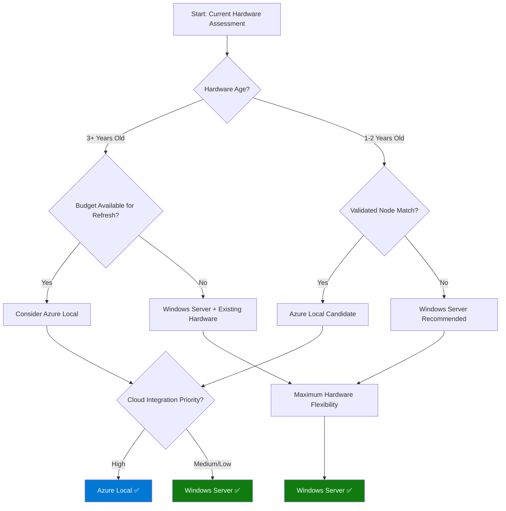
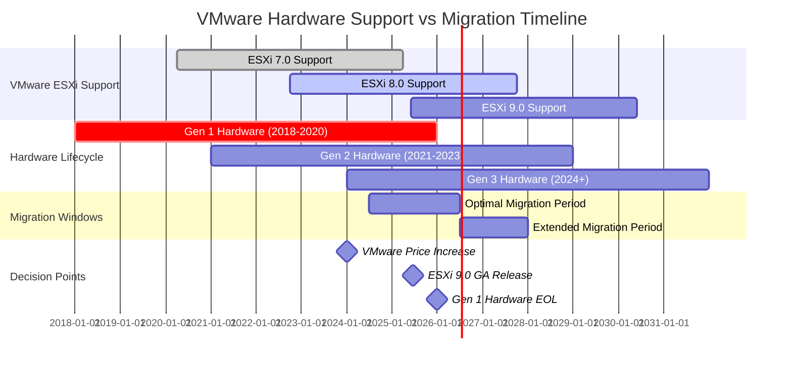

# Visual Enhancements Preview: "Beyond the Cloud: Hardware Considerations - Part III"

This document shows exactly how the proposed visual enhancements will appear in the blog post, including the context before and after each addition.

---

## Enhancement 1: Decision Tree "Which Platform for Your Hardware?" (After line 50)

**Context Before:**
```markdown
**The VMware Hardware Timeline Factor:** What makes this decision particularly urgent for many organizations is VMware's accelerating hardware obsolescence timeline. With VMware Cloud Foundation 9.0 and ESXi 9.0, VMware is deprecating significant numbers of older server components (storage controllers, network adapters, etc.) that were supported in vSphere 7 and 8.
```

**NEW VISUAL ENHANCEMENT:**
```markdown
### 🔄 Decision Tree: Which Platform for Your Hardware?



**Key Decision Points:**
- **Hardware Age**: Newer hardware has better Azure Local compatibility chances
- **Budget Constraints**: Windows Server maximizes existing investment value
- **Cloud Integration**: Azure Local provides tighter Azure services integration
- **Flexibility Needs**: Windows Server supports mixed hardware environments

**Context After:**
```markdown
### Path 1: Reuse Existing Hardware

If your current servers and storage ran VMware vSphere reliably, you might prefer to repurpose them for the new solution.
```

---

## Enhancement 2: SAN vs S2D Quick Comparison Table (After line 66)

**Context Before:**
```markdown
Windows Server 2025 (with Hyper-V and Failover Clustering) offers much greater flexibility to leverage existing gear than Azure Local does. If your goal is to maximize use of existing hardware, the Windows Server route is often the best choice.
```

**NEW VISUAL ENHANCEMENT:**
```markdown
### 📊 SAN vs S2D Quick Comparison

| Feature | External SAN | Storage Spaces Direct |
|---------|--------------|----------------------|
| **Initial Cost** | High (SAN + servers) | Medium (servers only) |
| **Complexity** | High (SAN + server admin) | Medium (unified management) |
| **Performance** | Excellent (dedicated controllers) | Very Good (distributed) |
| **Scalability** | Limited by SAN capacity | Linear (add nodes) |
| **Hardware Requirements** | Any servers + compatible SAN | Specific server configurations |
| **Single Point of Failure** | SAN controllers | None (distributed) |
| **Existing Hardware Reuse** | ✅ High compatibility | ⚠️ Limited compatibility |
| **Management Tools** | Separate SAN + server tools | Unified Windows tools |
| **Backup Integration** | Traditional SAN snapshots | Native Windows backup |
| **Network Requirements** | iSCSI/FC infrastructure | High-speed Ethernet |

> **💡 Cost Reality Check**
> 
> For most organizations with existing SAN investments, **reusing the SAN with Windows Server clusters often costs 60-70% less** than implementing Storage Spaces Direct with new hardware. The unified management benefits of S2D are significant, but may not justify the infrastructure replacement costs for hardware that still has useful life.

#### 🏗️ Architecture Diagrams: Storage Approach Comparison

**Traditional SAN-based Cluster:**
```
┌─────────────┐    ┌─────────────┐    ┌─────────────┐
│   Server 1  │    │   Server 2  │    │   Server 3  │
│  (Hyper-V)  │    │  (Hyper-V)  │    │  (Hyper-V)  │
└──────┬──────┘    └──────┬──────┘    └──────┬──────┘
       │                  │                  │
       └──────────────────┼──────────────────┘
                          │
                   ┌──────┴──────┐
                   │  SAN Array  │
                   │ (Shared     │
                   │  Storage)   │
                   └─────────────┘
```

**Storage Spaces Direct (S2D) Cluster:**
```
┌─────────────────────────────────────────────────────────────┐
│                    S2D Cluster Pool                        │
├─────────────────┬─────────────────┬─────────────────────────┤
│   Server 1      │   Server 2      │      Server 3          │
│ ┌─────────────┐ │ ┌─────────────┐ │  ┌─────────────────────┐│
│ │  Hyper-V    │ │ │  Hyper-V    │ │  │     Hyper-V         ││
│ │             │ │ │             │ │  │                     ││
│ ├─────────────┤ │ ├─────────────┤ │  ├─────────────────────┤│
│ │Local Storage│ │ │Local Storage│ │  │   Local Storage     ││
│ │  (NVMe/SSD) │ │ │  (NVMe/SSD) │ │  │    (NVMe/SSD)       ││
│ └─────────────┘ │ └─────────────┘ │  └─────────────────────┘│
└─────────────────┴─────────────────┴─────────────────────────┘
```

**Azure Local Approach:**
```
┌─────────────────────────────────────────────────────────────┐
│              Azure Local Cluster                           │
├─────────────────┬─────────────────┬─────────────────────────┤
│Validated Node 1 │Validated Node 2 │  Validated Node 3       │
│ ┌─────────────┐ │ ┌─────────────┐ │  ┌─────────────────────┐│
│ │Azure Stack  │ │ │Azure Stack  │ │  │   Azure Stack       ││
│ │HCI OS       │ │ │HCI OS       │ │  │   HCI OS            ││
│ ├─────────────┤ │ ├─────────────┤ │  ├─────────────────────┤│
│ │Certified    │ │ │Certified    │ │  │   Certified         ││
│ │Hardware     │ │ │Hardware     │ │  │   Hardware          ││
│ └─────────────┘ │ └─────────────┘ │  └─────────────────────┘│
└─────────┬───────┴─────────┬───────┴───────────┬─────────────┘
          │                 │                   │
          └─────────────────┼───────────────────┘
                            │
                    ┌───────┴───────┐
                    │ Azure Services│
                    │  Integration  │
                    └───────────────┘
```
```

**Context After:**
```markdown
It allows clustering with either shared storage (e.g., an iSCSI or FC SAN or NAS) or with internal disks via Storage Spaces Direct – giving you options to integrate with whatever infrastructure you already have.
```

---

## Enhancement 3: Hardware Flexibility Matrix (After line 92)

**Context Before:**
```markdown
In practice, unless your older servers were originally purchased as a supported HCI solution, this is rarely the case. The Azure Local program emphasizes using approved hardware to ensure stability.
```

**NEW VISUAL ENHANCEMENT:**
```markdown
### 🔧 Hardware Flexibility Matrix

| Hardware Scenario | Windows Server | Azure Local | VMware vSphere 9.0 | Recommendation |
|-------------------|----------------|-------------|-------------------|----------------|
| **3-5 year old Dell/HPE servers** | ✅ Full Support | ❌ Requires replacement | ⚠️ Check compatibility | Windows Server |
| **Mixed vendor environment** | ✅ No restrictions | ❌ Must be identical nodes | ❌ Compatibility issues | Windows Server |
| **Existing SAN investment** | ✅ Native support | 🚫 Not applicable | ✅ Continued support | Windows Server |
| **Legacy network adapters** | ✅ Broad compatibility | ❌ Certified NICs only | ❌ Many deprecated | Windows Server |
| **Custom server builds** | ✅ Flexible | ❌ OEM validated only | ⚠️ Limited support | Windows Server |
| **Recent HCI appliances** | ✅ Supported | ✅ May qualify | ✅ Usually supported | Any platform |
| **Budget constraints** | ✅ Maximize existing | ❌ New purchase required | ❌ Upgrade costs | Windows Server |
| **Cloud-first strategy** | ⚠️ Arc integration | ✅ Native Azure | 🚫 No cloud native | Azure Local |
| **Gradual modernization** | ✅ Phased approach | ❌ All-or-nothing | ❌ Version lock-in | Windows Server |
| **Branch office deployment** | ✅ Flexible sizing | ✅ Appliance model | ⚠️ Complex licensing | Azure Local |

**Legend:**
- ✅ = Fully Supported/Recommended
- ⚠️ = Supported with Limitations  
- ❌ = Not Supported/Not Recommended
- 🚫 = Not Applicable

#### 📈 Investment Protection Analysis

**Scenario: 5-Year TCO for 100 VMs**

| Cost Component | Windows Server + Existing | Azure Local + New HW | Stay VMware + Upgrade |
|----------------|---------------------------|----------------------|----------------------|
| **Hardware** | $0 (reuse) | $180,000 | $120,000 |
| **Software** | $45,000 (one-time) | $216,000 (5yr sub) | $350,000 (5yr) |
| **Network Upgrades** | $10,000 | $45,000 | $15,000 |
| **Migration** | $25,000 | $35,000 | $50,000 |
| **Training** | $15,000 | $25,000 | $5,000 |
| **Total 5-Year** | **$95,000** | **$501,000** | **$540,000** |
| **Cost per VM** | **$950** | **$5,010** | **$5,400** |

> **💰 Reality Check**: Windows Server with existing hardware typically costs **80-85% less** than new platform deployments over a 5-year period.
```

**Context After:**
```markdown
The result is a rock-solid platform, but at the cost of being locked into new hardware purchases in the near term.
```

---

## Enhancement 4: VMware Deprecation Timeline Chart (After line 82)

**Context Before:**
```markdown
**The VMware Hardware Timeline Factor:** What makes this decision particularly urgent for many organizations is VMware's accelerating hardware obsolescence timeline.
```

**NEW VISUAL ENHANCEMENT:**
```markdown
### ⏰ VMware Hardware Deprecation Timeline vs Migration Windows



#### 🚨 Critical Hardware Deprecation Alerts

| Component Type | Deprecated in ESXi 9.0 | Impact Level | Alternative Required |
|----------------|------------------------|--------------|---------------------|
| **Boot Media** | < 128GB drives | 🔴 Critical | New 128GB+ SSDs |
| **BIOS Systems** | Legacy BIOS | 🔴 Critical | UEFI firmware |
| **Memory** | < 8GB configurations | 🟡 Medium | Memory upgrades |
| **Network Cards** | Intel 82XXX series | 🟠 High | Certified NICs |
| **Storage Controllers** | Legacy RAID cards | 🟠 High | Modern HBAs |
| **Server Platforms** | 2018-2019 models | 🟡 Medium | Platform validation |

**Migration Decision Timeline:**

- **Q3 2025**: Audit current hardware against ESXi 9.0 compatibility
- **Q4 2025**: Budget planning for necessary upgrades
- **Q1 2026**: Begin hardware updates or platform migration
- **Q2 2026**: Complete migrations before support deadlines
- **Q3 2026**: Final cutover window before compatibility issues

> ⚠️ **Planning Reality**: Organizations that delay hardware compatibility assessment past Q4 2025 may face forced infrastructure decisions with limited vendor availability and inflated costs.
```

**Context After:**
```markdown
Organizations staying with VMware face their own hardware refresh timeline pressure – you can't simply renew VMware licenses and keep running on the same hardware indefinitely.
```

---

## Summary

These visual enhancements will provide:

1. **Clear Decision Path**: The decision tree helps readers quickly identify the best platform for their specific hardware situation
2. **Technical Comparison**: The SAN vs S2D table and architecture diagrams show the real differences between storage approaches
3. **Hardware Reality Check**: The flexibility matrix shows exactly what hardware scenarios work with each platform
4. **Timeline Awareness**: The VMware deprecation chart helps readers understand the urgency of their decisions

Each enhancement includes:
- ✅ Contextual placement within existing content
- ✅ Visual elements (tables, diagrams, charts)
- ✅ Actionable insights and recommendations
- ✅ Cost and timeline considerations
- ✅ Clear takeaways for decision-making

The enhancements maintain the blog's technical depth while making complex decisions more accessible through visual aids.
